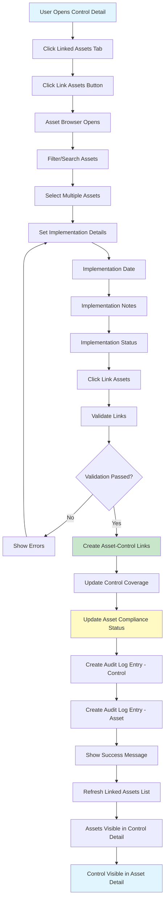
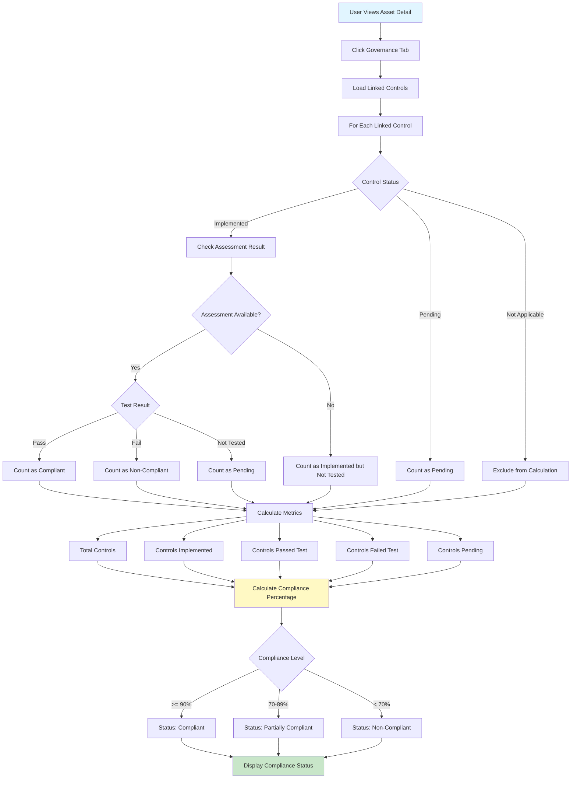
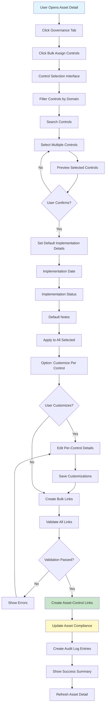
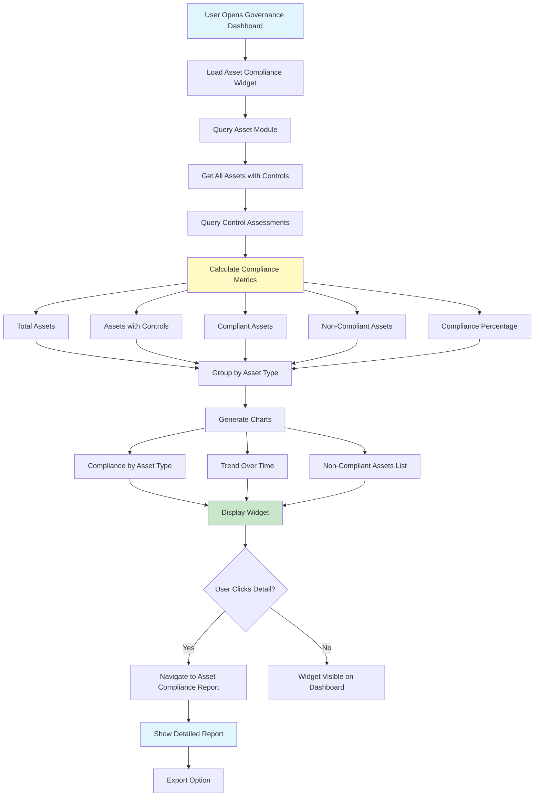
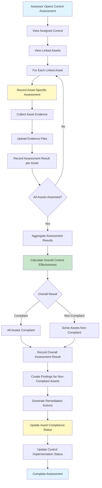

# Assets-Governance Integration Test Scenarios

**Document Version**: 1.0  
**Last Updated**: December 2024  
**Based on**: ASSET_MANAGEMENT_TEST_SCENARIOS.md and GOVERNANCE_TEST_SCENARIOS.md

---

## Table of Contents

1. [Overview](#overview)
2. [Integration Points](#integration-points)
3. [User Stories](#user-stories)
4. [Test Scenarios](#test-scenarios)
   - [Control to Asset Linking](#control-to-asset-linking)
   - [Asset Compliance Status](#asset-compliance-status)
   - [Governance Requirements from Assets](#governance-requirements-from-assets)
   - [Audit and Reporting Integration](#audit-and-reporting-integration)
5. [Flow Diagrams](#flow-diagrams)
6. [Acceptance Criteria](#acceptance-criteria)

---

## Overview

This document provides comprehensive test scenarios for the integration between the Asset Management and Governance Management modules. The integration enables:

- Linking controls to assets to demonstrate implementation
- Viewing asset compliance status based on linked controls
- Generating compliance reports that include asset information
- Tracking control implementation across asset inventory

---

## Integration Points

### 1. Control to Asset Linking
**Description**: Link governance controls to assets where they are implemented  
**Direction**: Governance → Assets  
**API Endpoint**: `POST /api/v1/governance/controls/:id/assets`

### 2. Asset Compliance Status
**Description**: View compliance status of assets based on assigned controls  
**Direction**: Assets → Governance  
**API Endpoint**: `GET /api/v1/governance/assets/:type/:id/compliance`

### 3. Controls for Asset
**Description**: View all controls linked to a specific asset  
**Direction**: Assets → Governance  
**API Endpoint**: `GET /api/v1/governance/assets/:type/:id/controls`

### 4. Bulk Control Assignment
**Description**: Assign multiple controls to an asset at once  
**Direction**: Governance → Assets  
**API Endpoint**: `POST /api/v1/governance/assets/:type/:id/controls`

### 5. Compliance Dashboard Integration
**Description**: Asset compliance metrics integrated into governance dashboard  
**Direction**: Bidirectional  
**Data Flow**: Real-time aggregation

---

## User Stories

### Integration Epic 1: Control-Asset Integration

#### User Story INT-1.1: Link Controls to Assets
**As a** control owner  
**I want to** link my controls to the assets where they are implemented  
**So that** I can demonstrate control coverage across the IT environment

**Priority**: P1 (Should Have)  
**Story Points**: 8

#### User Story INT-1.2: View Asset Compliance Status
**As a** compliance officer  
**I want to** view the compliance status of assets based on assigned controls  
**So that** I can identify non-compliant assets and take action

**Priority**: P1 (Should Have)  
**Story Points**: 5

#### User Story INT-1.3: View Controls for Asset
**As a** security architect  
**I want to** view all controls assigned to a specific asset  
**So that** I understand what controls are protecting that asset

**Priority**: P1 (Should Have)  
**Story Points**: 3

#### User Story INT-1.4: Bulk Control Assignment
**As a** compliance officer  
**I want to** assign multiple controls to an asset at once  
**So that** I can efficiently manage control coverage

**Priority**: P2 (Nice to Have)  
**Story Points**: 5

---

## Test Scenarios

### Control to Asset Linking

#### TS-INT-001: Link Control to Physical Asset from Governance

**User Story**: INT-1.1 (Link Controls to Assets)

**Preconditions**:
- User is authenticated
- Control exists in governance module
- Physical asset exists in asset module
- User has permission to link controls (Control Owner role)
- User has permission to view assets

**Test Steps**:
1. Navigate to Governance → Controls
2. Open control detail page: "Multi-Factor Authentication (UCL-IAM-002)"
3. Click "Linked Assets" tab
4. Click "Link Assets" button
5. Asset browser opens showing asset inventory
6. Filter assets:
   - Asset Type: "Physical Asset"
   - Search term: "Server"
7. Select multiple assets:
   - "Production Server 01"
   - "Production Server 02"
   - "Database Server 01"
8. Set implementation details:
   - Implementation Date: "2024-01-15"
   - Implementation Notes: "MFA enabled on all admin accounts"
   - Implementation Status: "Implemented"
9. Click "Link Assets" button
10. Confirm linking in dialog

**Expected Results**:
- Assets linked to control successfully
- Success message displayed
- Linked assets appear in "Linked Assets" tab with:
  - Asset name and type
  - Implementation date
  - Implementation status
  - Link date
- Navigation link to asset detail page works
- From asset side: Navigate to asset detail page
- Asset shows "Governance" tab
- Control appears in asset's "Linked Controls" list
- Control implementation status visible per asset
- Audit log entries created in both modules

**Acceptance Criteria**:
- ✅ Asset browser functional
- ✅ Multiple assets can be selected
- ✅ Implementation details saved
- ✅ Bidirectional linking works
- ✅ Navigation between modules functional
- ✅ Audit trail maintained in both modules

---

#### TS-INT-002: Link Control to Asset from Asset Side

**User Story**: INT-1.1 (Link Controls to Assets)

**Preconditions**:
- User is authenticated
- Physical asset exists in asset module
- Controls exist in governance module
- User has permission to view assets and controls

**Test Steps**:
1. Navigate to Assets → Physical Assets
2. Open asset detail page: "Production Server 01"
3. Click "Governance" tab
4. Click "Link Controls" button
5. Control browser opens showing control library
6. Filter controls:
   - Control Domain: "Access Control & Identity Management"
   - Search term: "MFA"
7. Select control: "Multi-Factor Authentication (UCL-IAM-002)"
8. Set implementation details:
   - Implementation Date: "2024-01-15"
   - Implementation Status: "Implemented"
   - Implementation Notes: "MFA enabled via Azure AD"
9. Click "Link Control" button

**Expected Results**:
- Control linked to asset successfully
- Control appears in asset's "Linked Controls" list
- Implementation details displayed
- Navigation link to control detail page works
- From governance side: Control shows asset in "Linked Assets"
- Bidirectional relationship established
- Audit log entries created

**Acceptance Criteria**:
- ✅ Control browser functional from asset side
- ✅ Control selection works
- ✅ Implementation details saved
- ✅ Bidirectional relationship established
- ✅ Navigation works both directions

---

#### TS-INT-003: View Controls for Asset

**User Story**: INT-1.3 (View Controls for Asset)

**Preconditions**:
- User is authenticated
- Physical asset exists with multiple controls linked
- User has permission to view assets and controls

**Test Steps**:
1. Navigate to Assets → Physical Assets
2. Open asset detail page: "Production Server 01"
3. Click "Governance" tab
4. View "Linked Controls" section

**Expected Results**:
- All linked controls displayed in list
- For each control, show:
  - Control identifier and title
  - Control domain
  - Implementation status
  - Implementation date
  - Last test date (if applicable)
  - Last test result (if applicable)
  - Compliance status
- Controls grouped by domain (optional)
- Click control to navigate to control detail page
- Summary metrics shown:
  - Total controls assigned
  - Controls implemented
  - Controls pending
  - Compliance percentage

**Acceptance Criteria**:
- ✅ All linked controls displayed
- ✅ Control details shown correctly
- ✅ Navigation to control detail works
- ✅ Summary metrics accurate
- ✅ Status information up-to-date

---

### Asset Compliance Status

#### TS-INT-004: View Asset Compliance Status

**User Story**: INT-1.2 (View Asset Compliance Status)

**Preconditions**:
- User is authenticated
- Physical asset exists with controls linked
- Some controls have assessment results
- User has permission to view compliance information

**Test Steps**:
1. Navigate to Assets → Physical Assets
2. Open asset detail page: "Production Server 01"
3. Click "Governance" tab
4. View "Compliance Status" section

**Expected Results**:
- Compliance status displayed with:
  - Overall compliance percentage (e.g., 85%)
  - Compliance status indicator (Compliant/Partially Compliant/Non-Compliant)
  - Breakdown by control:
    - Total controls assigned
    - Controls implemented
    - Controls pending implementation
    - Controls passed test
    - Controls failed test
  - Controls list with status:
    - Control name and identifier
    - Implementation status
    - Last assessment date
    - Last assessment result
    - Next test due date
- Visual indicators (traffic lights, progress bars)
- Link to detailed compliance report

**Acceptance Criteria**:
- ✅ Compliance status calculated correctly
- ✅ Breakdown metrics accurate
- ✅ Status indicators clear
- ✅ Control list complete
- ✅ Links to detailed reports work

---

#### TS-INT-005: Asset Compliance Status from Governance Dashboard

**User Story**: INT-1.2 (View Asset Compliance Status)

**Preconditions**:
- User is authenticated
- Multiple assets exist with controls assigned
- User has permission to view governance dashboard

**Test Steps**:
1. Navigate to Governance → Dashboard
2. View "Asset Compliance" widget
3. Click on compliance metric or "View Details"

**Expected Results**:
- Asset compliance metrics displayed:
  - Total assets
  - Assets with controls assigned
  - Compliant assets (percentage)
  - Non-compliant assets (count)
  - Assets with missing controls
- Breakdown by asset type
- Trend chart showing compliance over time
- List of non-compliant assets
- Click asset to navigate to asset detail
- Export compliance report option

**Acceptance Criteria**:
- ✅ Metrics calculated correctly
- ✅ Breakdown by asset type works
- ✅ Navigation to assets functional
- ✅ Export functionality works

---

#### TS-INT-006: Control Implementation Status Across Assets

**User Story**: INT-1.1 (Link Controls to Assets)

**Preconditions**:
- User is authenticated
- Control exists with multiple assets linked
- Some assets have implemented, others pending
- User has permission to view controls

**Test Steps**:
1. Navigate to Governance → Controls
2. Open control detail page: "Multi-Factor Authentication"
3. Click "Linked Assets" tab
4. View asset implementation status

**Expected Results**:
- All linked assets displayed
- For each asset, show:
  - Asset name and type
  - Implementation status (Implemented/Pending/Not Applicable)
  - Implementation date
  - Last test date
  - Last test result
  - Compliance status
- Summary metrics:
  - Total assets linked
  - Assets with implementation complete
  - Assets pending implementation
  - Implementation percentage
- Filter by implementation status
- Export asset-control matrix
- Click asset to navigate to asset detail

**Acceptance Criteria**:
- ✅ Asset list complete
- ✅ Status information accurate
- ✅ Summary metrics correct
- ✅ Filtering functional
- ✅ Navigation works
- ✅ Export works

---

### Governance Requirements from Assets

#### TS-INT-007: Identify Assets Requiring Controls

**User Story**: INT-1.2 (View Asset Compliance Status)

**Preconditions**:
- User is authenticated
- Multiple assets exist in system
- Some assets have controls, others don't
- Control requirements exist (based on asset type/criticality)
- User has permission to view assets and controls

**Test Steps**:
1. Navigate to Governance → Dashboard
2. View "Assets Without Controls" widget
3. Click "View All Assets Without Controls"

**Expected Results**:
- List of assets displayed that:
  - Have no controls assigned, OR
  - Have controls assigned but missing required controls based on:
    - Asset type
    - Asset criticality
    - Business unit requirements
- For each asset, show:
  - Asset name and type
  - Criticality level
  - Business unit
  - Required controls (missing)
  - Current compliance status
- Filter by asset type, criticality, business unit
- Option to assign controls from this view
- Export report of assets without controls

**Acceptance Criteria**:
- ✅ Assets without controls identified
- ✅ Required controls determined correctly
- ✅ Filtering works
- ✅ Bulk control assignment works
- ✅ Export functional

---

#### TS-INT-008: Control Gap Analysis by Asset Type

**User Story**: INT-1.2 (View Asset Compliance Status)

**Preconditions**:
- User is authenticated
- Multiple assets of different types exist
- Controls exist with asset type requirements
- User has permission to view compliance reports

**Test Steps**:
1. Navigate to Governance → Reports
2. Select "Control Gap Analysis by Asset Type"
3. Select asset types to analyze:
   - Physical Assets
   - Applications
   - Information Assets
4. Select framework: "NCA ECC"
5. Generate report

**Expected Results**:
- Report generated showing:
  - For each asset type:
    - Total assets of this type
    - Required controls for this asset type
    - Assets with all required controls (count and percentage)
    - Assets missing required controls (list)
    - Gap analysis (which controls are missing)
  - Visual representation (charts, tables)
- Export to Excel/PDF
- Drill-down capability:
  - Click asset type → see asset list
  - Click asset → see asset detail
  - Click control gap → see control detail

**Acceptance Criteria**:
- ✅ Gap analysis accurate
- ✅ Asset type requirements correct
- ✅ Visual representation clear
- ✅ Drill-down navigation works
- ✅ Export functional

---

### Audit and Reporting Integration

#### TS-INT-009: Compliance Report Including Assets

**User Story**: INT-1.2 (View Asset Compliance Status)

**Preconditions**:
- User is authenticated
- Assets exist with controls assigned
- Control assessments have been completed
- User has permission to generate reports

**Test Steps**:
1. Navigate to Governance → Reports
2. Select "Framework Compliance Report"
3. Select framework: "NCA ECC"
4. Select "Include Asset Details" checkbox
5. Select date range: Last quarter
6. Generate report

**Expected Results**:
- Report generated with sections:
  - Executive Summary
  - Framework Compliance Overview
  - Control Implementation Status
  - Asset Compliance Details:
    - Assets by compliance status
    - Asset-control mapping
    - Non-compliant assets list
    - Remediation recommendations
  - Evidence references
- Export to Excel/PDF
- Report includes:
  - Charts and graphs
  - Detailed tables
  - Asset information
  - Control assessment results

**Acceptance Criteria**:
- ✅ Report includes asset information
- ✅ Compliance status accurate
- ✅ Asset-control mapping correct
- ✅ Visual elements render correctly
- ✅ Export works

---

#### TS-INT-010: Asset Audit Trail with Governance Events

**User Story**: INT-1.1 (Link Controls to Assets)

**Preconditions**:
- User is authenticated
- Asset exists with governance events:
  - Controls linked/unlinked
  - Compliance status changes
  - Assessment results recorded
- User has permission to view audit logs

**Test Steps**:
1. Navigate to Assets → Physical Assets
2. Open asset detail page
3. Click "Audit History" tab
4. Filter by "Governance Events"

**Expected Results**:
- Governance-related audit entries displayed:
  - Control linked (date, user, control ID)
  - Control unlinked (date, user, control ID)
  - Implementation status changed (date, user, old status, new status)
  - Assessment result recorded (date, assessor, result)
  - Compliance status changed (date, user, reason)
- All entries show:
  - Timestamp
  - User who made change
  - Action type
  - Details
  - Related governance entity (control, assessment)
- Link to related governance entity
- Export audit log to CSV/PDF

**Acceptance Criteria**:
- ✅ Governance events captured in asset audit log
- ✅ Filter by governance events works
- ✅ Links to governance entities functional
- ✅ Export works

---

## Flow Diagrams

### Flow Diagram 1: Control to Asset Linking Flow

### Flow Diagram 2: Asset Compliance Status Calculation Flow

### Flow Diagram 3: Bulk Control Assignment Flow

### Flow Diagram 4: Asset Compliance Dashboard Integration Flow

### Flow Diagram 5: Control-Asset Integration in Assessment Flow

---

## Acceptance Criteria

### Integration Acceptance

All integration test scenarios must meet the following acceptance criteria:

1. **Bidirectional Navigation**
   - ✅ Users can navigate from Governance to Assets
   - ✅ Users can navigate from Assets to Governance
   - ✅ Links work in both directions
   - ✅ Context preserved during navigation

2. **Data Consistency**
   - ✅ Asset-control links synchronized
   - ✅ Status updates propagate correctly
   - ✅ Audit logs maintained in both modules
   - ✅ No data inconsistencies

3. **Performance**
   - ✅ Cross-module queries performant (<2 seconds)
   - ✅ Compliance calculations efficient
   - ✅ Dashboard widgets load quickly
   - ✅ Bulk operations optimized

4. **Permissions**
   - ✅ User permissions respected across modules
   - ✅ Access control enforced
   - ✅ Audit trail captures all changes

5. **User Experience**
   - ✅ Seamless navigation between modules
   - ✅ Clear indication of linked entities
   - ✅ Consistent UI/UX patterns
   - ✅ Helpful error messages

### Functional Acceptance

- ✅ Control-asset linking works from both modules
- ✅ Compliance status calculated accurately
- ✅ Reports include integrated data
- ✅ Audit trails capture integration events
- ✅ Bulk operations functional

### Technical Acceptance

- ✅ API endpoints functional
- ✅ Data models compatible
- ✅ Error handling robust
- ✅ Transaction integrity maintained

---

**Document End**

