# Asset Management System Architecture

## System Overview Diagram

## Data Flow Diagram

## Integration Architecture Detail

```mermaid
graph LR
    subgraph "Integration Service"
        Config[Integration Config<br/>- Endpoint URL<br/>- Auth Type<br/>- Field Mapping<br/>- Sync Interval]
        SyncEngine[Sync Engine<br/>- Fetch Data<br/>- Map Fields<br/>- Detect Duplicates<br/>- Handle Conflicts]
        Scheduler[Scheduler<br/>- Interval-based<br/>- Manual Trigger]
    end

    subgraph "Authentication Methods"
        APIKey[API Key<br/>X-API-Key Header]
        Bearer[Bearer Token<br/>Authorization Header]
        Basic[Basic Auth<br/>Username/Password]
        OAuth2[OAuth 2.0<br/>Token Exchange]
    end

    subgraph "External Systems"
        ServiceNow[ServiceNow CMDB]
        BMC[BMC Remedy]
        Lansweeper[Lansweeper]
        ManageEngine[ManageEngine]
        CustomAPI[Custom REST API]
    end

    subgraph "Data Processing"
        FieldMapping[Field Mapping<br/>External → Internal]
        Validation[Data Validation]
        Deduplication[Duplicate Detection<br/>by Unique Identifier]
        ConflictResolution[Conflict Resolution<br/>- Overwrite<br/>- Skip<br/>- Merge]
    end

    subgraph "Storage"
        Assets[(Asset Tables)]
        SyncLogs[(Sync Logs)]
        ErrorLogs[(Error Reports)]
    end

    Config --> SyncEngine
    Scheduler --> SyncEngine
    SyncEngine --> APIKey
    SyncEngine --> Bearer
    SyncEngine --> Basic
    SyncEngine --> OAuth2
    
    APIKey --> ServiceNow
    Bearer --> BMC
    Basic --> Lansweeper
    Bearer --> ManageEngine
    Bearer --> CustomAPI

    ServiceNow --> FieldMapping
    BMC --> FieldMapping
    Lansweeper --> FieldMapping
    ManageEngine --> FieldMapping
    CustomAPI --> FieldMapping

    FieldMapping --> Validation
    Validation --> Deduplication
    Deduplication --> ConflictResolution
    ConflictResolution --> Assets
    SyncEngine --> SyncLogs
    SyncEngine --> ErrorLogs

    style Config fill:#fff9c4
    style SyncEngine fill:#fff9c4
    style FieldMapping fill:#e1f5ff
    style Assets fill:#e0f2f1
```

## Asset Relationships & Dependencies

## Complete System Integration Map

## Key Components Summary

### 1. **Import System**
- **CSV/Excel Parser**: Handles file parsing and preview
- **Field Mapper**: Maps external columns to internal fields
- **Validator**: Validates data before import
- **Error Reporter**: Generates detailed error reports

### 2. **Integration System**
- **Configuration Manager**: Stores integration settings
- **Sync Engine**: Fetches and processes external data
- **Authentication Handler**: Supports multiple auth methods
- **Field Mapper**: Maps external fields to internal schema
- **Conflict Resolver**: Handles duplicates and conflicts

### 3. **Field Configuration System**
- **Field Registry**: Stores custom field definitions
- **Validator**: Applies validation rules
- **Form Generator**: Dynamically generates forms
- **Dependency Engine**: Handles conditional fields

### 4. **Asset Services**
- **CRUD Operations**: Create, Read, Update, Delete
- **Search & Filter**: Global search across all types
- **Dependency Management**: Track relationships
- **Audit Logging**: Track all changes

### 5. **Analytics & Reporting**
- **Dashboard Service**: Aggregates statistics
- **Compliance Tracking**: Monitor compliance coverage
- **Security Status**: Track security test results
- **Ownership Management**: Track asset ownership

