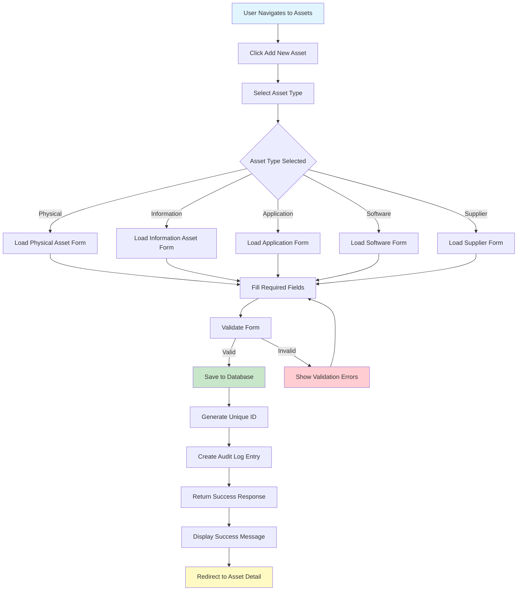
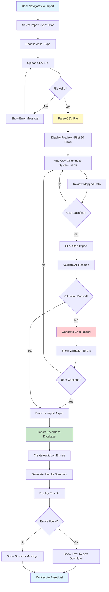
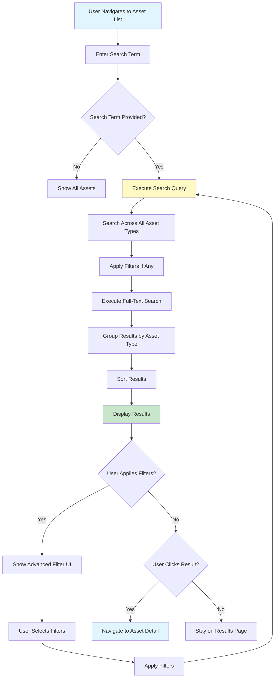
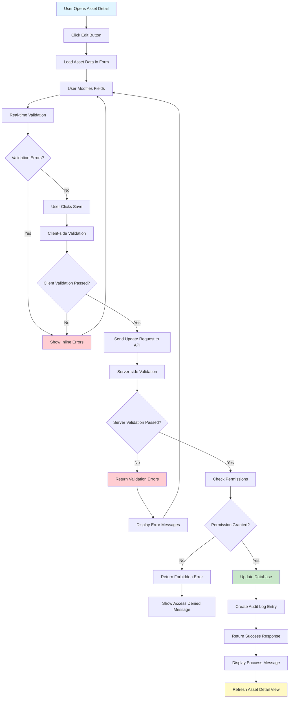
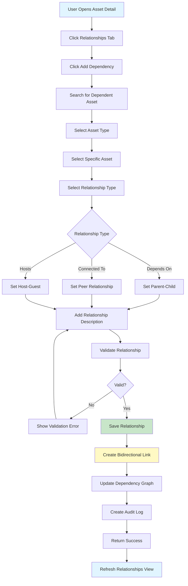

# Asset Management Module - Test Scenarios

**Document Version**: 1.0  
**Last Updated**: December 2024  
**Based on**: PHASE2_ASSET_MANAGEMENT_PRD.md

---

## Table of Contents

1. [Overview](#overview)
2. [User Stories](#user-stories)
3. [Test Scenarios by Feature](#test-scenarios-by-feature)
   - [Physical Asset Management](#physical-asset-management)
   - [Information Asset Management](#information-asset-management)
   - [Business Application Management](#business-application-management)
   - [Software Asset Management](#software-asset-management)
   - [Supplier Management](#supplier-management)
   - [Data Import](#data-import)
   - [Search and Discovery](#search-and-discovery)
   - [Asset Relationships](#asset-relationships)
   - [Audit and Compliance](#audit-and-compliance)
   - [Reporting and Analytics](#reporting-and-analytics)
4. [Flow Diagrams](#flow-diagrams)
5. [Acceptance Criteria](#acceptance-criteria)

---

## Overview

This document provides comprehensive test scenarios for the Asset Management Module based on the PRD. Each scenario includes:
- User story reference
- Test scenario description
- Preconditions
- Test steps
- Expected results
- Acceptance criteria
- Flow diagram reference

---

## User Stories

### Epic 1: Data Import

#### User Story 1.1: CSV File Import
**As a** cybersecurity analyst  
**I want to** import asset data from CSV files  
**So that** I can quickly populate the asset inventory without manual data entry

**Priority**: P0 (Must Have)  
**Story Points**: 8

#### User Story 1.2: Excel File Import
**As a** cybersecurity analyst  
**I want to** import asset data from Excel files (.xlsx, .xls)  
**So that** I can use existing spreadsheets to import asset information

**Priority**: P0 (Must Have)  
**Story Points**: 8

### Epic 2: Physical Asset Management

#### User Story 2.1: Add Physical Asset
**As a** cybersecurity analyst  
**I want to** add new physical assets to the inventory  
**So that** I can maintain an accurate record of all physical assets

**Priority**: P0 (Must Have)  
**Story Points**: 5

#### User Story 2.2: View Physical Asset Details
**As a** cybersecurity analyst  
**I want to** view detailed information about a physical asset  
**So that** I can access all relevant asset attributes and metadata

**Priority**: P0 (Must Have)  
**Story Points**: 3

#### User Story 2.3: Update Physical Asset
**As a** cybersecurity analyst  
**I want to** update existing physical asset information  
**So that** I can keep asset records current

**Priority**: P1 (Should Have)  
**Story Points**: 5

#### User Story 2.4: Search and Filter Physical Assets
**As a** cybersecurity analyst  
**I want to** search and filter physical assets by various criteria  
**So that** I can quickly find specific assets

**Priority**: P0 (Must Have)  
**Story Points**: 5

### Epic 3: Information Asset Management

#### User Story 3.1: Add Information Asset
**As a** compliance officer  
**I want to** add information assets to the inventory  
**So that** I can track and classify data assets

**Priority**: P1 (Should Have)  
**Story Points**: 5

### Epic 4: Business Application Management

#### User Story 4.1: Add Business Application
**As a** security architect  
**I want to** add business applications to the inventory  
**So that** I can track applications and their security requirements

**Priority**: P1 (Should Have)  
**Story Points**: 5

### Epic 5: Software Asset Management

#### User Story 5.1: Add Software Asset
**As an** IT asset manager  
**I want to** add software assets to the inventory  
**So that** I can track software licenses and installations

**Priority**: P1 (Should Have)  
**Story Points**: 5

### Epic 6: Supplier Management

#### User Story 6.1: Add Third Party/Supplier
**As a** compliance officer  
**I want to** add third-party suppliers to the inventory  
**So that** I can track vendor relationships and risks

**Priority**: P1 (Should Have)  
**Story Points**: 5

### Epic 7: Advanced Features

#### User Story 7.1: Asset Ownership Management
**As a** cybersecurity analyst  
**I want to** assign owners to assets  
**So that** accountability and responsibility are clear

**Priority**: P0 (Must Have)  
**Story Points**: 3

#### User Story 7.2: Universal Asset Search
**As a** cybersecurity analyst  
**I want to** search across all asset types with a single query  
**So that** I can quickly find any asset regardless of type

**Priority**: P0 (Must Have)  
**Story Points**: 5

#### User Story 7.3: Asset Relationship Mapping
**As a** security architect  
**I want to** map relationships between assets  
**So that** I can understand dependencies and impact

**Priority**: P2 (Nice to Have)  
**Story Points**: 8

#### User Story 7.4: Bulk Asset Operations
**As a** cybersecurity analyst  
**I want to** perform bulk operations on multiple assets  
**So that** I can efficiently manage large numbers of assets

**Priority**: P2 (Nice to Have)  
**Story Points**: 8

#### User Story 7.5: Asset Audit Trail
**As a** compliance officer  
**I want to** view the complete change history for assets  
**So that** I can audit changes and maintain compliance

**Priority**: P1 (Should Have)  
**Story Points**: 5

#### User Story 7.7: Asset Dashboard and Analytics
**As a** security architect  
**I want to** view asset metrics and analytics on a dashboard  
**So that** I can monitor asset inventory health

**Priority**: P1 (Should Have)  
**Story Points**: 8

#### User Story 7.8: Asset Export and Reporting
**As a** compliance officer  
**I want to** export asset data in various formats  
**So that** I can generate reports for audits and stakeholders

**Priority**: P2 (Nice to Have)  
**Story Points**: 5

### Epic 8: Configuration

#### User Story 8.1: Configure Asset Fields
**As a** system administrator  
**I want to** configure custom fields for assets  
**So that** I can adapt the system to organizational needs

**Priority**: P1 (Should Have)  
**Story Points**: 8

#### User Story 8.2: User Access Control
**As a** system administrator  
**I want to** control user access to asset data  
**So that** sensitive information is protected

**Priority**: P0 (Must Have)  
**Story Points**: 5

---

## Test Scenarios by Feature

### Physical Asset Management

#### TS-PA-001: Create Physical Asset - Happy Path

**User Story**: 2.1 (Add Physical Asset)

**Preconditions**:
- User is authenticated
- User has permission to create physical assets
- Asset type "Physical" exists in system

**Test Steps**:
1. Navigate to Assets → Physical Assets
2. Click "Add New Asset" button
3. Fill in required fields:
   - Asset Description: "Production Server 01"
   - Asset Type: "Server"
   - Business Unit: "IT Operations"
   - Owner: Select from dropdown
   - Criticality Level: "High"
   - Location: "Data Center A"
4. Fill in optional fields:
   - IP Address: "192.168.1.100"
   - MAC Address: "00:1B:44:11:3A:B7"
   - Serial Number: "SN123456789"
5. Click "Save" button

**Expected Results**:
- Asset is created successfully
- Success message displayed
- User redirected to asset detail page
- Asset appears in asset list
- Audit log entry created
- All entered data is displayed correctly

**Acceptance Criteria**:
- ✅ All required fields validated
- ✅ Unique identifier auto-generated
- ✅ Asset saved to database
- ✅ Audit trail captured
- ✅ User feedback provided

---

#### TS-PA-002: Create Physical Asset - Validation Errors

**User Story**: 2.1 (Add Physical Asset)

**Preconditions**:
- User is authenticated
- User has permission to create physical assets

**Test Steps**:
1. Navigate to Assets → Physical Assets
2. Click "Add New Asset" button
3. Leave required fields empty
4. Enter invalid data:
   - IP Address: "999.999.999.999"
   - MAC Address: "invalid-mac"
5. Click "Save" button

**Expected Results**:
- Form displays validation errors
- Invalid fields highlighted in red
- Error messages shown for each invalid field:
  - "Asset Description is required"
  - "Invalid IP address format"
  - "Invalid MAC address format"
- Asset is NOT created
- User remains on form page

**Acceptance Criteria**:
- ✅ Client-side validation works
- ✅ Server-side validation works
- ✅ Clear error messages displayed
- ✅ No data saved on validation failure

---

#### TS-PA-003: View Physical Asset Details

**User Story**: 2.2 (View Physical Asset Details)

**Preconditions**:
- User is authenticated
- Physical asset exists in system
- User has permission to view assets

**Test Steps**:
1. Navigate to Assets → Physical Assets
2. Search for asset "Production Server 01"
3. Click on asset name or "View" action

**Expected Results**:
- Asset detail page loads
- All asset attributes displayed:
  - Basic Information section
  - Network Information section
  - Ownership section
  - Compliance section
  - Additional Metadata section
- Related assets shown (if any)
- Audit history available in tab
- Edit and Delete buttons visible (if user has permissions)

**Acceptance Criteria**:
- ✅ All asset data displays correctly
- ✅ Page loads within 2 seconds
- ✅ Navigation works properly
- ✅ Related information accessible

---

#### TS-PA-004: Update Physical Asset

**User Story**: 2.3 (Update Physical Asset)

**Preconditions**:
- User is authenticated
- Physical asset exists in system
- User has permission to edit assets

**Test Steps**:
1. Navigate to Assets → Physical Assets
2. Open asset detail page
3. Click "Edit" button
4. Modify fields:
   - Change IP Address: "192.168.1.101"
   - Update Criticality Level: "Critical"
5. Click "Save" button

**Expected Results**:
- Changes saved successfully
- Success message displayed
- Updated data visible on detail page
- Audit log entry created with change details
- Previous version information maintained

**Acceptance Criteria**:
- ✅ Changes persist after save
- ✅ Validation still applies on update
- ✅ Audit trail maintained
- ✅ User feedback provided

---

#### TS-PA-005: Delete Physical Asset

**User Story**: 2.1 (Add Physical Asset)

**Preconditions**:
- User is authenticated
- Physical asset exists in system
- User has permission to delete assets
- Asset has no active dependencies

**Test Steps**:
1. Navigate to Assets → Physical Assets
2. Open asset detail page
3. Click "Delete" button
4. Confirm deletion in dialog
5. Click "Confirm Delete"

**Expected Results**:
- Confirmation dialog displayed
- Asset soft-deleted (marked as deleted, not removed)
- Success message displayed
- Asset no longer appears in active list
- Audit log entry created
- Asset can be restored if needed

**Acceptance Criteria**:
- ✅ Soft delete implemented
- ✅ Confirmation required
- ✅ Audit trail maintained
- ✅ Dependencies checked before delete

---

#### TS-PA-006: Search and Filter Physical Assets

**User Story**: 2.4 (Search and Filter Physical Assets)

**Preconditions**:
- User is authenticated
- Multiple physical assets exist in system
- User has permission to view assets

**Test Steps**:
1. Navigate to Assets → Physical Assets
2. Enter search term "Server" in search box
3. Apply filters:
   - Criticality Level: "High"
   - Business Unit: "IT Operations"
   - Connectivity Status: "Connected"
4. Click "Apply Filters"

**Expected Results**:
- Results filtered to matching assets
- Only assets matching all criteria shown
- Result count displayed
- Filters remain applied
- Clear filters option available
- Results sorted by default (most recent first)

**Acceptance Criteria**:
- ✅ Search works across all fields
- ✅ Multiple filters work together
- ✅ Results update in real-time
- ✅ Performance acceptable (<1 second)

---

### Information Asset Management

#### TS-IA-001: Create Information Asset

**User Story**: 3.1 (Add Information Asset)

**Preconditions**:
- User is authenticated
- User has permission to create information assets
- Data classification levels configured

**Test Steps**:
1. Navigate to Assets → Information Assets
2. Click "Add New Asset" button
3. Fill in required fields:
   - Asset Name: "Customer Database"
   - Data Classification: "Confidential"
   - Information Owner: Select from dropdown
   - Custodian: Select from dropdown
   - Business Unit: "Sales"
4. Fill in compliance requirements
5. Click "Save" button

**Expected Results**:
- Information asset created successfully
- Success message displayed
- Data classification validated
- Owner and custodian assigned
- Compliance requirements linked
- Reclassification date set automatically

**Acceptance Criteria**:
- ✅ Data classification enforced
- ✅ Owner/custodian distinction clear
- ✅ Compliance tracking enabled
- ✅ Audit trail maintained

---

### Business Application Management

#### TS-BA-001: Create Business Application

**User Story**: 4.1 (Add Business Application)

**Preconditions**:
- User is authenticated
- User has permission to create applications
- Vendor information exists (optional)

**Test Steps**:
1. Navigate to Assets → Applications
2. Click "Add New Application" button
3. Fill in required fields:
   - Application Name: "CRM System"
   - Version: "2.1.0"
   - Vendor: Select from dropdown
   - Business Unit: "Sales"
   - Data Types Processed: ["Customer Data", "Transaction Data"]
4. Fill in vendor contact information
5. Click "Save" button

**Expected Results**:
- Application created successfully
- Version tracked
- Vendor linked
- Data types categorized
- Contact information stored
- Success message displayed

**Acceptance Criteria**:
- ✅ Version tracking enabled
- ✅ Vendor information linked
- ✅ Data types categorized
- ✅ All fields validated

---

### Software Asset Management

#### TS-SA-001: Create Software Asset

**User Story**: 5.1 (Add Software Asset)

**Preconditions**:
- User is authenticated
- User has permission to create software assets
- Physical assets exist for linking

**Test Steps**:
1. Navigate to Assets → Software
2. Click "Add New Asset" button
3. Fill in required fields:
   - Software Name: "Windows Server 2022"
   - Version: "21H2"
   - License Type: "Volume"
   - Vendor: "Microsoft"
   - Installed On: Select physical asset
4. Fill in licensing information
5. Click "Save" button

**Expected Results**:
- Software asset created
- License information tracked
- Link to physical asset established
- Vendor information stored
- Success message displayed

**Acceptance Criteria**:
- ✅ License tracking enabled
- ✅ Physical asset linking works
- ✅ Vendor information stored
- ✅ Version tracking accurate

---

### Supplier Management

#### TS-TP-001: Create Supplier

**User Story**: 6.1 (Add Third Party/Supplier)

**Preconditions**:
- User is authenticated
- User has permission to create suppliers

**Test Steps**:
1. Navigate to Assets → Suppliers
2. Click "Add New Supplier" button
3. Fill in required fields:
   - Supplier Name: "ABC Security Services"
   - Criticality Level: "High"
   - Contract Reference: "CONTRACT-2024-001"
4. Add contact persons (multiple)
5. Fill in goods/services provided
6. Click "Save" button

**Expected Results**:
- Supplier created successfully
- Unique identifier auto-generated
- Contact persons added
- Criticality level assigned
- Contract reference tracked
- Success message displayed

**Acceptance Criteria**:
- ✅ Unique ID auto-generated
- ✅ Multiple contacts supported
- ✅ Criticality tracked
- ✅ Contract linking enabled

---

### Data Import

#### TS-IMPORT-001: CSV File Import - Happy Path

**User Story**: 1.1 (CSV File Import)

**Preconditions**:
- User is authenticated
- User has permission to import assets
- Valid CSV file prepared

**Test Steps**:
1. Navigate to Assets → Import
2. Select "CSV Import" option
3. Choose asset type: "Physical Assets"
4. Upload CSV file via drag-and-drop or file picker
5. System parses file and shows preview (first 10 rows)
6. Map CSV columns to system fields:
   - CSV Column "Asset Name" → System Field "Asset Description"
   - CSV Column "IP" → System Field "IP Address"
   - etc.
7. Review mapped data in preview
8. Click "Start Import" button
9. Monitor import progress
10. View import results

**Expected Results**:
- File uploaded successfully
- File parsed correctly
- Column mapping interface displayed
- Preview shows first 10 rows with mapped fields
- Import proceeds asynchronously
- Progress indicator shown
- Results summary displayed:
  - Total records: 100
  - Successful: 98
  - Failed: 2
- Error report available for download
- Successfully imported assets visible in asset list

**Acceptance Criteria**:
- ✅ File upload works
- ✅ CSV parsing accurate
- ✅ Field mapping intuitive
- ✅ Preview functional
- ✅ Validation before import
- ✅ Error reporting comprehensive
- ✅ Audit log of import activity

---

#### TS-IMPORT-002: CSV File Import - Validation Errors

**User Story**: 1.1 (CSV File Import)

**Preconditions**:
- User is authenticated
- User has permission to import assets
- CSV file with errors prepared

**Test Steps**:
1. Navigate to Assets → Import
2. Select "CSV Import" option
3. Upload CSV file with errors:
   - Row 5: Missing required field "Asset Description"
   - Row 12: Invalid IP address format
   - Row 20: Duplicate unique identifier
4. Map columns to system fields
5. Click "Start Import" button
6. Review error report

**Expected Results**:
- Import processes file
- Valid records imported successfully
- Invalid records rejected with clear errors
- Error report generated with:
  - Row number
  - Field name
  - Error description
  - Suggested fix
- Error report downloadable as CSV
- Summary shows count of errors

**Acceptance Criteria**:
- ✅ Validation catches all errors
- ✅ Error messages clear and actionable
- ✅ Valid records still imported
- ✅ Error report comprehensive

---

#### TS-IMPORT-003: Excel File Import

**User Story**: 1.2 (Excel File Import)

**Preconditions**:
- User is authenticated
- User has permission to import assets
- Excel file (.xlsx) prepared

**Test Steps**:
1. Navigate to Assets → Import
2. Select "Excel Import" option
3. Choose asset type: "Information Assets"
4. Upload Excel file
5. Select worksheet if multiple sheets
6. Map Excel columns to system fields
7. Preview mapped data
8. Start import
9. View results

**Expected Results**:
- Excel file uploaded
- Worksheets listed if multiple
- Column mapping works
- Preview functional
- Import successful
- Results displayed

**Acceptance Criteria**:
- ✅ .xlsx and .xls supported
- ✅ Multiple worksheets handled
- ✅ Mapping interface works
- ✅ Import successful

---

### Search and Discovery

#### TS-SEARCH-001: Universal Asset Search

**User Story**: 7.2 (Universal Asset Search)

**Preconditions**:
- User is authenticated
- Multiple asset types exist in system
- User has permission to search

**Test Steps**:
1. Navigate to Assets → All Assets
2. Enter search term in global search box: "Server"
3. Press Enter or click search button

**Expected Results**:
- Search executed across all asset types
- Results grouped by asset type:
  - Physical Assets: 5 results
  - Software Assets: 2 results
  - Applications: 1 result
- Results displayed with asset type badge
- Each result shows key information
- Clicking result opens detail page
- Search term highlighted in results

**Acceptance Criteria**:
- ✅ Cross-type search works
- ✅ Results grouped clearly
- ✅ Performance acceptable
- ✅ Highlighting functional

---

#### TS-SEARCH-002: Advanced Filtering

**User Story**: 7.2 (Universal Asset Search)

**Preconditions**:
- User is authenticated
- Multiple assets exist with various attributes

**Test Steps**:
1. Navigate to Assets → All Assets
2. Click "Advanced Filters"
3. Apply multiple filters:
   - Asset Type: "Physical Asset"
   - Criticality: "High" OR "Critical"
   - Business Unit: "IT Operations"
   - Date Range: Last 30 days
   - Owner: Specific user
4. Click "Apply Filters"
5. Save filter configuration

**Expected Results**:
- Multiple filters applied simultaneously
- Logical operators supported (AND, OR)
- Results update based on all filters
- Filter configuration can be saved
- Saved filters appear in dropdown
- Clear all filters option available

**Acceptance Criteria**:
- ✅ Multiple filters work together
- ✅ Logical operators functional
- ✅ Save filter configuration works
- ✅ Performance acceptable

---

### Asset Relationships

#### TS-REL-001: Create Asset Dependency

**User Story**: 7.3 (Asset Relationship Mapping)

**Preconditions**:
- User is authenticated
- Multiple assets exist in system
- User has permission to manage relationships

**Test Steps**:
1. Navigate to Asset Detail page
2. Click "Relationships" tab
3. Click "Add Dependency" button
4. Select dependent asset type and asset
5. Select relationship type: "Depends On"
6. Add description: "Application depends on server infrastructure"
7. Click "Save"

**Expected Results**:
- Dependency created successfully
- Bidirectional relationship established
- Dependency shown on both assets
- Relationship type displayed
- Visual dependency graph updated
- Audit log entry created

**Acceptance Criteria**:
- ✅ Dependencies created successfully
- ✅ Bidirectional display works
- ✅ Relationship types supported
- ✅ Visual graph functional

---

### Audit and Compliance

#### TS-AUDIT-001: View Asset Audit Trail

**User Story**: 7.5 (Asset Audit Trail)

**Preconditions**:
- User is authenticated
- Asset exists with change history
- User has permission to view audit logs

**Test Steps**:
1. Navigate to Asset Detail page
2. Click "Audit History" tab
3. Review audit log entries

**Expected Results**:
- Complete audit trail displayed
- Entries show:
  - Timestamp
  - User who made change
  - Action type (Create, Update, Delete)
  - Field changed
  - Old value
  - New value
  - Reason for change (if provided)
- Entries sorted by date (most recent first)
- Export to CSV option available

**Acceptance Criteria**:
- ✅ All changes logged
- ✅ Complete change details
- ✅ User attribution accurate
- ✅ Export functionality works

---

### Reporting and Analytics

#### TS-REPORT-001: Export Assets to CSV

**User Story**: 7.8 (Asset Export and Reporting)

**Preconditions**:
- User is authenticated
- Assets exist in system
- User has permission to export

**Test Steps**:
1. Navigate to Assets → All Assets
2. Apply filters if needed
3. Click "Export" button
4. Select export format: "CSV"
5. Select fields to include
6. Click "Export" button
7. Download file

**Expected Results**:
- Export dialog appears
- Field selection interface shown
- Selected fields only included
- CSV file generated
- Download starts automatically
- File contains correct data
- Format is valid CSV

**Acceptance Criteria**:
- ✅ Multiple formats supported (CSV, Excel, PDF)
- ✅ Field selection works
- ✅ Filters applied to export
- ✅ File format valid

---

## Flow Diagrams

### Flow Diagram 1: Asset Creation Flow

### Flow Diagram 2: CSV Import Flow

### Flow Diagram 3: Asset Search Flow

### Flow Diagram 4: Asset Update Flow with Validation

### Flow Diagram 5: Asset Dependency Creation Flow

---

## Acceptance Criteria

### Functional Acceptance

All test scenarios must meet the following acceptance criteria:

1. **CRUD Operations**
   - ✅ All asset types support Create, Read, Update, Delete
   - ✅ Operations respect user permissions
   - ✅ Data validation enforced at client and server
   - ✅ Unique identifiers generated automatically
   - ✅ Soft delete implemented (data preserved)

2. **Data Import**
   - ✅ CSV and Excel files supported
   - ✅ Field mapping interface functional
   - ✅ Preview shows first 10 rows
   - ✅ Validation before import
   - ✅ Error reporting comprehensive
   - ✅ Import activity logged

3. **Search and Discovery**
   - ✅ Global search across all asset types
   - ✅ Advanced filtering with multiple criteria
   - ✅ Results grouped by asset type
   - ✅ Performance < 1 second for 10,000 assets

4. **Relationships**
   - ✅ Dependencies can be created
   - ✅ Bidirectional relationships displayed
   - ✅ Visual dependency graph functional
   - ✅ Circular dependencies prevented

5. **Audit Trail**
   - ✅ All changes logged
   - ✅ User attribution accurate
   - ✅ Change details complete
   - ✅ Export functionality works

### Performance Acceptance

- ✅ Page load time < 2 seconds (95% of requests)
- ✅ Search results < 1 second (up to 10,000 assets)
- ✅ Import 1,000 records < 60 seconds
- ✅ Support 50 concurrent users

### Security Acceptance

- ✅ Authentication required for all operations
- ✅ RBAC enforced properly
- ✅ Data validation prevents injection attacks
- ✅ Audit trail immutable
- ✅ Sensitive data encrypted

### User Acceptance

- ✅ 90% of users complete tasks without assistance
- ✅ User satisfaction score > 7/10
- ✅ Clear error messages
- ✅ Intuitive user interface

---

**Document End**

