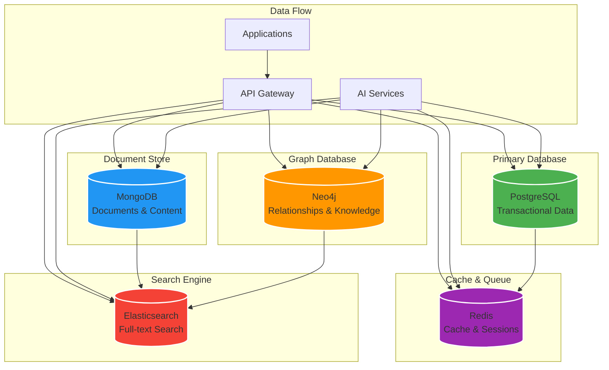

# Database Schema for Modern AI-Powered GRC Platform

This document outlines the complete database schema for the Modern AI-Powered GRC Platform, including PostgreSQL, MongoDB, Neo4j, Redis, and Elasticsearch schemas.

## Database Architecture Overview



## PostgreSQL Schema

### Core Tables

#### Users Table
```sql
CREATE TABLE users (
    id UUID PRIMARY KEY DEFAULT gen_random_uuid(),
    email VARCHAR(255) UNIQUE NOT NULL,
    first_name VARCHAR(100),
    last_name VARCHAR(100),
    phone VARCHAR(20),
    avatar_url VARCHAR(500),
    role user_role DEFAULT 'user',
    status user_status DEFAULT 'active',
    email_verified BOOLEAN DEFAULT false,
    phone_verified BOOLEAN DEFAULT false,
    last_login_at TIMESTAMP,
    password_changed_at TIMESTAMP,
    created_at TIMESTAMP DEFAULT NOW(),
    updated_at TIMESTAMP DEFAULT NOW(),
    
    -- Indexes
    CONSTRAINT users_email_check CHECK (email ~* '^[A-Za-z0-9._%+-]+@[A-Za-z0-9.-]+\.[A-Za-z]{2,}$')
);

-- Enums
CREATE TYPE user_role AS ENUM ('super_admin', 'admin', 'compliance_officer', 'risk_manager', 'auditor', 'user');
CREATE TYPE user_status AS ENUM ('active', 'inactive', 'suspended', 'pending');

-- Indexes
CREATE INDEX idx_users_email ON users(email);
CREATE INDEX idx_users_role ON users(role);
CREATE INDEX idx_users_status ON users(status);
CREATE INDEX idx_users_created_at ON users(created_at);
```

#### Organizations Table
```sql
CREATE TABLE organizations (
    id UUID PRIMARY KEY DEFAULT gen_random_uuid(),
    name VARCHAR(255) NOT NULL,
    legal_name VARCHAR(255),
    registration_number VARCHAR(100),
    tax_id VARCHAR(50),
    country VARCHAR(100) NOT NULL,
    state_province VARCHAR(100),
    city VARCHAR(100),
    address TEXT,
    postal_code VARCHAR(20),
    phone VARCHAR(20),
    website VARCHAR(255),
    industry VARCHAR(100),
    company_size VARCHAR(50),
    logo_url VARCHAR(500),
    timezone VARCHAR(50) DEFAULT 'UTC',
    language VARCHAR(10) DEFAULT 'en',
    status org_status DEFAULT 'active',
    subscription_plan VARCHAR(50) DEFAULT 'trial',
    subscription_expires_at TIMESTAMP,
    created_at TIMESTAMP DEFAULT NOW(),
    updated_at TIMESTAMP DEFAULT NOW()
);

-- Enums
CREATE TYPE org_status AS ENUM ('active', 'inactive', 'suspended', 'trial');

-- Indexes
CREATE INDEX idx_organizations_country ON organizations(country);
CREATE INDEX idx_organizations_industry ON organizations(industry);
CREATE INDEX idx_organizations_status ON organizations(status);
```

#### User Organizations Table
```sql
CREATE TABLE user_organizations (
    id UUID PRIMARY KEY DEFAULT gen_random_uuid(),
    user_id UUID NOT NULL REFERENCES users(id) ON DELETE CASCADE,
    organization_id UUID NOT NULL REFERENCES organizations(id) ON DELETE CASCADE,
    role user_org_role NOT NULL,
    permissions JSONB DEFAULT '[]',
    is_default BOOLEAN DEFAULT false,
    invited_by UUID REFERENCES users(id),
    invited_at TIMESTAMP,
    joined_at TIMESTAMP DEFAULT NOW(),
    created_at TIMESTAMP DEFAULT NOW(),
    updated_at TIMESTAMP DEFAULT NOW(),
    
    UNIQUE(user_id, organization_id)
);

-- Enums
CREATE TYPE user_org_role AS ENUM ('owner', 'admin', 'manager', 'member', 'viewer');

-- Indexes
CREATE INDEX idx_user_organizations_user_id ON user_organizations(user_id);
CREATE INDEX idx_user_organizations_org_id ON user_organizations(organization_id);
CREATE INDEX idx_user_organizations_role ON user_organizations(role);
```

#### Compliance Frameworks Table
```sql
CREATE TABLE compliance_frameworks (
    id UUID PRIMARY KEY DEFAULT gen_random_uuid(),
    name VARCHAR(255) NOT NULL,
    code VARCHAR(50) UNIQUE NOT NULL,
    description TEXT,
    country VARCHAR(100),
    authority VARCHAR(255),
    version VARCHAR(20),
    status framework_status DEFAULT 'active',
    is_custom BOOLEAN DEFAULT false,
    organization_id UUID REFERENCES organizations(id),
    created_at TIMESTAMP DEFAULT NOW(),
    updated_at TIMESTAMP DEFAULT NOW()
);

-- Enums
CREATE TYPE framework_status AS ENUM ('active', 'deprecated', 'draft');

-- Indexes
CREATE INDEX idx_compliance_frameworks_code ON compliance_frameworks(code);
CREATE INDEX idx_compliance_frameworks_country ON compliance_frameworks(country);
CREATE INDEX idx_compliance_frameworks_status ON compliance_frameworks(status);
```

#### Compliance Requirements Table
```sql
CREATE TABLE compliance_requirements (
    id UUID PRIMARY KEY DEFAULT gen_random_uuid(),
    framework_id UUID NOT NULL REFERENCES compliance_frameworks(id) ON DELETE CASCADE,
    code VARCHAR(100) NOT NULL,
    title VARCHAR(255) NOT NULL,
    description TEXT,
    category VARCHAR(100),
    subcategory VARCHAR(100),
    priority req_priority DEFAULT 'medium',
    requirement_type VARCHAR(50),
    evidence_required BOOLEAN DEFAULT false,
    assessment_frequency VARCHAR(50),
    status requirement_status DEFAULT 'active',
    parent_requirement_id UUID REFERENCES compliance_requirements(id),
    order_index INTEGER DEFAULT 0,
    metadata JSONB DEFAULT '{}',
    created_at TIMESTAMP DEFAULT NOW(),
    updated_at TIMESTAMP DEFAULT NOW(),
    
    UNIQUE(framework_id, code)
);

-- Enums
CREATE TYPE req_priority AS ENUM ('critical', 'high', 'medium', 'low');
CREATE TYPE requirement_status AS ENUM ('active', 'deprecated', 'draft');

-- Indexes
CREATE INDEX idx_compliance_requirements_framework_id ON compliance_requirements(framework_id);
CREATE INDEX idx_compliance_requirements_code ON compliance_requirements(code);
CREATE INDEX idx_compliance_requirements_category ON compliance_requirements(category);
CREATE INDEX idx_compliance_requirements_priority ON compliance_requirements(priority);
CREATE INDEX idx_compliance_requirements_status ON compliance_requirements(status);
```

#### Controls Table
```sql
CREATE TABLE controls (
    id UUID PRIMARY KEY DEFAULT gen_random_uuid(),
    title VARCHAR(255) NOT NULL,
    description TEXT,
    control_type control_type_enum NOT NULL,
    control_family VARCHAR(100),
    implementation_status control_status DEFAULT 'planned',
    effectiveness_score INTEGER CHECK (effectiveness_score >= 0 AND effectiveness_score <= 100),
    automation_level automation_level_enum DEFAULT 'manual',
    frequency VARCHAR(50),
    owner_id UUID REFERENCES users(id),
    organization_id UUID NOT NULL REFERENCES organizations(id) ON DELETE CASCADE,
    parent_control_id UUID REFERENCES controls(id),
    order_index INTEGER DEFAULT 0,
    metadata JSONB DEFAULT '{}',
    created_at TIMESTAMP DEFAULT NOW(),
    updated_at TIMESTAMP DEFAULT NOW()
);

-- Enums
CREATE TYPE control_type_enum AS ENUM ('preventive', 'detective', 'corrective', 'compensating');
CREATE TYPE control_status AS ENUM ('planned', 'implemented', 'tested', 'effective', 'ineffective', 'deprecated');
CREATE TYPE automation_level_enum AS ENUM ('manual', 'semi_automated', 'automated', 'fully_automated');

-- Indexes
CREATE INDEX idx_controls_organization_id ON controls(organization_id);
CREATE INDEX idx_controls_type ON controls(control_type);
CREATE INDEX idx_controls_status ON controls(implementation_status);
CREATE INDEX idx_controls_owner_id ON controls(owner_id);
```

#### Control Requirement Mapping Table
```sql
CREATE TABLE control_requirement_mapping (
    id UUID PRIMARY KEY DEFAULT gen_random_uuid(),
    control_id UUID NOT NULL REFERENCES controls(id) ON DELETE CASCADE,
    requirement_id UUID NOT NULL REFERENCES compliance_requirements(id) ON DELETE CASCADE,
    mapping_strength mapping_strength_enum DEFAULT 'partial',
    notes TEXT,
    created_by UUID REFERENCES users(id),
    created_at TIMESTAMP DEFAULT NOW(),
    updated_at TIMESTAMP DEFAULT NOW(),
    
    UNIQUE(control_id, requirement_id)
);

-- Enums
CREATE TYPE mapping_strength_enum AS ENUM ('full', 'partial', 'minimal');

-- Indexes
CREATE INDEX idx_control_requirement_mapping_control_id ON control_requirement_mapping(control_id);
CREATE INDEX idx_control_requirement_mapping_requirement_id ON control_requirement_mapping(requirement_id);
```

#### Risks Table
```sql
CREATE TABLE risks (
    id UUID PRIMARY KEY DEFAULT gen_random_uuid(),
    title VARCHAR(255) NOT NULL,
    description TEXT,
    risk_category VARCHAR(100),
    risk_type VARCHAR(100),
    likelihood INTEGER CHECK (likelihood >= 1 AND likelihood <= 5),
    impact INTEGER CHECK (impact >= 1 AND impact <= 5),
    risk_score INTEGER GENERATED ALWAYS AS (likelihood * impact) STORED,
    risk_level risk_level_enum GENERATED ALWAYS AS (
        CASE 
            WHEN (likelihood * impact) >= 15 THEN 'critical'
            WHEN (likelihood * impact) >= 10 THEN 'high'
            WHEN (likelihood * impact) >= 5 THEN 'medium'
            ELSE 'low'
        END
    ) STORED,
    status risk_status DEFAULT 'identified',
    owner_id UUID REFERENCES users(id),
    organization_id UUID NOT NULL REFERENCES organizations(id) ON DELETE CASCADE,
    parent_risk_id UUID REFERENCES risks(id),
    external_references JSONB DEFAULT '[]',
    metadata JSONB DEFAULT '{}',
    created_at TIMESTAMP DEFAULT NOW(),
    updated_at TIMESTAMP DEFAULT NOW()
);

-- Enums
CREATE TYPE risk_level_enum AS ENUM ('critical', 'high', 'medium', 'low');
CREATE TYPE risk_status AS ENUM ('identified', 'assessed', 'mitigated', 'accepted', 'transferred', 'closed');

-- Indexes
CREATE INDEX idx_risks_organization_id ON risks(organization_id);
CREATE INDEX idx_risks_category ON risks(risk_category);
CREATE INDEX idx_risks_level ON risks(risk_level);
CREATE INDEX idx_risks_status ON risks(risk_status);
CREATE INDEX idx_risks_owner_id ON risks(owner_id);
CREATE INDEX idx_risks_risk_score ON risks(risk_score);
```

#### Risk Control Mapping Table
```sql
CREATE TABLE risk_control_mapping (
    id UUID PRIMARY KEY DEFAULT gen_random_uuid(),
    risk_id UUID NOT NULL REFERENCES risks(id) ON DELETE CASCADE,
    control_id UUID NOT NULL REFERENCES controls(id) ON DELETE CASCADE,
    effectiveness INTEGER CHECK (effectiveness >= 0 AND effectiveness <= 100),
    notes TEXT,
    created_by UUID REFERENCES users(id),
    created_at TIMESTAMP DEFAULT NOW(),
    updated_at TIMESTAMP DEFAULT NOW(),
    
    UNIQUE(risk_id, control_id)
);

-- Indexes
CREATE INDEX idx_risk_control_mapping_risk_id ON risk_control_mapping(risk_id);
CREATE INDEX idx_risk_control_mapping_control_id ON risk_control_mapping(control_id);
```

#### Audits Table
```sql
CREATE TABLE audits (
    id UUID PRIMARY KEY DEFAULT gen_random_uuid(),
    title VARCHAR(255) NOT NULL,
    description TEXT,
    audit_type audit_type_enum NOT NULL,
    status audit_status DEFAULT 'planned',
    start_date DATE,
    end_date DATE,
    scope TEXT,
    criteria TEXT,
    organization_id UUID NOT NULL REFERENCES organizations(id) ON DELETE CASCADE,
    lead_auditor_id UUID REFERENCES users(id),
    team_members JSONB DEFAULT '[]',
    findings JSONB DEFAULT '[]',
    recommendations JSONB DEFAULT '[]',
    overall_score INTEGER CHECK (overall_score >= 0 AND overall_score <= 100),
    report_url VARCHAR(500),
    metadata JSONB DEFAULT '{}',
    created_at TIMESTAMP DEFAULT NOW(),
    updated_at TIMESTAMP DEFAULT NOW()
);

-- Enums
CREATE TYPE audit_type_enum AS ENUM ('internal', 'external', 'regulatory', 'supplier');
CREATE TYPE audit_status AS ENUM ('planned', 'in_progress', 'completed', 'cancelled');

-- Indexes
CREATE INDEX idx_audits_organization_id ON audits(organization_id);
CREATE INDEX idx_audits_type ON audits(audit_type);
CREATE INDEX idx_audits_status ON audits(audit_status);
CREATE INDEX idx_audits_start_date ON audits(start_date);
CREATE INDEX idx_audits_lead_auditor_id ON audits(lead_auditor_id);
```

#### Tasks Table
```sql
CREATE TABLE tasks (
    id UUID PRIMARY KEY DEFAULT gen_random_uuid(),
    title VARCHAR(255) NOT NULL,
    description TEXT,
    task_type task_type_enum NOT NULL,
    priority task_priority DEFAULT 'medium',
    status task_status DEFAULT 'todo',
    due_date TIMESTAMP,
    assigned_to UUID REFERENCES users(id),
    assigned_by UUID REFERENCES users(id),
    organization_id UUID NOT NULL REFERENCES organizations(id) ON DELETE CASCADE,
    related_entity_type VARCHAR(50),
    related_entity_id UUID,
    checklist JSONB DEFAULT '[]',
    attachments JSONB DEFAULT '[]',
    completion_notes TEXT,
    completed_at TIMESTAMP,
    metadata JSONB DEFAULT '{}',
    created_at TIMESTAMP DEFAULT NOW(),
    updated_at TIMESTAMP DEFAULT NOW()
);

-- Enums
CREATE TYPE task_type_enum AS ENUM ('risk_mitigation', 'control_implementation', 'audit_finding', 'compliance_requirement', 'policy_review');
CREATE TYPE task_priority AS ENUM ('critical', 'high', 'medium', 'low');
CREATE TYPE task_status AS ENUM ('todo', 'in_progress', 'review', 'completed', 'cancelled');

-- Indexes
CREATE INDEX idx_tasks_organization_id ON tasks(organization_id);
CREATE INDEX idx_tasks_assigned_to ON tasks(assigned_to);
CREATE INDEX idx_tasks_status ON tasks(status);
CREATE INDEX idx_tasks_priority ON tasks(priority);
CREATE INDEX idx_tasks_due_date ON tasks(due_date);
CREATE INDEX idx_tasks_type ON tasks(task_type);
```

#### Notifications Table
```sql
CREATE TABLE notifications (
    id UUID PRIMARY KEY DEFAULT gen_random_uuid(),
    user_id UUID NOT NULL REFERENCES users(id) ON DELETE CASCADE,
    title VARCHAR(255) NOT NULL,
    message TEXT,
    type notification_type NOT NULL,
    priority notification_priority DEFAULT 'medium',
    status notification_status DEFAULT 'unread',
    action_url VARCHAR(500),
    metadata JSONB DEFAULT '{}',
    expires_at TIMESTAMP,
    read_at TIMESTAMP,
    created_at TIMESTAMP DEFAULT NOW()
);

-- Enums
CREATE TYPE notification_type AS ENUM ('system', 'task_assigned', 'risk_alert', 'compliance_update', 'audit_reminder', 'policy_approval');
CREATE TYPE notification_priority AS ENUM ('low', 'medium', 'high', 'urgent');
CREATE TYPE notification_status AS ENUM ('unread', 'read', 'archived');

-- Indexes
CREATE INDEX idx_notifications_user_id ON notifications(user_id);
CREATE INDEX idx_notifications_status ON notifications(status);
CREATE INDEX idx_notifications_type ON notifications(type);
CREATE INDEX idx_notifications_created_at ON notifications(created_at);
```

### Audit Trail Tables

#### Audit Logs Table
```sql
CREATE TABLE audit_logs (
    id UUID PRIMARY KEY DEFAULT gen_random_uuid(),
    user_id UUID REFERENCES users(id),
    organization_id UUID REFERENCES organizations(id),
    action VARCHAR(100) NOT NULL,
    entity_type VARCHAR(50) NOT NULL,
    entity_id UUID,
    old_values JSONB,
    new_values JSONB,
    ip_address INET,
    user_agent TEXT,
    session_id VARCHAR(255),
    timestamp TIMESTAMP DEFAULT NOW(),
    metadata JSONB DEFAULT '{}'
);

-- Indexes
CREATE INDEX idx_audit_logs_user_id ON audit_logs(user_id);
CREATE INDEX idx_audit_logs_organization_id ON audit_logs(organization_id);
CREATE INDEX idx_audit_logs_action ON audit_logs(action);
CREATE INDEX idx_audit_logs_entity_type ON audit_logs(entity_type);
CREATE INDEX idx_audit_logs_timestamp ON audit_logs(timestamp);
```

### AI Analysis Tables

#### AI Analysis Results Table
```sql
CREATE TABLE ai_analysis_results (
    id UUID PRIMARY KEY DEFAULT gen_random_uuid(),
    entity_type VARCHAR(50) NOT NULL,
    entity_id UUID NOT NULL,
    analysis_type ai_analysis_type NOT NULL,
    model_version VARCHAR(50),
    confidence_score DECIMAL(5,4),
    results JSONB NOT NULL,
    recommendations JSONB DEFAULT '[]',
    processing_time_ms INTEGER,
    created_at TIMESTAMP DEFAULT NOW()
);

-- Enums
CREATE TYPE ai_analysis_type AS ENUM ('compliance_analysis', 'risk_prediction', 'document_analysis', 'anomaly_detection');

-- Indexes
CREATE INDEX idx_ai_analysis_results_entity ON ai_analysis_results(entity_type, entity_id);
CREATE INDEX idx_ai_analysis_results_type ON ai_analysis_results(analysis_type);
CREATE INDEX idx_ai_analysis_results_created_at ON ai_analysis_results(created_at);
```

## MongoDB Schema

### Collections

#### Policies Collection
```javascript
{
  _id: ObjectId,
  title: String,
  content: String,
  summary: String,
  version: Number,
  status: String, // 'draft', 'review', 'approved', 'published', 'archived'
  framework: String, // 'NCA', 'SAMA', 'ADGM', etc.
  language: String, // 'en', 'ar'
  organization_id: UUID,
  metadata: {
    author: {
      id: UUID,
      name: String,
      email: String
    },
    reviewers: [{
      id: UUID,
      name: String,
      email: String,
      status: String, // 'pending', 'approved', 'rejected'
      review_date: Date,
      comments: String
    }],
    approval_date: Date,
    expiry_date: Date,
    review_frequency: String, // 'monthly', 'quarterly', 'annually'
    tags: [String],
    classification: String // 'public', 'internal', 'confidential', 'restricted'
  },
  ai_analysis: {
    compliance_score: Number,
    risk_factors: [String],
    recommendations: [{
      action: String,
      priority: String,
      impact: String
    }],
    related_requirements: [{
      framework: String,
      requirement_id: String,
      relevance_score: Number
    }],
    processing_metadata: {
      model_version: String,
      confidence_score: Number,
      processed_at: Date
    }
  },
  version_history: [{
    version: Number,
    changes: String,
    changed_by: UUID,
    changed_at: Date
  }],
  attachments: [{
    name: String,
    url: String,
    type: String,
    size: Number,
    uploaded_at: Date
  }],
  created_at: Date,
  updated_at: Date,
  
  // Indexes
  indexes: [
    { organization_id: 1 },
    { framework: 1 },
    { status: 1 },
    { language: 1 },
    { "metadata.tags": 1 },
    { title: "text", content: "text", summary: "text" }
  ]
}
```

#### Compliance Reports Collection
```javascript
{
  _id: ObjectId,
  title: String,
  description: String,
  framework: String,
  organization_id: UUID,
  report_type: String, // 'periodic', 'on_demand', 'audit', 'assessment'
  period: {
    start_date: Date,
    end_date: Date
  },
  status: String, // 'generating', 'completed', 'failed'
  compliance_data: {
    overall_score: Number,
    framework_scores: [{
      framework: String,
      score: Number,
      requirements_met: Number,
      total_requirements: Number,
      categories: [{
        name: String,
        score: Number,
        requirements_met: Number,
        total_requirements: Number
      }]
    }],
    gaps: [{
      requirement_id: String,
      requirement_code: String,
      title: String,
      severity: String,
      description: String,
      recommendations: [String]
    }],
    trends: {
      previous_score: Number,
      change: Number,
      trend: String // 'improving', 'stable', 'declining'
    }
  },
  ai_insights: {
    key_findings: [String],
    risk_areas: [String],
    recommendations: [{
      priority: String,
      action: String,
      expected_impact: String
    }],
    predictive_analysis: {
      future_risks: [String],
      compliance_forecast: Number,
      confidence_level: Number
    }
  },
  generated_by: UUID,
  generated_at: Date,
  file_url: String,
  file_size: Number,
  file_format: String, // 'pdf', 'excel', 'word'
  created_at: Date,
  updated_at: Date,
  
  // Indexes
  indexes: [
    { organization_id: 1 },
    { framework: 1 },
    { status: 1 },
    { "period.start_date": 1 },
    { "period.end_date": 1 },
    { generated_at: -1 }
  ]
}
```

#### Document Evidence Collection
```javascript
{
  _id: ObjectId,
  title: String,
  description: String,
  file_url: String,
  file_name: String,
  file_type: String,
  file_size: Number,
  mime_type: String,
  organization_id: UUID,
  related_entity: {
    type: String, // 'risk', 'control', 'requirement', 'audit'
    id: UUID
  },
  metadata: {
    uploaded_by: UUID,
    upload_date: Date,
    last_modified: Date,
    version: Number,
    classification: String,
    retention_period: String,
    tags: [String],
    custom_fields: Object
  },
  ai_analysis: {
    content_extracted: String,
    entities: [{
      type: String,
      value: String,
      confidence: Number
    }],
    sentiment: {
      score: Number,
      magnitude: Number
    },
    classification: {
      category: String,
      confidence: Number
    },
    processing_metadata: {
      ocr_used: Boolean,
      language_detected: String,
      processing_time: Number
    }
  },
  access_control: {
    permissions: [{
      user_id: UUID,
      role: String,
      granted_by: UUID,
      granted_at: Date
    }],
    public_access: Boolean
  },
  created_at: Date,
  updated_at: Date,
  
  // Indexes
  indexes: [
    { organization_id: 1 },
    { "related_entity.type": 1, "related_entity.id": 1 },
    { "metadata.uploaded_by": 1 },
    { "metadata.tags": 1 },
    { title: "text", description: "text", "ai_analysis.content_extracted": "text" }
  ]
}
```

## Neo4j Schema

### Nodes

#### User Nodes
```cypher
CREATE CONSTRAINT user_id_unique IF NOT EXISTS FOR (u:User) REQUIRE u.id IS UNIQUE;
CREATE INDEX user_email_index IF NOT EXISTS FOR (u:User) ON (u.email);
CREATE INDEX user_role_index IF NOT EXISTS FOR (u:User) ON (u.role);

(:User {
  id: UUID,
  email: String,
  firstName: String,
  lastName: String,
  role: String,
  organizationId: UUID,
  createdAt: DateTime,
  updatedAt: DateTime
})
```

#### Organization Nodes
```cypher
CREATE CONSTRAINT org_id_unique IF NOT EXISTS FOR (o:Organization) REQUIRE o.id IS UNIQUE;
CREATE INDEX org_name_index IF NOT EXISTS FOR (o:Organization) ON (o.name);
CREATE INDEX org_country_index IF NOT EXISTS FOR (o:Organization) ON (o.country);

(:Organization {
  id: UUID,
  name: String,
  country: String,
  industry: String,
  createdAt: DateTime,
  updatedAt: DateTime
})
```

#### Policy Nodes
```cypher
CREATE CONSTRAINT policy_id_unique IF NOT EXISTS FOR (p:Policy) REQUIRE p.id IS UNIQUE;
CREATE INDEX policy_title_index IF NOT EXISTS FOR (p:Policy) ON (p.title);
CREATE INDEX policy_framework_index IF NOT EXISTS FOR (p:Policy) ON (p.framework);

(:Policy {
  id: UUID,
  title: String,
  framework: String,
  status: String,
  language: String,
  organizationId: UUID,
  createdAt: DateTime,
  updatedAt: DateTime
})
```

#### Risk Nodes
```cypher
CREATE CONSTRAINT risk_id_unique IF NOT EXISTS FOR (r:Risk) REQUIRE r.id IS UNIQUE;
CREATE INDEX risk_title_index IF NOT EXISTS FOR (r:Risk) ON (r.title);
CREATE INDEX risk_category_index IF NOT EXISTS FOR (r:Risk) ON (r.category);
CREATE INDEX risk_level_index IF NOT EXISTS FOR (r:Risk) ON (r.level);

(:Risk {
  id: UUID,
  title: String,
  category: String,
  level: String,
  score: Integer,
  organizationId: UUID,
  createdAt: DateTime,
  updatedAt: DateTime
})
```

#### Control Nodes
```cypher
CREATE CONSTRAINT control_id_unique IF NOT EXISTS FOR (c:Control) REQUIRE c.id IS UNIQUE;
CREATE INDEX control_title_index IF NOT EXISTS FOR (c:Control) ON (c.title);
CREATE INDEX control_type_index IF NOT EXISTS FOR (c:Control) ON (c.type);

(:Control {
  id: UUID,
  title: String,
  type: String,
  status: String,
  effectiveness: Integer,
  organizationId: UUID,
  createdAt: DateTime,
  updatedAt: DateTime
})
```

#### Requirement Nodes
```cypher
CREATE CONSTRAINT requirement_id_unique IF NOT EXISTS FOR (req:Requirement) REQUIRE req.id IS UNIQUE;
CREATE INDEX requirement_code_index IF NOT EXISTS FOR (req:Requirement) ON (req.code);
CREATE INDEX requirement_framework_index IF NOT EXISTS FOR (req:Requirement) ON (req.framework);

(:Requirement {
  id: UUID,
  code: String,
  title: String,
  framework: String,
  category: String,
  priority: String,
  createdAt: DateTime,
  updatedAt: DateTime
})
```

### Relationships

#### User Relationships
```cypher
// User works for Organization
(:User)-[:WORKS_FOR {role: String, joinedAt: DateTime}]->(:Organization)

// User owns Risk
(:User)-[:OWNS {since: DateTime}]->(:Risk)

// User manages Control
(:User)-[:MANAGES {since: DateTime}]->(:Control)

// User created Policy
(:User)-[:CREATED {createdAt: DateTime}]->(:Policy)

// User reviewed Policy
(:User)-[:REVIEWED {status: String, reviewedAt: DateTime, comments: String}]->(:Policy)
```

#### Risk Relationships
```cypher
// Risk mitigated by Control
(:Risk)-[:MITIGATED_BY {effectiveness: Integer, implementedAt: DateTime}]->(:Control)

// Risk related to Risk
(:Risk)-[:RELATED_TO {relationship: String, strength: Float}]->(:Risk)

// Risk impacts Requirement
(:Risk)-[:IMPACTS {severity: String}]->(:Requirement)

// Risk addressed by Policy
(:Risk)-[:ADDRESSED_BY {relevance: Float}]->(:Policy)
```

#### Control Relationships
```cypher
// Control satisfies Requirement
(:Control)-[:SATISFIES {strength: String, coverage: Float}]->(:Requirement)

// Control implements Policy
(:Control)-[:IMPLEMENTS {implementationDate: DateTime}]->(:Policy)

// Control depends on Control
(:Control)-[:DEPENDS_ON {dependencyType: String}]->(:Control)
```

#### Requirement Relationships
```cypher
// Requirement part of Framework
(:Requirement)-[:PART_OF {category: String, order: Integer}]->(:Framework)

// Requirement references Requirement
(:Requirement)-[:REFERENCES {relationship: String}]->(:Requirement)

// Requirement enforced by Policy
(:Requirement)-[:ENFORCED_BY {strength: Float}]->(:Policy)
```

### Sample Graph Queries

#### Get Risk-Control-Requirement Network
```cypher
MATCH (org:Organization {id: $orgId})<-[:WORKS_FOR]-(user:User)
MATCH (org)-[:HAS_RISK]->(risk:Risk)
MATCH (risk)-[:MITIGATED_BY]->(control:Control)
MATCH (control)-[:SATISFIES]->(requirement:Requirement)
RETURN risk, control, requirement, user
LIMIT 100
```

#### Find Compliance Gaps
```cypher
MATCH (org:Organization {id: $orgId})
MATCH (requirement:Requirement {framework: $framework})
OPTIONAL MATCH (requirement)<-[:SATISFIES]-(control:Control {organizationId: $orgId})
WHERE control IS NULL
RETURN requirement as gap
ORDER BY requirement.priority
```

#### Get User Influence Network
```cypher
MATCH (user:User {id: $userId})-[:WORKS_FOR]->(org:Organization)
MATCH (user)-[:OWNS|MANAGES|CREATED]-(entity)
RETURN org, user, entity
```

## Redis Schema

### Data Structures

#### Session Storage
```redis
# User sessions
session:{sessionId} -> {
  "userId": "uuid",
  "email": "user@example.com",
  "role": "compliance_officer",
  "organizationId": "uuid",
  "createdAt": "timestamp",
  "expiresAt": "timestamp",
  "lastActivity": "timestamp"
}
# TTL: 24 hours

# JWT token blacklist
blacklist:{tokenId} -> "1"
# TTL: token expiration time
```

#### Cache Storage
```redis
# API response cache
cache:api:{endpoint}:{params_hash} -> {
  "data": {...},
  "timestamp": "timestamp",
  "ttl": 3600
}
# TTL: 1 hour

# User permissions cache
cache:user:{userId}:permissions -> {
  "permissions": [...],
  "roles": [...],
  "timestamp": "timestamp"
}
# TTL: 30 minutes

# Organization settings cache
cache:org:{orgId}:settings -> {
  "settings": {...},
  "timestamp": "timestamp"
}
# TTL: 1 hour
```

#### Rate Limiting
```redis
# Rate limiting per user
rate_limit:user:{userId}:hour -> counter
# TTL: 1 hour

rate_limit:user:{userId}:minute -> counter
# TTL: 1 minute

# Rate limiting per IP
rate_limit:ip:{ipAddress}:hour -> counter
# TTL: 1 hour
```

#### Real-time Notifications
```redis
# User notification queues
notifications:user:{userId} -> [
  {
    "id": "uuid",
    "type": "task_assigned",
    "title": "New task assigned",
    "message": "You have been assigned a new risk mitigation task",
    "timestamp": "timestamp",
    "read": false
  }
]

# Organization activity stream
activity:org:{orgId} -> [
  {
    "type": "risk_created",
    "userId": "uuid",
    "entityId": "uuid",
    "message": "New risk identified: Data Breach Risk",
    "timestamp": "timestamp"
  }
]
```

#### Background Jobs
```redis
# Job queues
jobs:ai_analysis -> [
  {
    "id": "job_uuid",
    "type": "document_analysis",
    "entityId": "uuid",
    "status": "pending",
    "createdAt": "timestamp",
    "attempts": 0
  }
]

jobs:email_notifications -> [...]
jobs:report_generation -> [...]
```

## Elasticsearch Schema

### Indices

#### Policies Index
```json
{
  "mappings": {
    "properties": {
      "title": {
        "type": "text",
        "analyzer": "standard",
        "fields": {
          "keyword": {
            "type": "keyword"
          }
        }
      },
      "content": {
        "type": "text",
        "analyzer": "standard"
      },
      "summary": {
        "type": "text",
        "analyzer": "standard"
      },
      "framework": {
        "type": "keyword"
      },
      "status": {
        "type": "keyword"
      },
      "language": {
        "type": "keyword"
      },
      "organizationId": {
        "type": "keyword"
      },
      "metadata": {
        "properties": {
          "tags": {
            "type": "keyword"
          },
          "classification": {
            "type": "keyword"
          },
          "author": {
            "properties": {
              "name": {
                "type": "text",
                "fields": {
                  "keyword": {
                    "type": "keyword"
                  }
                }
              }
            }
          }
        }
      },
      "ai_analysis": {
        "properties": {
          "compliance_score": {
            "type": "float"
          },
          "risk_factors": {
            "type": "keyword"
          }
        }
      },
      "createdAt": {
        "type": "date"
      },
      "updatedAt": {
        "type": "date"
      }
    }
  },
  "settings": {
    "analysis": {
      "analyzers": {
        "arabic_analyzer": {
          "type": "custom",
          "tokenizer": "standard",
          "filter": ["lowercase", "arabic_normalization"]
        }
      }
    }
  }
}
```

#### Compliance Requirements Index
```json
{
  "mappings": {
    "properties": {
      "code": {
        "type": "keyword"
      },
      "title": {
        "type": "text",
        "analyzer": "standard",
        "fields": {
          "keyword": {
            "type": "keyword"
          }
        }
      },
      "description": {
        "type": "text",
        "analyzer": "standard"
      },
      "framework": {
        "type": "keyword"
      },
      "category": {
        "type": "keyword"
      },
      "priority": {
        "type": "keyword"
      },
      "status": {
        "type": "keyword"
      }
    }
  }
}
```

#### Risks Index
```json
{
  "mappings": {
    "properties": {
      "title": {
        "type": "text",
        "analyzer": "standard",
        "fields": {
          "keyword": {
            "type": "keyword"
          }
        }
      },
      "description": {
        "type": "text",
        "analyzer": "standard"
      },
      "category": {
        "type": "keyword"
      },
      "level": {
        "type": "keyword"
      },
      "score": {
        "type": "integer"
      },
      "status": {
        "type": "keyword"
      },
      "organizationId": {
        "type": "keyword"
      },
      "owner": {
        "properties": {
          "name": {
            "type": "text",
            "fields": {
              "keyword": {
                "type": "keyword"
              }
            }
          }
        }
      }
    }
  }
}
```

### Search Queries

#### Multi-language Search
```json
{
  "query": {
    "multi_match": {
      "query": "access control",
      "fields": ["title^3", "content", "summary"],
      "analyzer": "standard"
    }
  },
  "filter": [
    {
      "term": {
        "organizationId": "org-uuid"
      }
    },
    {
      "term": {
        "language": "en"
      }
    }
  ]
}
```

#### Compliance Search
```json
{
  "query": {
    "bool": {
      "must": [
        {
          "match": {
            "description": "data protection"
          }
        }
      ],
      "filter": [
        {
          "term": {
            "framework": "NCA"
          }
        },
        {
          "term": {
            "status": "active"
          }
        }
      ]
    }
  }
}
```

This comprehensive database schema provides the foundation for implementing the Modern AI-Powered GRC Platform with proper data relationships, indexing strategies, and optimization for performance and scalability.