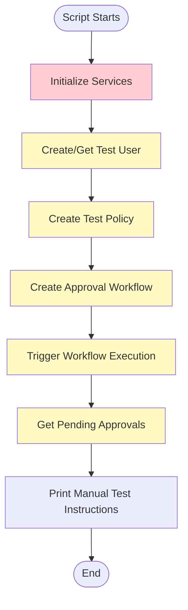

# Digital Signature Test Script Analysis

## File Location
`backend/src/scripts/test-digital-signature.js`

## Purpose
This script is designed to test the digital signature functionality in workflow approvals by:
1. Creating test data (user, policy, workflow)
2. Triggering a workflow execution
3. Creating pending approvals
4. Providing manual testing instructions

## Current Implementation Status

### ✅ What Works
- Script structure and flow logic
- Test data creation approach
- Manual testing instructions

### ❌ Issues Found

#### 1. **TypeScript/JavaScript Mismatch**
The script uses `require()` to import TypeScript services, which won't work:
```javascript
const { WorkflowService } = require('../../../src/workflow/services/workflow.service');
```
**Problem**: Services are TypeScript files (`.ts`), not JavaScript (`.js`). Node.js can't directly require TypeScript files.

**Solution Options**:
- Convert to TypeScript (`.ts`) and use `ts-node`
- Use compiled JavaScript from `dist/` folder
- Create a proper test using Jest/NestJS testing utilities

#### 2. **Entity Path Configuration**
```javascript
entities: ['src/**/*.entity.{ts,js}'],
```
**Problem**: This string pattern won't work with TypeORM DataSource. Needs actual entity classes or proper glob resolution.

**Solution**: Use the same pattern as `data-source.ts`:
```typescript
entities: [__dirname + '/../**/*.entity{.ts,.js}'],
```

#### 3. **Repository Access**
```javascript
dataSource.getRepository('Workflow')
```
**Problem**: `getRepository()` with string names doesn't work. Need actual entity classes.

**Solution**: Import entity classes and use them:
```typescript
import { Workflow } from '../workflow/entities/workflow.entity';
dataSource.getRepository(Workflow)
```

#### 4. **Database Name**
```javascript
database: process.env.DB_DATABASE || 'stratagem',
```
**Problem**: Should be `'grc_platform'` based on docker-compose.yml configuration.

#### 5. **Service Dependencies**
The services require proper dependency injection setup. Creating them manually won't work correctly because:
- Services may have other dependencies (Bull queues, Redis, etc.)
- Services need proper NestJS module context
- Some services use decorators that require NestJS DI container

#### 6. **Missing Error Handling**
- No validation of database connection
- No cleanup of test data
- No rollback on errors

## Recommended Solutions

### Option 1: Convert to TypeScript Test (Recommended)

Create a proper TypeScript test file that uses NestJS testing utilities:

```typescript
// backend/src/scripts/test-digital-signature.ts
import { Test } from '@nestjs/testing';
import { TypeOrmModule } from '@nestjs/typeorm';
import { WorkflowModule } from '../workflow/workflow.module';
import { PolicyModule } from '../policy/policy.module';
import { UsersModule } from '../users/users.module';
import { WorkflowService } from '../workflow/services/workflow.service';
// ... other imports

async function main() {
  const moduleRef = await Test.createTestingModule({
    imports: [
      TypeOrmModule.forRoot({
        // Use same config as data-source.ts
      }),
      WorkflowModule,
      PolicyModule,
      UsersModule,
    ],
  }).compile();

  const workflowService = moduleRef.get(WorkflowService);
  // ... rest of test logic
}
```

### Option 2: Use Compiled JavaScript

If keeping as JavaScript, use compiled files from `dist/`:

```javascript
const { WorkflowService } = require('../../dist/workflow/services/workflow.service');
```

But this still has dependency injection issues.

### Option 3: Create E2E Test

Use NestJS E2E testing framework:

```typescript
// backend/test/workflow/digital-signature.e2e-spec.ts
describe('Digital Signature (e2e)', () => {
  // Use proper E2E test setup
});
```

### Option 4: API-Based Test Script

Create a simpler script that calls the API endpoints:

```javascript
// Use axios to call the actual running API
const axios = require('axios');

async function testDigitalSignature() {
  const baseURL = process.env.API_URL || 'http://localhost:3001';
  
  // Create policy via API
  const policy = await axios.post(`${baseURL}/api/v1/policies`, {...});
  
  // Create workflow via API
  const workflow = await axios.post(`${baseURL}/api/v1/workflows`, {...});
  
  // Execute workflow via API
  const execution = await axios.post(`${baseURL}/api/v1/workflows/${workflow.id}/execute`, {...});
  
  // Get pending approvals via API
  const approvals = await axios.get(`${baseURL}/api/v1/workflows/my-approvals`);
  
  // Approve with signature via API
  await axios.post(`${baseURL}/api/v1/workflows/approvals/${approval.id}/approve`, {
    signature: {
      signatureData: 'base64...',
      signatureMethod: 'drawn',
    }
  });
}
```

## Current Script Flow



## Issues Breakdown

| Issue | Severity | Impact | Fix Complexity |
|-------|----------|--------|----------------|
| TypeScript import | 🔴 Critical | Script won't run | Medium |
| Entity path config | 🔴 Critical | DataSource won't initialize | Low |
| Repository string names | 🔴 Critical | Repositories won't work | Medium |
| Database name | 🟡 Medium | Wrong database connection | Low |
| Service dependencies | 🔴 Critical | Services won't work correctly | High |
| Missing error handling | 🟡 Medium | Poor error messages | Low |

## Recommended Fix

**Best Approach**: Convert to TypeScript and use proper NestJS testing setup:

1. **Rename file**: `test-digital-signature.js` → `test-digital-signature.ts`
2. **Use ts-node**: Update package.json script to use `ts-node`
3. **Import properly**: Use TypeScript imports
4. **Use data-source.ts**: Reuse existing DataSource configuration
5. **Use entity classes**: Import actual entity classes
6. **Add error handling**: Proper try-catch and cleanup

## Updated Package.json Script

```json
{
  "scripts": {
    "test:signature": "ts-node -r tsconfig-paths/register ./src/scripts/test-digital-signature.ts"
  }
}
```

## Testing the Digital Signature Feature

The digital signature feature itself appears to be **fully implemented**:

✅ **Backend**:
- `WorkflowApproval` entity has signature fields
- Migration exists: `AddSignatureFieldsToWorkflowApprovals`
- API endpoint: `POST /workflows/approvals/:id/approve` accepts signature
- Service method: `approve()` handles signature data
- DTO: `CaptureSignatureDto` for signature input

✅ **Database**:
- `signature_data` (text) - Base64 encoded image
- `signature_timestamp` (timestamp)
- `signature_method` (varchar) - 'drawn' or 'uploaded'
- `signature_metadata` (jsonb) - IP, user agent, etc.

❓ **Frontend**: Need to verify if signature capture UI exists

## Next Steps

1. **Fix the test script** using one of the recommended approaches
2. **Verify frontend implementation** for signature capture
3. **Test end-to-end** workflow with digital signature
4. **Document the feature** if not already documented

---

**Last Updated**: December 2025  
**Status**: Script needs fixes to work properly


