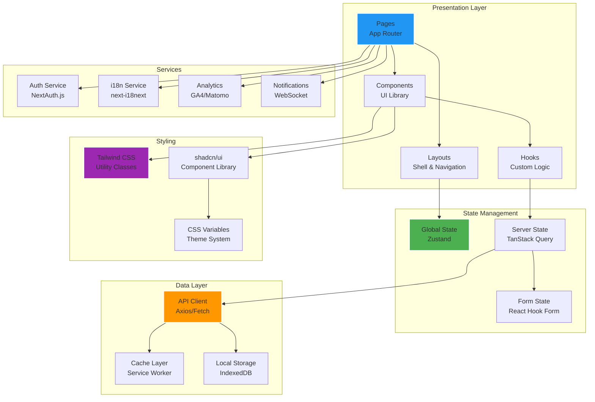

# Frontend Architecture for Modern AI-Powered GRC Platform

This document outlines the complete frontend architecture for the Modern AI-Powered GRC Platform using Next.js 14, React 18, and TypeScript.

## Architecture Overview



## Project Structure

```
frontend/
├── public/                          # Static assets
│   ├── icons/                       # Favicon, app icons
│   ├── images/                      # Static images
│   ├── locales/                     # Translation files
│   │   ├── en/
│   │   │   └── common.json
│   │   └── ar/
│   │       └── common.json
│   └── manifest.json               # PWA manifest
├── src/
│   ├── app/                        # Next.js App Router
│   │   ├── [locale]/              # Internationalized routes
│   │   │   ├── (auth)/           # Auth group
│   │   │   │   ├── login/
│   │   │   │   ├── register/
│   │   │   │   └── reset-password/
│   │   │   ├── (dashboard)/       # Dashboard group
│   │   │   │   ├── layout.tsx
│   │   │   │   ├── page.tsx
│   │   │   │   ├── policies/
│   │   │   │   ├── risks/
│   │   │   │   ├── compliance/
│   │   │   │   ├── audits/
│   │   │   │   └── settings/
│   │   │   ├── (marketing)/       # Public pages
│   │   │   │   ├── layout.tsx
│   │   │   │   ├── page.tsx
│   │   │   │   ├── features/
│   │   │   │   ├── about/
│   │   │   │   ├── contact/
│   │   │   │   └── pricing/
│   │   │   ├── api/               # API routes
│   │   │   │   ├── auth/
│   │   │   │   ├── users/
│   │   │   │   └── webhook/
│   │   │   ├── globals.css
│   │   │   ├── layout.tsx
│   │   │   └── not-found.tsx
│   │   └── sitemap.xml
│   ├── components/                 # Reusable components
│   │   ├── ui/                   # Base UI components
│   │   │   ├── button.tsx
│   │   │   ├── input.tsx
│   │   │   ├── modal.tsx
│   │   │   ├── dropdown.tsx
│   │   │   ├── table.tsx
│   │   │   ├── card.tsx
│   │   │   ├── badge.tsx
│   │   │   ├── avatar.tsx
│   │   │   ├── loading.tsx
│   │   │   └── index.ts
│   │   ├── forms/                 # Form components
│   │   │   ├── login-form.tsx
│   │   │   ├── register-form.tsx
│   │   │   ├── policy-form.tsx
│   │   │   ├── risk-form.tsx
│   │   │   └── user-profile-form.tsx
│   │   ├── layout/                # Layout components
│   │   │   ├── header.tsx
│   │   │   ├── sidebar.tsx
│   │   │   ├── footer.tsx
│   │   │   ├── navigation.tsx
│   │   │   └── breadcrumb.tsx
│   │   ├── dashboard/             # Dashboard components
│   │   │   ├── widgets/
│   │   │   │   ├── risk-heatmap.tsx
│   │   │   │   ├── compliance-status.tsx
│   │   │   │   ├── task-list.tsx
│   │   │   │   ├── ai-insights.tsx
│   │   │   │   └── recent-activity.tsx
│   │   │   ├── charts/
│   │   │   │   ├── bar-chart.tsx
│   │   │   │   ├── line-chart.tsx
│   │   │   │   ├── pie-chart.tsx
│   │   │   │   └── heatmap.tsx
│   │   │   └── dashboard-grid.tsx
│   │   ├── policies/              # Policy components
│   │   │   ├── policy-list.tsx
│   │   │   ├── policy-card.tsx
│   │   │   ├── policy-editor.tsx
│   │   │   ├── policy-viewer.tsx
│   │   │   └── policy-compliance.tsx
│   │   ├── risks/                 # Risk components
│   │   │   ├── risk-list.tsx
│   │   │   ├── risk-card.tsx
│   │   │   ├── risk-form.tsx
│   │   │   ├── risk-matrix.tsx
│   │   │   └── risk-details.tsx
│   │   ├── compliance/            # Compliance components
│   │   │   ├── framework-selector.tsx
│   │   │   ├── requirement-list.tsx
│   │   │   ├── compliance-score.tsx
│   │   │   ├── gap-analysis.tsx
│   │   │   └── compliance-report.tsx
│   │   ├── marketing/             # Marketing components
│   │   │   ├── hero-section.tsx
│   │   │   ├── feature-grid.tsx
│   │   │   ├── testimonial.tsx
│   │   │   ├── pricing-card.tsx
│   │   │   └── contact-form.tsx
│   │   └── common/                # Common components
│   │       ├── error-boundary.tsx
│   │       ├── loading-skeleton.tsx
│   │       ├── empty-state.tsx
│   │       ├── pagination.tsx
│   │       ├── search-bar.tsx
│   │       └── language-switcher.tsx
│   ├── lib/                       # Utility libraries
│   │   ├── api/                   # API client
│   │   │   ├── client.ts
│   │   │   ├── endpoints.ts
│   │   │   ├── types.ts
│   │   │   └── interceptors.ts
│   │   ├── auth/                  # Authentication
│   │   │   ├── config.ts
│   │   │   ├── providers.tsx
│   │   │   └── utils.ts
│   │   ├── db/                    # Database client
│   │   │   └── index.ts
│   │   ├── i18n/                  # Internationalization
│   │   │   ├── config.ts
│   │   │   ├── middleware.ts
│   │   │   └── utils.ts
│   │   ├── utils/                 # General utilities
│   │   │   ├── date.ts
│   │   │   ├── format.ts
│   │   │   ├── validation.ts
│   │   │   ├── constants.ts
│   │   │   └── helpers.ts
│   │   └── styles/                # Styling utilities
│   │       ├── globals.css
│   │       ├── themes.ts
│   │       ├── animations.ts
│   │       └── typography.ts
│   ├── hooks/                     # Custom React hooks
│   │   ├── use-auth.ts
│   │   ├── use-api.ts
│   │   ├── use-local-storage.ts
│   │   ├── use-debounce.ts
│   │   ├── use-websocket.ts
│   │   ├── use-permissions.ts
│   │   ├── use-language.ts
│   │   └── use-theme.ts
│   ├── store/                     # State management
│   │   ├── auth-store.ts
│   │   ├── user-store.ts
│   │   ├── organization-store.ts
│   │   ├── notification-store.ts
│   │   ├── theme-store.ts
│   │   └── index.ts
│   ├── types/                     # TypeScript definitions
│   │   ├── auth.ts
│   │   ├── user.ts
│   │   ├── organization.ts
│   │   ├── policy.ts
│   │   ├── risk.ts
│   │   ├── compliance.ts
│   │   ├── dashboard.ts
│   │   ├── api.ts
│   │   └── common.ts
│   └── styles/                    # Global styles
│       ├── globals.css
│       ├── components.css
│       └── themes.css
├── .env.local.example
├── .env.example
├── next.config.js
├── tailwind.config.js
├── tsconfig.json
├── package.json
├── Dockerfile
└── README.md
```

## Core Technologies

### Next.js 14 Configuration

```javascript
// next.config.js
const { i18n } = require('./next-i18next.config');
const { withAxiom } = require('next-axiom');

/** @type {import('next').NextConfig} */
const nextConfig = {
  reactStrictMode: true,
  swcMinify: true,
  experimental: {
    appDir: true,
    serverComponentsExternalPackages: ['@prisma/client'],
  },
  i18n,
  images: {
    domains: ['cdn.grc-platform.com'],
    formats: ['image/webp', 'image/avif'],
  },
  env: {
    CUSTOM_KEY: process.env.CUSTOM_KEY,
  },
  async rewrites() {
    return [
      {
        source: '/api/:path*',
        destination: `${process.env.API_URL}/api/:path*`,
      },
    ];
  },
  async headers() {
    return [
      {
        source: '/(.*)',
        headers: [
          {
            key: 'X-Frame-Options',
            value: 'DENY',
          },
          {
            key: 'X-Content-Type-Options',
            value: 'nosniff',
          },
          {
            key: 'Referrer-Policy',
            value: 'origin-when-cross-origin',
          },
        ],
      },
    ];
  },
  webpack: (config, { isServer }) => {
    if (!isServer) {
      config.resolve.fallback = {
        ...config.resolve.fallback,
        fs: false,
      };
    }
    return config;
  },
};

module.exports = withAxiom(nextConfig);
```

### Tailwind CSS Configuration

```javascript
// tailwind.config.js
const { fontFamily } = require('tailwindcss/defaultTheme');

/** @type {import('tailwindcss').Config} */
module.exports = {
  darkMode: ['class'],
  content: [
    './src/pages/**/*.{js,ts,jsx,tsx,mdx}',
    './src/components/**/*.{js,ts,jsx,tsx,mdx}',
    './src/app/**/*.{js,ts,jsx,tsx,mdx}',
  ],
  theme: {
    container: {
      center: true,
      padding: '2rem',
      screens: {
        '2xl': '1400px',
      },
    },
    extend: {
      colors: {
        border: 'hsl(var(--border))',
        input: 'hsl(var(--input))',
        ring: 'hsl(var(--ring))',
        background: 'hsl(var(--background))',
        foreground: 'hsl(var(--foreground))',
        primary: {
          DEFAULT: 'hsl(var(--primary))',
          foreground: 'hsl(var(--primary-foreground))',
        },
        secondary: {
          DEFAULT: 'hsl(var(--secondary))',
          foreground: 'hsl(var(--secondary-foreground))',
        },
        destructive: {
          DEFAULT: 'hsl(var(--destructive))',
          foreground: 'hsl(var(--destructive-foreground))',
        },
        muted: {
          DEFAULT: 'hsl(var(--muted))',
          foreground: 'hsl(var(--muted-foreground))',
        },
        accent: {
          DEFAULT: 'hsl(var(--accent))',
          foreground: 'hsl(var(--accent-foreground))',
        },
        popover: {
          DEFAULT: 'hsl(var(--popover))',
          foreground: 'hsl(var(--popover-foreground))',
        },
        card: {
          DEFAULT: 'hsl(var(--card))',
          foreground: 'hsl(var(--card-foreground))',
        },
      },
      borderRadius: {
        lg: 'var(--radius)',
        md: 'calc(var(--radius) - 2px)',
        sm: 'calc(var(--radius) - 4px)',
      },
      fontFamily: {
        sans: ['var(--font-sans)', ...fontFamily.sans],
        arabic: ['var(--font-arabic)', ...fontFamily.sans],
      },
      keyframes: {
        'accordion-down': {
          from: { height: '0' },
          to: { height: 'var(--radix-accordion-content-height)' },
        },
        'accordion-up': {
          from: { height: 'var(--radix-accordion-content-height)' },
          to: { height: '0' },
        },
        'fade-in': {
          '0%': { opacity: '0' },
          '100%': { opacity: '1' },
        },
        'slide-in': {
          '0%': { transform: 'translateY(-10px)', opacity: '0' },
          '100%': { transform: 'translateY(0)', opacity: '1' },
        },
      },
      animation: {
        'accordion-down': 'accordion-down 0.2s ease-out',
        'accordion-up': 'accordion-up 0.2s ease-out',
        'fade-in': 'fade-in 0.3s ease-out',
        'slide-in': 'slide-in 0.3s ease-out',
      },
    },
  },
  plugins: [
    require('tailwindcss-animate'),
    require('@tailwindcss/forms'),
    require('@tailwindcss/typography'),
    require('@tailwindcss/aspect-ratio'),
    require('tailwindcss-rtl'),
  ],
};
```

## Component Architecture

### Base UI Components

#### Button Component
```typescript
// src/components/ui/button.tsx
import * as React from 'react';
import { Slot } from '@radix-ui/react-slot';
import { cva, type VariantProps } from 'class-variance-authority';
import { cn } from '@/lib/utils';

const buttonVariants = cva(
  'inline-flex items-center justify-center whitespace-nowrap rounded-md text-sm font-medium ring-offset-background transition-colors focus-visible:outline-none focus-visible:ring-2 focus-visible:ring-ring focus-visible:ring-offset-2 disabled:pointer-events-none disabled:opacity-50',
  {
    variants: {
      variant: {
        default: 'bg-primary text-primary-foreground hover:bg-primary/90',
        destructive:
          'bg-destructive text-destructive-foreground hover:bg-destructive/90',
        outline:
          'border border-input bg-background hover:bg-accent hover:text-accent-foreground',
        secondary:
          'bg-secondary text-secondary-foreground hover:bg-secondary/80',
        ghost: 'hover:bg-accent hover:text-accent-foreground',
        link: 'text-primary underline-offset-4 hover:underline',
      },
      size: {
        default: 'h-10 px-4 py-2',
        sm: 'h-9 rounded-md px-3',
        lg: 'h-11 rounded-md px-8',
        icon: 'h-10 w-10',
      },
    },
    defaultVariants: {
      variant: 'default',
      size: 'default',
    },
  }
);

export interface ButtonProps
  extends React.ButtonHTMLAttributes<HTMLButtonElement>,
    VariantProps<typeof buttonVariants> {
  asChild?: boolean;
  loading?: boolean;
}

const Button = React.forwardRef<HTMLButtonElement, ButtonProps>(
  ({ className, variant, size, asChild = false, loading, children, disabled, ...props }, ref) => {
    const Comp = asChild ? Slot : 'button';
    return (
      <Comp
        className={cn(buttonVariants({ variant, size, className }))}
        ref={ref}
        disabled={disabled || loading}
        {...props}
      >
        {loading && (
          <svg className="mr-2 h-4 w-4 animate-spin" viewBox="0 0 24 24">
            <circle
              className="opacity-25"
              cx="12"
              cy="12"
              r="10"
              stroke="currentColor"
              strokeWidth="4"
              fill="none"
            />
            <path
              className="opacity-75"
              fill="currentColor"
              d="M4 12a8 8 0 018-8V0C5.373 0 0 5.373 0 12h4zm2 5.291A7.962 7.962 0 014 12H0c0 3.042 1.135 5.824 3 7.938l3-2.647z"
            />
          </svg>
        )}
        {children}
      </Comp>
    );
  }
);

Button.displayName = 'Button';

export { Button, buttonVariants };
```

#### Input Component
```typescript
// src/components/ui/input.tsx
import * as React from 'react';
import { cn } from '@/lib/utils';

export interface InputProps
  extends React.InputHTMLAttributes<HTMLInputElement> {
  error?: string;
  label?: string;
  helperText?: string;
}

const Input = React.forwardRef<HTMLInputElement, InputProps>(
  ({ className, type, error, label, helperText, ...props }, ref) => {
    return (
      <div className="space-y-2">
        {label && (
          <label
            htmlFor={props.id}
            className="text-sm font-medium leading-none peer-disabled:cursor-not-allowed peer-disabled:opacity-70"
          >
            {label}
          </label>
        )}
        <input
          type={type}
          className={cn(
            'flex h-10 w-full rounded-md border border-input bg-background px-3 py-2 text-sm ring-offset-background file:border-0 file:bg-transparent file:text-sm file:font-medium placeholder:text-muted-foreground focus-visible:outline-none focus-visible:ring-2 focus-visible:ring-ring focus-visible:ring-offset-2 disabled:cursor-not-allowed disabled:opacity-50',
            error && 'border-destructive focus-visible:ring-destructive',
            className
          )}
          ref={ref}
          {...props}
        />
        {error && (
          <p className="text-sm text-destructive">{error}</p>
        )}
        {helperText && !error && (
          <p className="text-sm text-muted-foreground">{helperText}</p>
        )}
      </div>
    );
  }
);

Input.displayName = 'Input';

export { Input };
```

### Dashboard Components

#### Risk Heatmap Widget
```typescript
// src/components/dashboard/widgets/risk-heatmap.tsx
'use client';

import React from 'react';
import { Card, CardContent, CardDescription, CardHeader, CardTitle } from '@/components/ui/card';
import { Badge } from '@/components/ui/badge';
import { useRiskHeatmap } from '@/hooks/use-api';
import { HeatmapChart } from '@/components/dashboard/charts/heatmap';
import { LoadingSkeleton } from '@/components/common/loading-skeleton';
import { EmptyState } from '@/components/common/empty-state';
import { useTranslation } from 'next-i18next';

interface RiskHeatmapProps {
  organizationId: string;
  timeframe?: string;
}

export function RiskHeatmap({ organizationId, timeframe = '30d' }: RiskHeatmapProps) {
  const { t } = useTranslation('dashboard');
  const { data, isLoading, error } = useRiskHeatmap(organizationId, timeframe);

  if (isLoading) {
    return <LoadingSkeleton className="h-80" />;
  }

  if (error) {
    return (
      <Card>
        <CardHeader>
          <CardTitle>{t('widgets.risk_heatmap.title')}</CardTitle>
        </CardHeader>
        <CardContent>
          <EmptyState
            title={t('widgets.risk_heatmap.error_title')}
            description={t('widgets.risk_heatmap.error_description')}
          />
        </CardContent>
      </Card>
    );
  }

  if (!data || data.heatmap.length === 0) {
    return (
      <Card>
        <CardHeader>
          <CardTitle>{t('widgets.risk_heatmap.title')}</CardTitle>
          <CardDescription>{t('widgets.risk_heatmap.description')}</CardDescription>
        </CardHeader>
        <CardContent>
          <EmptyState
            title={t('widgets.risk_heatmap.empty_title')}
            description={t('widgets.risk_heatmap.empty_description')}
          />
        </CardContent>
      </Card>
    );
  }

  return (
    <Card>
      <CardHeader className="flex flex-row items-center justify-between space-y-0 pb-2">
        <div>
          <CardTitle className="text-sm font-medium">
            {t('widgets.risk_heatmap.title')}
          </CardTitle>
          <CardDescription>
            {t('widgets.risk_heatmap.description')}
          </CardDescription>
        </div>
        <Badge variant="outline" className="text-xs">
          {t('widgets.risk_heatmap.total_risks', { count: data.summary.totalRisks })}
        </Badge>
      </CardHeader>
      <CardContent>
        <div className="space-y-4">
          <HeatmapChart data={data.heatmap} />
          <div className="grid grid-cols-2 gap-4 text-sm">
            <div>
              <span className="text-muted-foreground">
                {t('widgets.risk_heatmap.high_risk')}:{' '}
              </span>
              <span className="font-medium text-destructive">
                {data.summary.highRisk}
              </span>
            </div>
            <div>
              <span className="text-muted-foreground">
                {t('widgets.risk_heatmap.medium_risk')}:{' '}
              </span>
              <span className="font-medium text-yellow-600">
                {data.summary.mediumRisk}
              </span>
            </div>
            <div>
              <span className="text-muted-foreground">
                {t('widgets.risk_heatmap.low_risk')}:{' '}
              </span>
              <span className="font-medium text-green-600">
                {data.summary.lowRisk}
              </span>
            </div>
            <div>
              <span className="text-muted-foreground">
                {t('widgets.risk_heatmap.trend')}:{' '}
              </span>
              <span className={`font-medium ${
                data.summary.trend === 'increasing' ? 'text-red-600' :
                data.summary.trend === 'decreasing' ? 'text-green-600' :
                'text-gray-600'
              }`}>
                {t(`widgets.risk_heatmap.trend_${data.summary.trend}`)}
              </span>
            </div>
          </div>
        </div>
      </CardContent>
    </Card>
  );
}
```

## State Management

### Zustand Store Setup

```typescript
// src/store/auth-store.ts
import { create } from 'zustand';
import { persist } from 'zustand/middleware';
import { User, Organization } from '@/types';

interface AuthState {
  user: User | null;
  organization: Organization | null;
  isAuthenticated: boolean;
  isLoading: boolean;
  login: (user: User, organization: Organization) => void;
  logout: () => void;
  updateUser: (user: Partial<User>) => void;
  updateOrganization: (organization: Partial<Organization>) => void;
  setLoading: (loading: boolean) => void;
}

export const useAuthStore = create<AuthState>()(
  persist(
    (set, get) => ({
      user: null,
      organization: null,
      isAuthenticated: false,
      isLoading: false,

      login: (user, organization) => {
        set({
          user,
          organization,
          isAuthenticated: true,
          isLoading: false,
        });
      },

      logout: () => {
        set({
          user: null,
          organization: null,
          isAuthenticated: false,
          isLoading: false,
        });
      },

      updateUser: (userData) => {
        const currentUser = get().user;
        if (currentUser) {
          set({
            user: { ...currentUser, ...userData },
          });
        }
      },

      updateOrganization: (orgData) => {
        const currentOrg = get().organization;
        if (currentOrg) {
          set({
            organization: { ...currentOrg, ...orgData },
          });
        }
      },

      setLoading: (loading) => {
        set({ isLoading: loading });
      },
    }),
    {
      name: 'auth-storage',
      partialize: (state) => ({
        user: state.user,
        organization: state.organization,
        isAuthenticated: state.isAuthenticated,
      }),
    }
  )
);
```

### TanStack Query Configuration

```typescript
// src/lib/api/client.ts
import { QueryClient, QueryClientProvider } from '@tanstack/react-query';
import { ReactQueryDevtools } from '@tanstack/react-query-devtools';
import { useState } from 'react';

export function QueryProvider({ children }: { children: React.ReactNode }) {
  const [queryClient] = useState(
    () =>
      new QueryClient({
        defaultOptions: {
          queries: {
            staleTime: 5 * 60 * 1000, // 5 minutes
            cacheTime: 10 * 60 * 1000, // 10 minutes
            retry: (failureCount, error: any) => {
              if (error?.status === 404) return false;
              if (failureCount < 3) return true;
              return false;
            },
            refetchOnWindowFocus: false,
          },
          mutations: {
            retry: 1,
          },
        },
      })
  );

  return (
    <QueryClientProvider client={queryClient}>
      {children}
      <ReactQueryDevtools initialIsOpen={false} />
    </QueryClientProvider>
  );
}
```

## Custom Hooks

### API Hook
```typescript
// src/hooks/use-api.ts
import { useQuery, useMutation, useQueryClient } from '@tanstack/react-query';
import { apiClient } from '@/lib/api/client';
import { Risk, RiskHeatmapData } from '@/types';

export function useRisks(organizationId: string, filters?: any) {
  return useQuery({
    queryKey: ['risks', organizationId, filters],
    queryFn: () => apiClient.get('/risks', { params: { organizationId, ...filters } }),
    select: (response) => response.data,
  });
}

export function useRiskHeatmap(organizationId: string, timeframe: string) {
  return useQuery({
    queryKey: ['risk-heatmap', organizationId, timeframe],
    queryFn: () => apiClient.get('/risks/heatmap', { 
      params: { organizationId, timeframe } 
    }),
    select: (response) => response.data,
    staleTime: 2 * 60 * 1000, // 2 minutes
  });
}

export function useCreateRisk() {
  const queryClient = useQueryClient();
  
  return useMutation({
    mutationFn: (riskData: Partial<Risk>) => 
      apiClient.post('/risks', riskData),
    onSuccess: () => {
      queryClient.invalidateQueries({ queryKey: ['risks'] });
      queryClient.invalidateQueries({ queryKey: ['risk-heatmap'] });
    },
  });
}

export function useUpdateRisk() {
  const queryClient = useQueryClient();
  
  return useMutation({
    mutationFn: ({ id, ...riskData }: { id: string } & Partial<Risk>) => 
      apiClient.put(`/risks/${id}`, riskData),
    onSuccess: () => {
      queryClient.invalidateQueries({ queryKey: ['risks'] });
    },
  });
}
```

### WebSocket Hook
```typescript
// src/hooks/use-websocket.ts
import { useEffect, useRef, useState } from 'react';
import { useAuthStore } from '@/store/auth-store';
import { Notification } from '@/types';

export function useWebSocket() {
  const { user } = useAuthStore();
  const [isConnected, setIsConnected] = useState(false);
  const [notifications, setNotifications] = useState<Notification[]>([]);
  const ws = useRef<WebSocket | null>(null);

  useEffect(() => {
    if (!user) return;

    const wsUrl = `${process.env.NEXT_PUBLIC_WS_URL}/notifications/${user.id}`;
    ws.current = new WebSocket(wsUrl);

    ws.current.onopen = () => {
      setIsConnected(true);
      console.log('WebSocket connected');
    };

    ws.current.onmessage = (event) => {
      try {
        const notification = JSON.parse(event.data);
        setNotifications(prev => [notification, ...prev]);
      } catch (error) {
        console.error('Error parsing WebSocket message:', error);
      }
    };

    ws.current.onclose = () => {
      setIsConnected(false);
      console.log('WebSocket disconnected');
    };

    ws.current.onerror = (error) => {
      console.error('WebSocket error:', error);
    };

    return () => {
      if (ws.current) {
        ws.current.close();
      }
    };
  }, [user]);

  const sendNotificationRead = (notificationId: string) => {
    if (ws.current && ws.current.readyState === WebSocket.OPEN) {
      ws.current.send(JSON.stringify({
        type: 'mark_read',
        notificationId,
      }));
    }
  };

  return {
    isConnected,
    notifications,
    sendNotificationRead,
  };
}
```

## Internationalization

### i18n Configuration
```typescript
// next-i18next.config.js
module.exports = {
  i18n: {
    defaultLocale: 'en',
    locales: ['en', 'ar'],
    localeDetection: true,
  },
  fallbackLng: {
    default: ['en'],
  },
  debug: process.env.NODE_ENV === 'development',
  reloadOnPrerender: process.env.NODE_ENV === 'development',
  localePath: './public/locales',
  ns: ['common', 'dashboard', 'auth', 'policies', 'risks', 'compliance'],
};
```

### Language Switcher Component
```typescript
// src/components/common/language-switcher.tsx
'use client';

import React from 'react';
import { useTranslation } from 'next-i18next';
import { useRouter } from 'next/router';
import { Button } from '@/components/ui/button';
import {
  DropdownMenu,
  DropdownMenuContent,
  DropdownMenuItem,
  DropdownMenuTrigger,
} from '@/components/ui/dropdown-menu';
import { Globe } from 'lucide-react';

const languages = [
  { code: 'en', name: 'English', flag: '🇺🇸' },
  { code: 'ar', name: 'العربية', flag: '🇸🇦' },
];

export function LanguageSwitcher() {
  const { i18n } = useTranslation();
  const router = useRouter();

  const handleLanguageChange = (locale: string) => {
    const { pathname, asPath, query } = router;
    router.push({ pathname, query }, asPath, { locale });
  };

  const currentLanguage = languages.find(lang => lang.code === i18n.language);

  return (
    <DropdownMenu>
      <DropdownMenuTrigger asChild>
        <Button variant="ghost" size="sm">
          <Globe className="h-4 w-4 mr-2" />
          {currentLanguage?.flag} {currentLanguage?.name}
        </Button>
      </DropdownMenuTrigger>
      <DropdownMenuContent align="end">
        {languages.map((language) => (
          <DropdownMenuItem
            key={language.code}
            onClick={() => handleLanguageChange(language.code)}
            className={i18n.language === language.code ? 'bg-accent' : ''}
          >
            <span className="mr-2">{language.flag}</span>
            {language.name}
          </DropdownMenuItem>
        ))}
      </DropdownMenuContent>
    </DropdownMenu>
  );
}
```

## Performance Optimization

### Image Optimization
```typescript
// src/components/ui/optimized-image.tsx
import Image from 'next/image';
import { useState } from 'react';
import { cn } from '@/lib/utils';

interface OptimizedImageProps {
  src: string;
  alt: string;
  width?: number;
  height?: number;
  className?: string;
  priority?: boolean;
}

export function OptimizedImage({
  src,
  alt,
  width,
  height,
  className,
  priority = false,
}: OptimizedImageProps) {
  const [isLoading, setIsLoading] = useState(true);

  return (
    <div className={cn('overflow-hidden', className)}>
      <Image
        src={src}
        alt={alt}
        width={width}
        height={height}
        priority={priority}
        className={cn(
          'duration-700 ease-in-out',
          isLoading ? 'scale-110 blur-2xl grayscale' : 'scale-100 blur-0 grayscale-0'
        )}
        onLoadingComplete={() => setIsLoading(false)}
      />
    </div>
  );
}
```

### Code Splitting
```typescript
// src/components/dashboard/dashboard-grid.tsx
import dynamic from 'next/dynamic';

const RiskHeatmap = dynamic(
  () => import('./widgets/risk-heatmap').then(mod => ({ default: mod.RiskHeatmap })),
  { loading: () => <div>Loading risk heatmap...</div> }
);

const ComplianceStatus = dynamic(
  () => import('./widgets/compliance-status').then(mod => ({ default: mod.ComplianceStatus })),
  { loading: () => <div>Loading compliance status...</div> }
);

const TaskList = dynamic(
  () => import('./widgets/task-list').then(mod => ({ default: mod.TaskList })),
  { loading: () => <div>Loading task list...</div> }
);

export function DashboardGrid() {
  return (
    <div className="grid grid-cols-1 md:grid-cols-2 lg:grid-cols-3 gap-6">
      <RiskHeatmap organizationId="org-123" />
      <ComplianceStatus organizationId="org-123" />
      <TaskList organizationId="org-123" />
    </div>
  );
}
```

## Testing Strategy

### Component Testing
```typescript
// __tests__/components/ui/button.test.tsx
import { render, screen, fireEvent } from '@testing-library/react';
import { Button } from '@/components/ui/button';

describe('Button', () => {
  it('renders correctly', () => {
    render(<Button>Click me</Button>);
    expect(screen.getByRole('button')).toBeInTheDocument();
    expect(screen.getByText('Click me')).toBeInTheDocument();
  });

  it('handles click events', () => {
    const handleClick = jest.fn();
    render(<Button onClick={handleClick}>Click me</Button>);
    
    fireEvent.click(screen.getByRole('button'));
    expect(handleClick).toHaveBeenCalledTimes(1);
  });

  it('shows loading state', () => {
    render(<Button loading>Click me</Button>);
    expect(screen.getByRole('button')).toBeDisabled();
    expect(screen.getByRole('button')).toHaveAttribute('data-loading');
  });
});
```

This comprehensive frontend architecture provides a solid foundation for building the Modern AI-Powered GRC Platform with proper component organization, state management, internationalization, and performance optimization.