# Gap Analysis Implementation Flow Diagram

## Current Implementation Status


## Detailed Gap Analysis Flow

```mermaid
flowchart TD
    Start([User Initiates<br/>Gap Analysis]) --> CheckUI{Frontend UI<br/>Exists?}
    
    CheckUI -->|No - Not Implemented| MissingUI[❌ Frontend Missing<br/>Need to Create UI]
    CheckUI -->|Yes - If Implemented| UI[Gap Analysis Page]
    
    UI --> Filters[Apply Filters<br/>- Framework IDs<br/>- Domain<br/>- Category<br/>- Priority Only]
    Filters --> API[API Call<br/>GET /governance/reporting/gap-analysis]
    
    API --> Service[GapAnalysisService.performGapAnalysis]
    
    Service --> QueryFrameworks[Query All Frameworks<br/>SELECT from compliance_frameworks]
    QueryFrameworks --> CountReqs[Count Total Requirements<br/>per Framework]
    
    CountReqs --> LoopFrameworks{For Each<br/>Framework}
    
    LoopFrameworks --> QueryReqs[Query Framework Requirements<br/>SELECT from framework_requirements]
    QueryReqs --> QueryMappings[Query Control Mappings<br/>LEFT JOIN framework_control_mappings]
    
    QueryMappings --> CalcCoverage[Calculate Coverage<br/>- Mapped Requirements<br/>- Unmapped Requirements<br/>- Partial Coverage]
    
    CalcCoverage --> IdentifyGaps[Identify Gaps<br/>Requirements with<br/>mapped_controls_count = 0]
    
    IdentifyGaps --> DetermineSeverity[Determine Gap Severity<br/>Based on Requirement Priority<br/>- Critical → critical<br/>- High → high<br/>- Medium → medium<br/>- Low → low]
    
    DetermineSeverity --> BuildGapList[Build Gap List<br/>RequirementGapDto[]]
    
    BuildGapList --> LoopFrameworks
    
    LoopFrameworks -->|All Frameworks Processed| CalcOverall[Calculate Overall Statistics<br/>- Total Requirements<br/>- Total Mapped<br/>- Total Unmapped<br/>- Overall Coverage %]
    
    CalcOverall --> CountCritical[Count Critical Gaps<br/>Filter by gapSeverity = 'critical']
    
    CountCritical --> GenerateRecs[Generate Recommendations<br/>- Low coverage warnings<br/>- Critical gap alerts<br/>- High priority gaps<br/>- Framework-specific advice]
    
    GenerateRecs --> BuildResponse[Build GapAnalysisDto<br/>- generatedAt<br/>- totalFrameworks<br/>- frameworks[]<br/>- allGaps[]<br/>- recommendations[]]
    
    BuildResponse --> ReturnAPI[Return API Response<br/>JSON]
    
    ReturnAPI --> DisplayUI{Display in UI?}
    
    DisplayUI -->|No - Not Implemented| MissingDisplay[❌ Frontend Display Missing<br/>Need to Create Components]
    DisplayUI -->|Yes - If Implemented| ShowSummary[Display Framework Summary<br/>Coverage Cards]
    
    ShowSummary --> ShowGaps[Display Gaps Table<br/>- Requirement ID<br/>- Requirement Text<br/>- Severity<br/>- Framework]
    
    ShowGaps --> ShowRecs[Display Recommendations<br/>Action Items]
    
    ShowRecs --> Export{Export Report?}
    
    Export -->|Not Implemented| MissingExport[❌ Export Missing]
    Export -->|Implemented| ExportPDF[Export to PDF/Excel]
    
    ExportPDF --> End([End])
    MissingExport --> End
    MissingDisplay --> End
    MissingUI --> End
    
    style Start fill:#e1f5ff
    style Service fill:#c8e6c9
    style BuildResponse fill:#c8e6c9
    style ReturnAPI fill:#c8e6c9
    style MissingUI fill:#ffcdd2
    style MissingDisplay fill:#ffcdd2
    style MissingExport fill:#ffcdd2
    style UI fill:#fff9c4
    style ShowSummary fill:#fff9c4
    style ShowGaps fill:#fff9c4
    style ShowRecs fill:#fff9c4
    style ExportPDF fill:#fff9c4
```

## Data Flow Diagram

```mermaid
graph LR
    subgraph "Database Layer"
        A[(compliance_frameworks)]
        B[(framework_requirements)]
        C[(framework_control_mappings)]
        D[(unified_controls)]
    end

    subgraph "Backend Service Layer ✅"
        E[GapAnalysisService]
        F[SQL Queries]
        G[Gap Calculation Logic]
        H[Recommendation Engine]
    end

    subgraph "API Layer ✅"
        I[GET /governance/reporting/gap-analysis]
        J[GapAnalysisQueryDto]
        K[GapAnalysisDto]
    end

    subgraph "Frontend Layer ❌"
        L[Gap Analysis Page]
        M[Framework Cards]
        N[Gaps Table]
        O[Filters Component]
        P[Export Button]
    end

    A --> F
    B --> F
    C --> F
    D --> F
    
    F --> E
    E --> G
    G --> H
    H --> K
    
    E --> I
    J --> I
    I --> K
    
    K -.->|API Response| L
    L -.->|Not Implemented| M
    L -.->|Not Implemented| N
    L -.->|Not Implemented| O
    L -.->|Not Implemented| P

    style E fill:#c8e6c9
    style I fill:#c8e6c9
    style K fill:#c8e6c9
    style L fill:#ffcdd2
    style M fill:#ffcdd2
    style N fill:#ffcdd2
    style O fill:#ffcdd2
    style P fill:#ffcdd2
```



## Gap Analysis Calculation Logic


## Implementation Status Summary

```mermaid
mindmap
  root((Gap Analysis))
    ✅ Backend
      Service Implementation
        GapAnalysisService
        performGapAnalysis method
        analyzeFrameworkGaps method
        generateRecommendations method
      API Endpoint
        GET /governance/reporting/gap-analysis
        Query parameters support
        Response DTOs
      Database Queries
        Framework queries
        Requirement queries
        Control mapping queries
        Coverage calculations
      Business Logic
        Gap identification
        Severity determination
        Coverage calculation
        Recommendation generation
    ❌ Frontend
      Missing Components
        Gap Analysis Page
        Framework Summary Cards
        Gaps Table Component
        Filters UI
        Export Functionality
        Recommendations Display
      Missing Integration
        API Client Method
        React Query Integration
        State Management
        Error Handling
      Missing Features
        Export to PDF
        Export to Excel
        Print Functionality
        Share Report
```



## What Needs to Be Implemented

```mermaid
graph TD
    Start([To Complete Gap Analysis Feature]) --> CreatePage[Create Gap Analysis Page<br/>/dashboard/governance/gap-analysis]
    
    CreatePage --> CreateAPI[Create API Client Method<br/>gapAnalysisApi.getGapAnalysis]
    
    CreateAPI --> CreateComponents[Create UI Components]
    
    CreateComponents --> SummaryCard[Framework Summary Card<br/>- Coverage %<br/>- Mapped/Unmapped Count<br/>- Critical Gaps Count]
    
    CreateComponents --> GapsTable[Gaps Table Component<br/>- Requirement ID<br/>- Requirement Text<br/>- Severity Badge<br/>- Framework Name<br/>- Actions]
    
    CreateComponents --> FiltersComp[Filters Component<br/>- Framework Select<br/>- Domain Filter<br/>- Category Filter<br/>- Priority Toggle]
    
    CreateComponents --> RecsDisplay[Recommendations Display<br/>- List of Recommendations<br/>- Action Items]
    
    SummaryCard --> Integrate[Integrate Components]
    GapsTable --> Integrate
    FiltersComp --> Integrate
    RecsDisplay --> Integrate
    
    Integrate --> AddExport[Add Export Functionality<br/>- Export to PDF<br/>- Export to Excel]
    
    AddExport --> AddNavigation[Add Navigation Link<br/>Sidebar Menu Item]
    
    AddNavigation --> Test[Test End-to-End]
    
    Test --> Complete([Feature Complete ✅])
    
    style Start fill:#e1f5ff
    style CreatePage fill:#fff9c4
    style CreateAPI fill:#fff9c4
    style CreateComponents fill:#fff9c4
    style Integrate fill:#fff9c4
    style AddExport fill:#fff9c4
    style Complete fill:#c8e6c9
```



## API Request/Response Flow

```mermaid
sequenceDiagram
    participant User
    participant Frontend as Frontend UI<br/>(❌ Not Implemented)
    participant API as API Endpoint<br/>(✅ Implemented)
    participant Service as GapAnalysisService<br/>(✅ Implemented)
    participant DB as Database<br/>(✅ Implemented)

    User->>Frontend: Navigate to Gap Analysis Page
    Note over Frontend: ❌ Page doesn't exist yet
    
    Frontend->>API: GET /governance/reporting/gap-analysis?frameworkIds=...&priorityOnly=true
    Note over Frontend,API: This call would work if frontend existed
    
    API->>Service: performGapAnalysis(query)
    
    Service->>DB: Query compliance_frameworks
    DB-->>Service: Return frameworks
    
    Service->>DB: Query framework_requirements<br/>LEFT JOIN framework_control_mappings
    DB-->>Service: Return requirements with mapping counts
    
    Service->>Service: Calculate Coverage<br/>Identify Gaps<br/>Determine Severity
    
    Service->>Service: Generate Recommendations
    
    Service-->>API: Return GapAnalysisDto
    
    API-->>Frontend: JSON Response
    Note over Frontend: ❌ No UI to display response
    
    Frontend-->>User: Display Results
    Note over Frontend,User: ❌ Not implemented
```



---

**Legend:**
- ✅ = Implemented
- ❌ = Not Implemented
- 🟡 = Needs Implementation

**Last Updated**: December 2025


