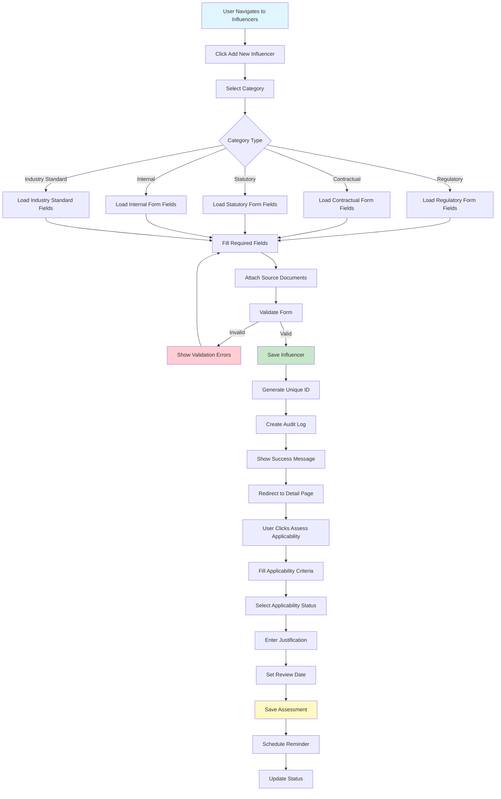
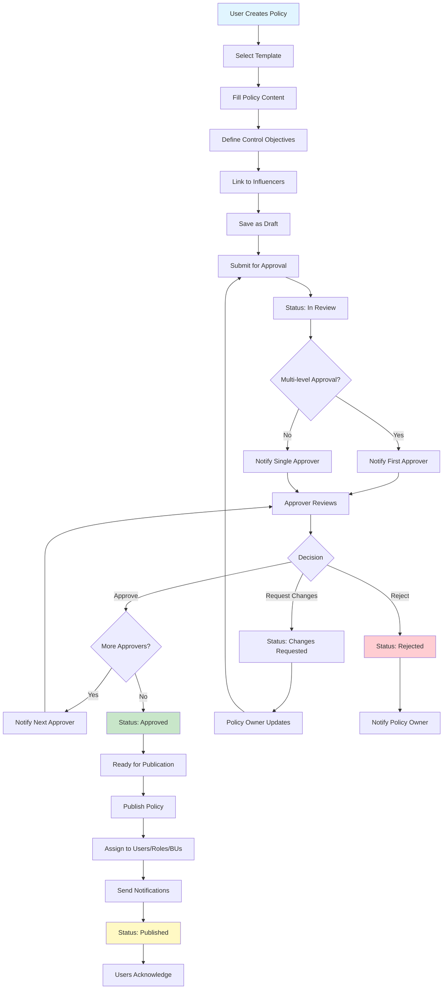
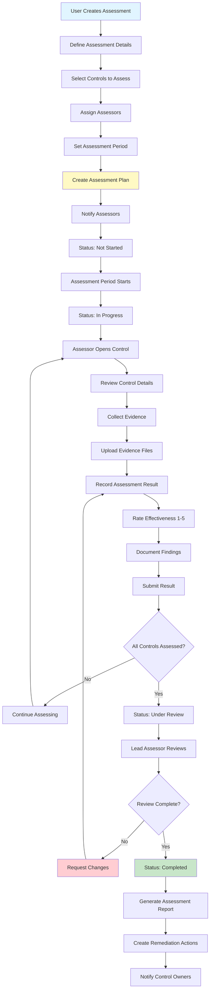
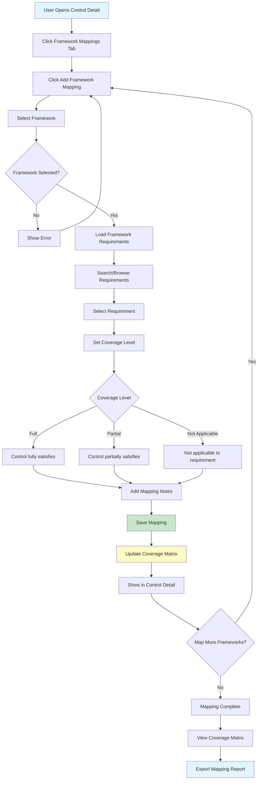
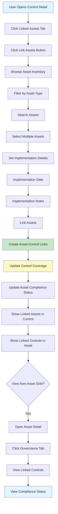

# Governance Management Module - Test Scenarios

**Document Version**: 1.0  
**Last Updated**: December 2024  
**Based on**: Requirments-US-PRD-DB Schema Governance Management Module Integrated with Assets managment.md

---

## Table of Contents

1. [Overview](#overview)
2. [User Stories](#user-stories)
3. [Test Scenarios by Feature](#test-scenarios-by-feature)
   - [Influencer Management](#influencer-management)
   - [Policy Management](#policy-management)
   - [Unified Control Library](#unified-control-library)
   - [Control Assessments](#control-assessments)
   - [Evidence Management](#evidence-management)
   - [SOP Management](#sop-management)
   - [Reporting and Analytics](#reporting-and-analytics)
4. [Flow Diagrams](#flow-diagrams)
5. [Acceptance Criteria](#acceptance-criteria)

---

## Overview

This document provides comprehensive test scenarios for the Governance Management Module based on the PRD. Each scenario includes:
- User story reference
- Test scenario description
- Preconditions
- Test steps
- Expected results
- Acceptance criteria
- Flow diagram reference

---

## User Stories

### Epic 1: Influencer Registry and Management

#### User Story 1.1: Create Influencer Entry
**As a** compliance officer  
**I want to** create and register new governance influencers  
**So that** I can document all regulatory, contractual, and internal requirements driving our governance program

**Priority**: P0 (Must Have)  
**Story Points**: 5

#### User Story 1.4: Assess Influencer Applicability
**As a** compliance officer  
**I want to** assess whether an influencer applies to our organization  
**So that** we focus only on relevant requirements

**Priority**: P0 (Must Have)  
**Story Points**: 8

#### User Story 1.6: View Influencer Details and Relationships
**As a** compliance officer  
**I want to** view complete influencer details and related policies/controls  
**So that** I understand the influencer's impact across the organization

**Priority**: P0 (Must Have)  
**Story Points**: 5

#### User Story 1.8: Search and Filter Influencers
**As a** compliance officer  
**I want to** search and filter the influencer registry  
**So that** I can quickly find relevant requirements

**Priority**: P0 (Must Have)  
**Story Points**: 5

### Epic 2: Policy Management

#### User Story 2.1: Create Policy Document
**As a** policy manager  
**I want to** create a new policy using a standardized template  
**So that** all policies follow a consistent structure

**Priority**: P0 (Must Have)  
**Story Points**: 8

#### User Story 2.2: Define Control Objectives within Policy
**As a** policy manager  
**I want to** define control objectives within a policy document  
**So that** I establish clear, measurable requirements

**Priority**: P0 (Must Have)  
**Story Points**: 8

#### User Story 2.4: Policy Approval Workflow
**As a** policy manager  
**I want to** route policies through an approval process  
**So that** policies are reviewed and authorized before publication

**Priority**: P0 (Must Have)  
**Story Points**: 13

#### User Story 2.5: Publish and Distribute Policy
**As a** policy manager  
**I want to** publish approved policies and notify relevant users  
**So that** staff are aware of new or updated requirements

**Priority**: P0 (Must Have)  
**Story Points**: 8

#### User Story 2.6: Policy Acknowledgment Tracking
**As a** policy manager  
**I want to** track which users have acknowledged reading policies  
**So that** I can ensure awareness and demonstrate compliance

**Priority**: P1 (Should Have)  
**Story Points**: 8

### Epic 3: Unified Control Library

#### User Story 3.1: Create Unified Control
**As a** compliance officer  
**I want to** create a control in the unified control library  
**So that** I can define implementation requirements once and map to multiple frameworks

**Priority**: P0 (Must Have)  
**Story Points**: 8

#### User Story 3.3: Map Control to Multiple Frameworks
**As a** compliance officer  
**I want to** map a single control to requirements from multiple frameworks  
**So that** implementing one control satisfies multiple compliance obligations

**Priority**: P0 (Must Have)  
**Story Points**: 13

#### User Story 3.7: Track Control Implementation Status
**As a** control owner  
**I want to** update the implementation status of my assigned controls  
**So that** stakeholders can track governance maturity

**Priority**: P0 (Must Have)  
**Story Points**: 8

#### User Story 3.8: Link Controls to Assets
**As a** control owner  
**I want to** link controls to the assets where they're implemented  
**So that** I can demonstrate control coverage across the IT environment

**Priority**: P1 (Should Have)  
**Story Points**: 8

#### User Story 3.9: Create Control Assessment
**As an** assessor  
**I want to** create and conduct control assessments  
**So that** I can evaluate control effectiveness

**Priority**: P0 (Must Have)  
**Story Points**: 13

#### User Story 3.10: Execute Control Assessment and Record Results
**As an** assessor  
**I want to** execute control assessments and record findings  
**So that** control effectiveness is documented

**Priority**: P0 (Must Have)  
**Story Points**: 13

---

## Test Scenarios by Feature

### Influencer Management

#### TS-INF-001: Create Influencer Entry - Happy Path

**User Story**: 1.1 (Create Influencer Entry)

**Preconditions**:
- User is authenticated
- User has permission to create influencers (Compliance Officer role)
- Business units exist in system

**Test Steps**:
1. Navigate to Governance → Influencers
2. Click "Add New Influencer" button
3. Fill in required fields:
   - Name: "NCA ECC"
   - Category: Select "Regulatory" from dropdown
   - Sub-Category: "Cybersecurity"
   - Issuing Authority: "National Cybersecurity Authority"
   - Jurisdiction: "Saudi Arabia"
   - Reference Number: "NCA-ECC-2023"
   - Effective Date: "2023-01-01"
   - Status: "Active"
   - Applicability Status: "Under Review"
4. Fill in optional fields:
   - Description: "Essential Cybersecurity Controls"
   - Source URL: "https://nca.gov.sa/..."
   - Owner: Select from dropdown
   - Business Units Affected: Select multiple
   - Tags: ["cybersecurity", "saudi-arabia"]
5. Attach source document (PDF)
6. Click "Save" button

**Expected Results**:
- Influencer created successfully
- Unique identifier auto-generated
- Success message displayed
- User redirected to influencer detail page
- All entered data displayed correctly
- Source document attached
- Audit log entry created
- Influencer appears in influencer list

**Acceptance Criteria**:
- ✅ All required fields validated
- ✅ Category dropdown shows all options: Internal, Contractual, Statutory, Regulatory, Industry Standards
- ✅ Unique identifier auto-generated
- ✅ File upload works for attachments
- ✅ Multiple business units can be selected
- ✅ Tags can be added
- ✅ Audit trail captured
- ✅ User feedback provided

---

#### TS-INF-002: Assess Influencer Applicability

**User Story**: 1.4 (Assess Influencer Applicability)

**Preconditions**:
- User is authenticated
- Influencer exists in system
- User has permission to assess applicability

**Test Steps**:
1. Navigate to Governance → Influencers
2. Open influencer detail page
3. Click "Assess Applicability" button
4. Fill in applicability criteria:
   - Industry: "Financial Services"
   - Geography: "Saudi Arabia"
   - Business Activities: ["Payment Processing", "Data Storage"]
   - Data Types: ["Personal Data", "Financial Data"]
5. Select Applicability Status: "Applicable"
6. Enter justification: "Organization operates in Saudi Arabia financial sector"
7. Attach supporting evidence document
8. Set Review Date: "2024-12-31"
9. Click "Save Assessment"

**Expected Results**:
- Applicability assessment saved
- Status updated to "Applicable"
- Justification and criteria stored
- Evidence attached
- Review date set
- Reminder scheduled for review date
- Success message displayed
- Audit log entry created

**Acceptance Criteria**:
- ✅ Applicability criteria fields functional
- ✅ Status options: Applicable, Not Applicable, Under Review
- ✅ Justification required for decision
- ✅ Evidence attachment works
- ✅ Review date reminder scheduled
- ✅ Filter by applicability status works

---

#### TS-INF-003: View Influencer Details and Relationships

**User Story**: 1.6 (View Influencer Details and Relationships)

**Preconditions**:
- User is authenticated
- Influencer exists in system
- Influencer is linked to policies and controls
- User has permission to view influencers

**Test Steps**:
1. Navigate to Governance → Influencers
2. Search for influencer "NCA ECC"
3. Click on influencer name to open detail page

**Expected Results**:
- Influencer detail page loads
- All attributes displayed:
  - Basic Information section
  - Applicability section
  - Relationships section showing:
    - Linked Policies (count and list)
    - Linked Control Objectives (count and list)
    - Linked Controls (count and list)
  - Affected Business Units
  - Owner information
  - Change History tab
- Export to PDF button visible
- Edit and Delete buttons visible (if user has permissions)

**Acceptance Criteria**:
- ✅ All influencer data displays correctly
- ✅ Relationships displayed clearly
- ✅ Click policy/control to navigate to detail
- ✅ Change history accessible
- ✅ Export functionality works
- ✅ Page loads within 2 seconds

---

#### TS-INF-004: Search and Filter Influencers

**User Story**: 1.8 (Search and Filter Influencers)

**Preconditions**:
- User is authenticated
- Multiple influencers exist in system
- User has permission to view influencers

**Test Steps**:
1. Navigate to Governance → Influencers
2. Enter search term "NCA" in search box
3. Apply filters:
   - Category: "Regulatory"
   - Status: "Active"
   - Applicability Status: "Applicable"
   - Jurisdiction: "Saudi Arabia"
4. Click "Apply Filters"
5. Sort by "Effective Date" descending
6. Save search configuration

**Expected Results**:
- Search executed across all fields
- Filters applied simultaneously
- Results filtered to matching influencers
- Only influencers matching all criteria shown
- Result count displayed
- Results sorted by effective date (newest first)
- Filters remain applied
- Search configuration can be saved
- Clear filters option available

**Acceptance Criteria**:
- ✅ Full-text search works
- ✅ Multiple filters work together
- ✅ Sorting functional
- ✅ Save search configuration works
- ✅ Results update quickly (<1 second)
- ✅ Export filtered results works

---

### Policy Management

#### TS-POL-001: Create Policy Document

**User Story**: 2.1 (Create Policy Document)

**Preconditions**:
- User is authenticated
- User has permission to create policies (Policy Manager role)
- Policy templates exist in system
- Influencers exist for linking

**Test Steps**:
1. Navigate to Governance → Policies
2. Click "Create New Policy" button
3. Select policy template: "Information Security Policy"
4. Fill in policy metadata:
   - Title: "Information Security Policy"
   - Policy Type: "Information Security"
   - Version: "1.0" (auto-generated)
   - Owner: Select from dropdown
   - Business Units: Select multiple
   - Review Frequency: "Annual"
5. Link to influencers: Select "NCA ECC"
6. Fill in template sections:
   - Purpose: "Define information security requirements"
   - Scope: "All employees and systems"
   - Policy Statements: Rich text content
7. Save as draft
8. Click "Submit for Review"

**Expected Results**:
- Policy created successfully
- Template sections populated
- Version number auto-generated
- Status changes to "In Review"
- Approval workflow initiated
- Notification sent to approvers
- Audit log entry created
- Draft saved automatically

**Acceptance Criteria**:
- ✅ Template selection works
- ✅ Rich text editor functional
- ✅ Version control enabled
- ✅ Status workflow functional
- ✅ Influencer linking works
- ✅ Draft auto-save works
- ✅ Approval workflow initiated

---

#### TS-POL-002: Define Control Objectives within Policy

**User Story**: 2.2 (Define Control Objectives within Policy)

**Preconditions**:
- User is authenticated
- Policy exists in draft status
- User has permission to edit policy
- Influencers linked to policy

**Test Steps**:
1. Navigate to Governance → Policies
2. Open policy detail page
3. Navigate to "Control Objectives" section
4. Click "Add Control Objective" button
5. Fill in control objective:
   - Objective Identifier: Auto-generated "CO-IAM-001"
   - Statement: "The organization shall implement multi-factor authentication for all privileged accounts"
   - Rationale: "To prevent unauthorized access"
   - Link to influencer requirement
   - Assign Responsible Party
   - Set Target Implementation Date
   - Mark as Mandatory
6. Add additional control objectives
7. Reorder objectives via drag-and-drop
8. Save policy

**Expected Results**:
- Control objectives added successfully
- Unique identifiers auto-generated
- Objectives displayed in order
- Influencer requirements linked
- Responsible parties assigned
- Reordering functional
- Objectives saved with policy
- Audit log entry created

**Acceptance Criteria**:
- ✅ Control objectives can be added
- ✅ Unique identifiers auto-generated
- ✅ Reordering via drag-and-drop works
- ✅ Mandatory/recommended flag works
- ✅ Influencer linking functional
- ✅ Responsible party assignment works

---

#### TS-POL-003: Policy Approval Workflow

**User Story**: 2.4 (Policy Approval Workflow)

**Preconditions**:
- User is authenticated
- Policy exists in "In Review" status
- User has approver role
- Approval workflow configured

**Test Steps**:
1. Navigate to "My Approvals" or receive notification
2. Open policy for review
3. Review policy content and control objectives
4. Click "Approve" button
5. Add approval comments: "Policy approved, ready for publication"
6. Provide digital signature (if configured)
7. Click "Confirm Approval"

**Expected Results**:
- Approval recorded
- Policy status updates to "Approved"
- Approval comments saved
- Digital signature captured
- Notification sent to policy owner
- Next approver notified (if multi-level)
- Audit log entry created with approval details
- Policy ready for publication

**Acceptance Criteria**:
- ✅ Approval workflow functional
- ✅ Multi-level approval supported
- ✅ Comments captured
- ✅ Digital signature works (if configured)
- ✅ Status updates automatically
- ✅ Notifications sent correctly
- ✅ Audit trail maintained

---

#### TS-POL-004: Publish and Distribute Policy

**User Story**: 2.5 (Publish and Distribute Policy)

**Preconditions**:
- User is authenticated
- Policy exists in "Approved" status
- User has permission to publish policies
- Users and business units exist for assignment

**Test Steps**:
1. Navigate to Governance → Policies
2. Open approved policy
3. Click "Publish" button
4. Configure distribution:
   - Assign to Business Units: Select "IT Operations", "Sales"
   - Assign to Roles: Select "All Employees"
   - Assign to Individuals: Select specific users
   - Custom Notification Message: "New Information Security Policy published"
5. Set Published Date: Current date
6. Click "Publish and Notify"

**Expected Results**:
- Policy status changes to "Published"
- Published date recorded
- Policy visible in repository
- Assignment created
- Email notifications sent to assigned users
- Policy appears in "My Assigned Policies" for users
- Dashboard statistics updated
- Audit log entry created
- Success message displayed

**Acceptance Criteria**:
- ✅ Policy published successfully
- ✅ Multiple assignment types supported
- ✅ Email notifications sent
- ✅ Users can access assigned policies
- ✅ Dashboard statistics update
- ✅ Previous versions remain accessible

---

#### TS-POL-005: Policy Acknowledgment Tracking

**User Story**: 2.6 (Policy Acknowledgment Tracking)

**Preconditions**:
- User is authenticated
- Policy is published and assigned to user
- User received notification

**Test Steps**:
1. User receives email notification about assigned policy
2. Navigate to "My Assigned Policies" or click link in email
3. View policy document
4. Read through policy content
5. Click "I Acknowledge" button
6. Confirm acknowledgment

**Expected Results**:
- Acknowledgment recorded
- Acknowledgment date captured
- User status shows "Acknowledged"
- Policy manager can view acknowledgment status
- Reminder notifications stop
- Dashboard shows updated acknowledgment rate
- Audit log entry created

**Acceptance Criteria**:
- ✅ Acknowledgment button functional
- ✅ Date and user captured
- ✅ Status tracking works
- ✅ Reminders stop after acknowledgment
- ✅ Reports show acknowledgment rates
- ✅ Re-acknowledgment required after updates (if configured)

---

### Unified Control Library

#### TS-CONTROL-001: Create Unified Control

**User Story**: 3.1 (Create Unified Control)

**Preconditions**:
- User is authenticated
- User has permission to create controls (Compliance Officer role)
- Control domains configured

**Test Steps**:
1. Navigate to Governance → Controls
2. Click "Create New Control" button
3. Fill in control details:
   - Control Identifier: Auto-generated "UCL-IAM-002"
   - Title: "Multi-Factor Authentication"
   - Control Domain: Select "Access Control & Identity Management"
   - Control Family: "Authentication"
   - Control Type: "Preventive"
   - Description: "Implement MFA for all privileged accounts"
   - Implementation Guidance: Rich text content
   - Priority: "Critical"
   - Risk Level: "High"
   - Implementation Complexity: "Medium"
   - Cost Impact: "Medium"
4. Assign Control Owner
5. Set Target Implementation Date
6. Attach supporting documents
7. Click "Save" button

**Expected Results**:
- Control created successfully
- Unique identifier auto-generated
- All fields saved correctly
- Owner assigned
- Target date set
- Documents attached
- Control appears in control library
- Audit log entry created
- Success message displayed

**Acceptance Criteria**:
- ✅ All required fields validated
- ✅ Unique identifier auto-generated
- ✅ Domain and family selection works
- ✅ Rich text editor functional
- ✅ File attachments work
- ✅ Owner assignment works
- ✅ Audit trail maintained

---

#### TS-CONTROL-002: Map Control to Multiple Frameworks

**User Story**: 3.3 (Map Control to Multiple Frameworks)

**Preconditions**:
- User is authenticated
- Control exists in system
- Multiple frameworks exist (NCA ECC, ISO 27001, NIST CSF)
- Framework requirements defined
- User has permission to map controls

**Test Steps**:
1. Navigate to Governance → Controls
2. Open control detail page
3. Click "Framework Mappings" tab
4. Click "Add Framework Mapping" button
5. Select Framework: "NCA ECC"
6. Select Requirement: "5-1-2 - Strong Authentication"
7. Set Coverage Level: "Full"
8. Add Mapping Notes: "This control fully satisfies NCA ECC requirement 5-1-2"
9. Save mapping
10. Repeat for additional frameworks:
    - ISO 27001: "A.9.4.2"
    - NIST CSF: "PR.AC-7"

**Expected Results**:
- Framework mappings created successfully
- Multiple frameworks mapped to single control
- Coverage levels specified
- Mapping notes saved
- All mappings displayed on control detail page
- Mapping matrix shows control coverage
- Audit log entry created for each mapping

**Acceptance Criteria**:
- ✅ Multiple frameworks can be mapped
- ✅ Framework requirements selectable
- ✅ Coverage levels (Full/Partial/N/A) functional
- ✅ Mapping notes saved
- ✅ Mappings displayed clearly
- ✅ Mapping matrix shows coverage

---

#### TS-CONTROL-003: Track Control Implementation Status

**User Story**: 3.7 (Track Control Implementation Status)

**Preconditions**:
- User is authenticated
- Control exists in system
- User is control owner
- Assets exist in system

**Test Steps**:
1. Navigate to Governance → Controls
2. Open assigned control
3. Click "Implementation Status" section
4. Update status fields:
   - Implementation Status: "Implemented"
   - Implementation Percentage: "100"
   - Actual Implementation Date: "2024-01-15"
   - Implementation Approach: "MFA enabled on all admin accounts via Azure AD"
5. Link implementing assets: Select multiple assets
6. Upload implementation evidence
7. Click "Save Status"

**Expected Results**:
- Implementation status updated
- Status change tracked
- Assets linked successfully
- Evidence attached
- Dashboard shows updated status
- Notification sent to stakeholders (if configured)
- Audit log entry created

**Acceptance Criteria**:
- ✅ Status update functional
- ✅ Percentage tracking works
- ✅ Asset linking works
- ✅ Evidence upload works
- ✅ Status change notifications work
- ✅ Dashboard updates

---

#### TS-CONTROL-004: Link Controls to Assets

**User Story**: 3.8 (Link Controls to Assets)

**Preconditions**:
- User is authenticated
- Control exists in system
- Assets exist in asset management module
- User has permission to link controls

**Test Steps**:
1. Navigate to Governance → Controls
2. Open control detail page
3. Click "Linked Assets" tab
4. Click "Link Assets" button
5. Browse asset inventory:
   - Filter by asset type: "Physical Asset"
   - Search for assets: "Server"
   - Select multiple assets
6. Set implementation details:
   - Implementation Date: "2024-01-15"
   - Implementation Notes: "MFA enabled on all servers"
7. Click "Link Assets"

**Expected Results**:
- Assets linked to control successfully
- Link details saved
- Assets displayed in "Linked Assets" tab
- Implementation status shown per asset
- Assets visible from control detail page
- Controls visible from asset detail page (in Governance tab)
- Audit log entry created

**Acceptance Criteria**:
- ✅ Asset browsing functional
- ✅ Multiple assets can be selected
- ✅ Link details saved
- ✅ Bidirectional visibility works
- ✅ Asset-control integration functional

---

### Control Assessments

#### TS-ASSESS-001: Create Control Assessment

**User Story**: 3.9 (Create Control Assessment)

**Preconditions**:
- User is authenticated
- User has permission to create assessments (Assessor role)
- Controls exist in system
- Assessors exist in system

**Test Steps**:
1. Navigate to Governance → Assessments
2. Click "Create New Assessment" button
3. Fill in assessment details:
   - Assessment Name: "Q4 2024 Control Assessment"
   - Description: "Quarterly control effectiveness assessment"
   - Assessment Type: "Operating Effectiveness"
   - Start Date: "2024-01-01"
   - End Date: "2024-03-31"
4. Select Lead Assessor
5. Add additional assessors
6. Select controls to assess:
   - Filter by domain: "Access Control & Identity Management"
   - Select multiple controls
7. Define assessment procedures
8. Click "Create Assessment"

**Expected Results**:
- Assessment created successfully
- Controls assigned to assessment
- Assessors notified
- Assessment status: "Not Started"
- Assessment appears in assessments list
- Progress tracking enabled
- Audit log entry created

**Acceptance Criteria**:
- ✅ Assessment creation works
- ✅ Control selection functional
- ✅ Assessor assignment works
- ✅ Notifications sent
- ✅ Status tracking enabled
- ✅ Progress tracking works

---

#### TS-ASSESS-002: Execute Control Assessment and Record Results

**User Story**: 3.10 (Execute Control Assessment and Record Results)

**Preconditions**:
- User is authenticated
- Assessment exists with assigned controls
- User is assigned assessor
- Control evidence available

**Test Steps**:
1. Navigate to Governance → Assessments
2. Open assigned assessment
3. View assigned controls list
4. Click on control to assess
5. Review control description and assessment procedures
6. Collect evidence:
   - Upload configuration screenshots
   - Attach policy documents
   - Link existing evidence
7. Record assessment result:
   - Result: "Compliant"
   - Effectiveness Rating: "5" (out of 5)
   - Findings: "Control operating effectively"
   - Observations: "MFA properly configured on all systems"
   - Recommendations: "Continue current implementation"
8. Mark "Requires Remediation": No
9. Submit assessment result

**Expected Results**:
- Assessment result recorded
- Evidence attached
- Result and rating saved
- Findings documented
- Assessment progress updated
- Assessment status updates (if all controls assessed)
- Audit log entry created
- Review workflow initiated (if configured)

**Acceptance Criteria**:
- ✅ Assessment result recording works
- ✅ Evidence attachment functional
- ✅ Rating scale works (1-5)
- ✅ Findings documented
- ✅ Progress tracking updates
- ✅ Status updates correctly

---

### Evidence Management

#### TS-EVID-001: Upload and Link Evidence

**User Story**: 3.11 (Manage Control Evidence Repository)

**Preconditions**:
- User is authenticated
- User has permission to upload evidence
- Control exists in system

**Test Steps**:
1. Navigate to Governance → Evidence
2. Click "Upload Evidence" button
3. Fill in evidence details:
   - Title: "MFA Configuration Screenshot"
   - Evidence Type: "Configuration Screenshot"
   - Collection Date: "2024-01-15"
   - Valid Until Date: "2025-01-15"
   - Description: "Screenshot showing MFA configuration"
4. Select file to upload (PDF/image)
5. Link to control: Select control
6. Set status: "Draft"
7. Click "Upload"

**Expected Results**:
- Evidence uploaded successfully
- File stored securely
- Evidence linked to control
- Metadata saved
- Evidence appears in evidence repository
- Linked control shows evidence in its detail page
- Status set to "Draft"
- Audit log entry created

**Acceptance Criteria**:
- ✅ File upload works
- ✅ Multiple file types supported
- ✅ Linking to controls functional
- ✅ Metadata saved correctly
- ✅ Status workflow works
- ✅ Bidirectional visibility

---

## Flow Diagrams

### Flow Diagram 1: Influencer Creation and Applicability Assessment Flow

### Flow Diagram 2: Policy Creation and Approval Workflow

### Flow Diagram 3: Control Assessment Flow

### Flow Diagram 4: Control to Framework Mapping Flow

### Flow Diagram 5: Control to Asset Linking Flow

---

## Acceptance Criteria

### Functional Acceptance

All test scenarios must meet the following acceptance criteria:

1. **Influencer Management**
   - ✅ All influencer categories supported
   - ✅ Applicability assessment functional
   - ✅ Relationship tracking works
   - ✅ Search and filtering comprehensive

2. **Policy Management**
   - ✅ Policy templates functional
   - ✅ Control objectives can be defined
   - ✅ Approval workflow operational
   - ✅ Distribution and acknowledgment tracking works

3. **Unified Control Library**
   - ✅ Controls can be created and managed
   - ✅ Framework mapping functional
   - ✅ Multiple frameworks per control supported
   - ✅ Implementation status tracking works

4. **Control Assessments**
   - ✅ Assessment creation functional
   - ✅ Evidence collection works
   - ✅ Results recording accurate
   - ✅ Remediation tracking enabled

5. **Evidence Management**
   - ✅ File upload works
   - ✅ Linking to controls functional
   - ✅ Status workflow operational
   - ✅ Expiration alerts work

6. **Integration with Assets**
   - ✅ Controls linkable to assets
   - ✅ Asset compliance status visible
   - ✅ Bidirectional navigation works

### Performance Acceptance

- ✅ Page load time < 2 seconds (95% of requests)
- ✅ Search results < 1 second
- ✅ File uploads < 5 seconds for files < 10MB
- ✅ Support 50 concurrent users

### Security Acceptance

- ✅ Authentication required for all operations
- ✅ RBAC enforced properly
- ✅ Audit trail immutable
- ✅ Sensitive documents protected

### User Acceptance

- ✅ 90% of users complete tasks without assistance
- ✅ User satisfaction score > 7/10
- ✅ Clear error messages
- ✅ Intuitive workflow navigation

---

**Document End**

