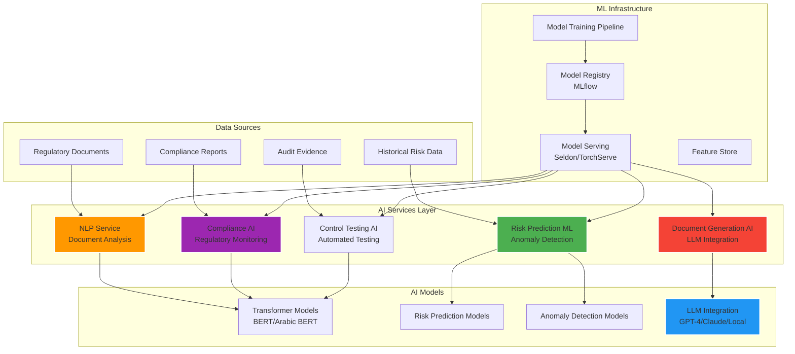
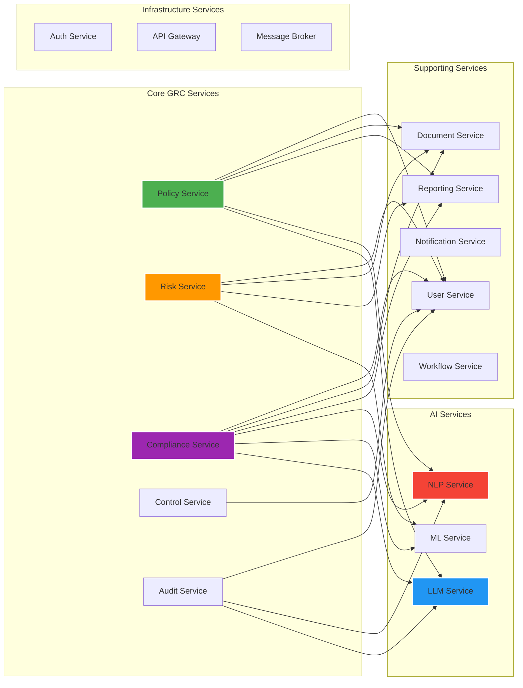
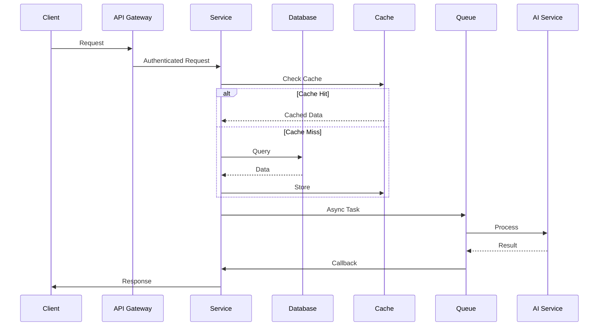
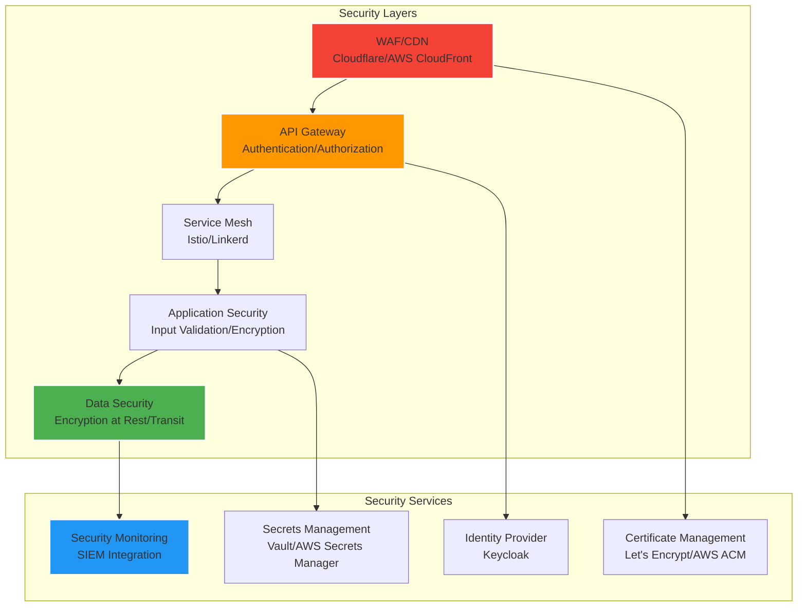

# Modern GRC System Architecture for Middle East
## Technology Stack & AI Integration Recommendations

**Target Markets:** Saudi Arabia, UAE, Egypt  
**Document Version:** 1.0  
**Last Updated:** 2024

---

## Table of Contents

1. [Executive Summary](#executive-summary)
2. [Regional Compliance Requirements](#regional-compliance-requirements)
3. [System Architecture Overview](#system-architecture-overview)
4. [Technology Stack Recommendations](#technology-stack-recommendations)
5. [AI Integration Strategy](#ai-integration-strategy)
6. [Microservices Architecture](#microservices-architecture)
7. [Data Architecture](#data-architecture)
8. [Security & Compliance Architecture](#security--compliance-architecture)
9. [Deployment Architecture](#deployment-architecture)
10. [Regional Considerations](#regional-considerations)
11. [Implementation Roadmap](#implementation-roadmap)
12. [Cost Optimization](#cost-optimization)

---

## Executive Summary

This document outlines the architecture and technology stack for a modern, AI-powered GRC system designed specifically for Middle Eastern markets (Saudi Arabia, UAE, Egypt). The system will incorporate cutting-edge AI capabilities, microservices architecture, and cloud-native technologies while ensuring compliance with regional regulations and data sovereignty requirements.

### Key Objectives

- **Compliance**: Support Saudi NCA, UAE ADGM/DFSA, and Egypt data protection regulations
- **AI-Powered**: Integrate NLP, ML, and LLM capabilities for intelligent automation
- **Scalable**: Microservices architecture supporting multi-tenant SaaS deployment
- **Localized**: Full Arabic language support, RTL UI, and regional compliance frameworks
- **Secure**: End-to-end encryption, data sovereignty, and zero-trust architecture

---

## Regional Compliance Requirements

### Saudi Arabia

**Key Regulations:**
- **NCA Cybersecurity Framework**: National Cybersecurity Authority requirements
- **SAMA Regulations**: Saudi Arabian Monetary Authority (financial sector)
- **PDPL**: Personal Data Protection Law (similar to GDPR)
- **Data Localization**: Critical data must be stored within Saudi Arabia

**Compliance Features Required:**
- NCA Essential Cybersecurity Controls (ECC) mapping
- SAMA compliance tracking for financial institutions
- Arabic language support (mandatory)
- Data residency controls

### United Arab Emirates

**Key Regulations:**
- **ADGM**: Abu Dhabi Global Market regulations
- **DFSA**: Dubai Financial Services Authority
- **UAE Data Protection Law**: Federal Law No. 45 of 2021
- **DIFC Data Protection Law**: Dubai International Financial Centre

**Compliance Features Required:**
- Multi-jurisdiction compliance tracking
- ADGM/DFSA framework mapping
- Data transfer controls
- Bilingual support (Arabic/English)

### Egypt

**Key Regulations:**
- **Egypt Data Protection Law**: Law No. 151 of 2020
- **Central Bank of Egypt Regulations**: Financial sector compliance
- **National Cybersecurity Strategy**

**Compliance Features Required:**
- Data protection impact assessments (DPIA)
- Cross-border data transfer controls
- Arabic language support
- Local data storage options

---

## System Architecture Overview

### High-Level Architecture

```mermaid
graph TB
    subgraph "Client Layer"
        A[Web Application<br/>React/Next.js]
        B[Mobile Apps<br/>React Native]
        C[API Clients]
    end
    
    subgraph "API Gateway Layer"
        D[API Gateway<br/>Kong/AWS API Gateway]
        E[Authentication Service<br/>OAuth2/OIDC]
        F[Rate Limiting]
    end
    
    subgraph "Microservices Layer"
        G[Policy Management Service]
        H[Risk Management Service]
        I[Compliance Service]
        J[Control Management Service]
        K[Audit Service]
        L[AI/ML Service]
        M[Document Management Service]
        N[Reporting Service]
        O[Notification Service]
    end
    
    subgraph "AI/ML Layer"
        P[NLP Engine]
        Q[Risk Prediction ML]
        R[Document Analysis AI]
        S[Compliance Monitoring AI]
        T[LLM Integration]
    end
    
    subgraph "Data Layer"
        U[(PostgreSQL<br/>Primary DB)]
        V[(MongoDB<br/>Document Store)]
        W[(Neo4j<br/>Knowledge Graph)]
        X[(Redis<br/>Cache/Queue)]
        Y[(Elasticsearch<br/>Search)]
        Z[S3/MinIO<br/>Object Storage]
    end
    
    subgraph "Integration Layer"
        AA[LDAP/AD Connector]
        BB[SIEM Integration]
        CC[Cloud Services API]
        DD[Regulatory APIs]
    end
    
    A --> D
    B --> D
    C --> D
    D --> E
    D --> F
    D --> G
    D --> H
    D --> I
    D --> J
    D --> K
    D --> L
    
    G --> P
    H --> Q
    I --> S
    L --> T
    M --> R
    
    G --> U
    H --> U
    I --> U
    J --> U
    K --> U
    M --> V
    L --> W
    N --> Y
    
    G --> X
    H --> X
    I --> X
    
    I --> AA
    H --> BB
    L --> CC
    I --> DD
    
    style A fill:#2196F3,stroke:#fff,stroke-width:2px
    style D fill:#4CAF50,stroke:#fff,stroke-width:2px
    style L fill:#FF9800,stroke:#fff,stroke-width:2px
    style U fill:#9C27B0,stroke:#fff,stroke-width:2px
    style T fill:#F44336,stroke:#fff,stroke-width:2px
```



---

## Technology Stack Recommendations

### Frontend Stack

#### Primary Recommendation: **React + Next.js**

**Rationale:**
- **Next.js 14+**: Server-side rendering, excellent performance, built-in API routes
- **TypeScript**: Type safety, better developer experience
- **React 18+**: Concurrent features, improved performance
- **Tailwind CSS**: Rapid UI development, consistent design system
- **React Query/TanStack Query**: Efficient data fetching and caching
- **Zustand/Redux Toolkit**: State management

**Alternative Options:**
- **Vue.js 3 + Nuxt 3**: Good alternative, excellent DX
- **Angular 17+**: Enterprise-grade, strong typing

**UI Component Libraries:**
- **shadcn/ui**: Modern, accessible components
- **Ant Design**: Comprehensive component library
- **Material-UI (MUI)**: Material Design components

**Arabic/RTL Support:**
- **next-i18next**: Internationalization
- **react-i18next**: Translation management
- **rtl-css-js**: RTL styling utilities
- **bidi-js**: Bidirectional text handling

**Mobile:**
- **React Native**: Cross-platform mobile development
- **Expo**: Development toolchain and deployment
- **React Native Paper**: Material Design for mobile

### Backend Stack

#### Primary Recommendation: **Node.js + TypeScript**

**Framework Options:**

1. **NestJS** (Recommended)
   - Enterprise-grade, TypeScript-first
   - Built-in microservices support
   - Excellent dependency injection
   - GraphQL support
   - WebSocket support
   - Strong ecosystem

2. **Fastify**
   - High performance
   - Plugin architecture
   - TypeScript support
   - Lower overhead than Express

3. **Express.js**
   - Mature, large ecosystem
   - Flexible
   - Good for rapid prototyping

**Alternative: Python FastAPI**
- Excellent for AI/ML integration
- Fast performance
- Automatic API documentation
- Strong async support
- Easy integration with ML libraries

**Alternative: Go**
- Excellent performance
- Strong concurrency
- Good for high-throughput services
- Smaller ecosystem

### Database Stack

#### Primary Database: **PostgreSQL 15+**

**Why PostgreSQL:**
- ACID compliance
- Excellent JSON support (JSONB)
- Full-text search capabilities
- Advanced indexing (GIN, GiST)
- Row-level security
- Foreign data wrappers
- Strong consistency
- Excellent performance
- Open source

**Use Cases:**
- Transactional data
- User management
- Policy and compliance data
- Risk assessments
- Audit logs

#### Document Database: **MongoDB 7+**

**Why MongoDB:**
- Flexible schema for documents
- Excellent for unstructured data
- Strong query capabilities
- Horizontal scaling
- Change streams for real-time updates

**Use Cases:**
- Policy documents
- Audit evidence
- Compliance reports
- Document versions

#### Graph Database: **Neo4j 5+**

**Why Neo4j:**
- Relationship modeling
- Risk-to-control mapping
- Compliance framework relationships
- Knowledge graph for AI
- Cypher query language

**Use Cases:**
- Risk relationships
- Control dependencies
- Compliance framework mapping
- AI knowledge graphs

#### Cache & Queue: **Redis 7+**

**Why Redis:**
- In-memory caching
- Session storage
- Message queue (Redis Streams)
- Pub/sub for real-time updates
- Rate limiting
- Distributed locks

**Use Cases:**
- API response caching
- User sessions
- Background job queues
- Real-time notifications
- Rate limiting

#### Search Engine: **Elasticsearch 8+**

**Why Elasticsearch:**
- Full-text search
- Advanced analytics
- Log aggregation
- Real-time search
- Kibana for visualization

**Use Cases:**
- Document search
- Compliance search
- Audit log analysis
- Reporting and analytics

#### Object Storage: **MinIO or AWS S3**

**Why Object Storage:**
- Scalable file storage
- Cost-effective
- S3-compatible API
- Versioning
- Lifecycle policies

**Use Cases:**
- Document storage
- Evidence files
- Report exports
- Backup storage

### Message Queue & Event Streaming

#### Primary: **Apache Kafka**

**Why Kafka:**
- High throughput
- Event streaming
- Event sourcing support
- Durable message storage
- Horizontal scaling

**Alternative: RabbitMQ**
- Simpler setup
- Good for traditional message queuing
- Excellent management UI

**Alternative: AWS SQS/SNS**
- Managed service
- Good for cloud deployments
- Pay-as-you-go

### API Gateway

#### Primary: **Kong Gateway**

**Why Kong:**
- Open source
- Plugin ecosystem
- Rate limiting
- Authentication/authorization
- Request/response transformation
- API versioning
- Analytics

**Alternatives:**
- **AWS API Gateway**: Managed, cloud-native
- **Traefik**: Modern, cloud-native
- **NGINX**: Lightweight, high performance

### Authentication & Authorization

#### Primary: **Keycloak or Auth0**

**Keycloak:**
- Open source
- OAuth2/OIDC support
- SAML support
- User federation (LDAP/AD)
- Fine-grained authorization
- Multi-factor authentication
- Social login

**Auth0:**
- Managed service
- Excellent developer experience
- Strong security features
- Good documentation

**Alternative: AWS Cognito**
- Managed service
- Good AWS integration
- Cost-effective

### Container Orchestration

#### Primary: **Kubernetes (K8s)**

**Why Kubernetes:**
- Industry standard
- Auto-scaling
- Self-healing
- Service discovery
- Load balancing
- Rolling updates
- Resource management

**Managed Options:**
- **EKS** (AWS)
- **GKE** (Google Cloud)
- **AKS** (Azure)
- **DigitalOcean Kubernetes**
- **Linode Kubernetes**

**Local Development:**
- **Docker Compose**: Simple local setup
- **Minikube**: Local K8s cluster
- **Kind**: Kubernetes in Docker

### CI/CD

#### Primary: **GitHub Actions or GitLab CI**

**GitHub Actions:**
- Integrated with GitHub
- Large action marketplace
- Good for open source

**GitLab CI:**
- Integrated with GitLab
- Comprehensive DevOps platform
- Self-hosted options

**Alternatives:**
- **Jenkins**: Mature, flexible
- **CircleCI**: Cloud-native
- **Azure DevOps**: Microsoft ecosystem

### Monitoring & Observability

#### Primary Stack:

**Metrics:**
- **Prometheus**: Metrics collection
- **Grafana**: Visualization and dashboards

**Logging:**
- **Loki**: Log aggregation (Grafana Labs)
- **ELK Stack**: Elasticsearch, Logstash, Kibana

**Tracing:**
- **Jaeger**: Distributed tracing
- **Zipkin**: Alternative tracing solution

**APM:**
- **New Relic**: Application performance monitoring
- **Datadog**: Full-stack observability
- **Sentry**: Error tracking

### Infrastructure as Code

#### Primary: **Terraform**

**Why Terraform:**
- Multi-cloud support
- Declarative configuration
- State management
- Large provider ecosystem

**Alternative: Pulumi**
- Code in familiar languages
- Better for complex logic
- Type safety

---

## AI Integration Strategy

### AI/ML Architecture



### AI Capabilities to Implement

#### 1. Natural Language Processing (NLP)

**Use Cases:**
- **Regulatory Document Analysis**: Extract requirements from regulations
- **Policy Analysis**: Analyze policies for compliance gaps
- **Risk Statement Generation**: Auto-generate risk descriptions
- **Arabic Language Support**: Full Arabic NLP capabilities

**Technologies:**
- **spaCy**: NLP library with Arabic support
- **Transformers (Hugging Face)**: Pre-trained models
- **Arabic BERT**: Arabic language model
- **CamemBERT**: French/Arabic support
- **mBERT**: Multilingual BERT

**Implementation:**
```python
# Example: Arabic NLP Service
from transformers import AutoTokenizer, AutoModelForSequenceClassification
import torch

class ArabicNLPService:
    def __init__(self):
        self.tokenizer = AutoTokenizer.from_pretrained("aubmindlab/bert-base-arabertv2")
        self.model = AutoModelForSequenceClassification.from_pretrained("aubmindlab/bert-base-arabertv2")
    
    def analyze_regulatory_text(self, text: str):
        # Extract compliance requirements
        # Classify risk levels
        # Generate recommendations
        pass
```

#### 2. Machine Learning for Risk Prediction

**Use Cases:**
- **Predictive Risk Analytics**: Predict potential risks before they materialize
- **Anomaly Detection**: Identify unusual patterns in risk data
- **Risk Scoring**: Automated risk scoring based on historical data
- **Control Effectiveness Prediction**: Predict control failure likelihood

**Technologies:**
- **Scikit-learn**: Traditional ML algorithms
- **XGBoost/LightGBM**: Gradient boosting for risk prediction
- **PyTorch/TensorFlow**: Deep learning for complex patterns
- **Prophet**: Time series forecasting

**Implementation:**
```python
# Example: Risk Prediction Service
import xgboost as xgb
import pandas as pd

class RiskPredictionService:
    def __init__(self):
        self.model = xgb.XGBClassifier()
        self.model.load_model('risk_prediction_model.json')
    
    def predict_risk(self, risk_features: dict):
        df = pd.DataFrame([risk_features])
        probability = self.model.predict_proba(df)[0]
        return {
            'risk_level': self.model.predict(df)[0],
            'probability': float(probability[1]),
            'factors': self._explain_factors(df)
        }
```

#### 3. Large Language Models (LLMs)

**Use Cases:**
- **Policy Drafting**: Assist in drafting policies and procedures
- **Report Generation**: Auto-generate compliance reports
- **Document Summarization**: Summarize long regulatory documents
- **Q&A System**: Answer compliance questions

**Options:**

**Cloud-Based (Recommended for MVP):**
- **OpenAI GPT-4**: Best performance, API-based
- **Anthropic Claude**: Excellent for long documents
- **Google Gemini**: Good multilingual support

**Self-Hosted (For Data Sovereignty):**
- **Llama 2/3**: Meta's open-source LLM
- **Mistral AI**: High-performance open model
- **Falcon**: UAE-developed model
- **Jais**: Arabic-optimized LLM (G42)

**Implementation:**
```typescript
// Example: LLM Integration Service
import OpenAI from 'openai';

class LLMService {
    private client: OpenAI;
    
    async generatePolicyDraft(context: string, requirements: string[]) {
        const prompt = `Generate a policy draft based on:
        Context: ${context}
        Requirements: ${requirements.join(', ')}
        
        Ensure compliance with Saudi NCA framework.`;
        
        const response = await this.client.chat.completions.create({
            model: 'gpt-4',
            messages: [{ role: 'user', content: prompt }],
            temperature: 0.7
        });
        
        return response.choices[0].message.content;
    }
}
```

#### 4. Computer Vision for Document Processing

**Use Cases:**
- **Document OCR**: Extract text from scanned documents
- **Form Recognition**: Extract data from compliance forms
- **Signature Verification**: Verify document signatures
- **Evidence Classification**: Classify audit evidence

**Technologies:**
- **Tesseract OCR**: Open-source OCR
- **AWS Textract**: Managed OCR service
- **Google Cloud Vision**: Document AI
- **Azure Form Recognizer**: Form processing

#### 5. Knowledge Graph for Compliance Mapping

**Use Cases:**
- **Compliance Framework Mapping**: Map requirements to controls
- **Risk Relationships**: Visualize risk interdependencies
- **Control Dependencies**: Understand control relationships
- **Regulatory Change Impact**: Assess impact of regulatory changes

**Technologies:**
- **Neo4j**: Graph database
- **Cypher**: Query language
- **GraphQL**: API layer

---

## Microservices Architecture

### Service Breakdown



### Service Communication

**Synchronous:**
- **REST APIs**: Standard HTTP/REST for service-to-service calls
- **GraphQL**: Flexible querying for complex data needs
- **gRPC**: High-performance inter-service communication

**Asynchronous:**
- **Event-Driven**: Kafka for event streaming
- **Message Queue**: RabbitMQ/Redis for job queues
- **Pub/Sub**: Redis pub/sub for real-time updates

### Service Template (NestJS Example)

```typescript
// Example: Risk Management Service
import { Module } from '@nestjs/common';
import { TypeOrmModule } from '@nestjs/typeorm';
import { RiskController } from './risk.controller';
import { RiskService } from './risk.service';
import { Risk } from './entities/risk.entity';
import { HttpModule } from '@nestjs/axios';
import { ClientsModule, Transport } from '@nestjs/microservices';

@Module({
  imports: [
    TypeOrmModule.forFeature([Risk]),
    HttpModule,
    ClientsModule.register([
      {
        name: 'ML_SERVICE',
        transport: Transport.KAFKA,
        options: {
          client: {
            clientId: 'risk-service',
            brokers: ['localhost:9092'],
          },
        },
      },
    ]),
  ],
  controllers: [RiskController],
  providers: [RiskService],
  exports: [RiskService],
})
export class RiskModule {}
```

---

## Data Architecture

### Data Flow Architecture



### Database Schema Design

#### PostgreSQL Schema (Core Tables)

```sql
-- Risk Management
CREATE TABLE risks (
    id UUID PRIMARY KEY DEFAULT gen_random_uuid(),
    title VARCHAR(255) NOT NULL,
    description TEXT,
    risk_category VARCHAR(100),
    likelihood INTEGER,
    impact INTEGER,
    risk_score INTEGER,
    status VARCHAR(50),
    owner_id UUID REFERENCES users(id),
    created_at TIMESTAMP DEFAULT NOW(),
    updated_at TIMESTAMP DEFAULT NOW()
);

-- Compliance Requirements
CREATE TABLE compliance_requirements (
    id UUID PRIMARY KEY DEFAULT gen_random_uuid(),
    framework VARCHAR(100), -- 'NCA', 'SAMA', 'ADGM', etc.
    requirement_code VARCHAR(100),
    title VARCHAR(255),
    description TEXT,
    category VARCHAR(100),
    created_at TIMESTAMP DEFAULT NOW()
);

-- Controls
CREATE TABLE controls (
    id UUID PRIMARY KEY DEFAULT gen_random_uuid(),
    title VARCHAR(255),
    description TEXT,
    control_type VARCHAR(100),
    effectiveness_score INTEGER,
    status VARCHAR(50),
    owner_id UUID REFERENCES users(id),
    created_at TIMESTAMP DEFAULT NOW()
);

-- Control-Requirement Mapping
CREATE TABLE control_requirement_mapping (
    control_id UUID REFERENCES controls(id),
    requirement_id UUID REFERENCES compliance_requirements(id),
    PRIMARY KEY (control_id, requirement_id)
);
```

#### MongoDB Schema (Documents)

```javascript
// Policy Document Schema
{
  _id: ObjectId,
  title: String,
  content: String,
  version: Number,
  status: String, // 'draft', 'approved', 'published', 'archived'
  framework: String, // 'NCA', 'SAMA', etc.
  language: String, // 'ar', 'en'
  metadata: {
    author: ObjectId,
    reviewers: [ObjectId],
    approvalDate: Date,
    expiryDate: Date
  },
  aiAnalysis: {
    complianceScore: Number,
    riskFactors: [String],
    recommendations: [String]
  },
  createdAt: Date,
  updatedAt: Date
}
```

#### Neo4j Schema (Knowledge Graph)

```cypher
// Risk-Control Relationships
CREATE (r:Risk {id: $riskId, title: $title})
CREATE (c:Control {id: $controlId, title: $title})
CREATE (r)-[:MITIGATED_BY]->(c)

// Compliance Framework Mapping
CREATE (req:Requirement {id: $reqId, framework: 'NCA'})
CREATE (c:Control {id: $controlId})
CREATE (req)-[:SATISFIED_BY]->(c)
```

---

## Security & Compliance Architecture

### Security Architecture



### Security Best Practices

1. **Zero Trust Architecture**
   - Verify every request
   - Least privilege access
   - Network segmentation

2. **Encryption**
   - TLS 1.3 for data in transit
   - AES-256 for data at rest
   - Field-level encryption for PII

3. **Authentication & Authorization**
   - OAuth2/OIDC
   - Multi-factor authentication (MFA)
   - Role-based access control (RBAC)
   - Attribute-based access control (ABAC)

4. **Secrets Management**
   - HashiCorp Vault
   - AWS Secrets Manager
   - Kubernetes Secrets (encrypted)

5. **Security Monitoring**
   - SIEM integration
   - Real-time threat detection
   - Security event logging
   - Anomaly detection

---

## Deployment Architecture

### Cloud Deployment Options

#### Option 1: Multi-Cloud (Recommended)

**Saudi Arabia:**
- **AWS Middle East (Bahrain)**: Closest region
- **Oracle Cloud Saudi Arabia**: Local data center
- **Saudi Cloud**: Government cloud (if available)

**UAE:**
- **AWS Middle East (Bahrain)**: Good latency
- **Microsoft Azure UAE**: Local region
- **Google Cloud**: Middle East region

**Egypt:**
- **AWS**: Europe (Frankfurt) or Middle East
- **Azure**: Europe or Middle East
- **Local providers**: If available

#### Option 2: Hybrid Cloud

- **Public Cloud**: Non-sensitive data, development
- **Private Cloud**: Sensitive data, production
- **On-Premise**: Critical compliance data

### Kubernetes Deployment

```yaml
# Example: Risk Service Deployment
apiVersion: apps/v1
kind: Deployment
metadata:
  name: risk-service
spec:
  replicas: 3
  selector:
    matchLabels:
      app: risk-service
  template:
    metadata:
      labels:
        app: risk-service
    spec:
      containers:
      - name: risk-service
        image: grc-platform/risk-service:latest
        ports:
        - containerPort: 3000
        env:
        - name: DATABASE_URL
          valueFrom:
            secretKeyRef:
              name: db-secrets
              key: url
        resources:
          requests:
            memory: "512Mi"
            cpu: "500m"
          limits:
            memory: "1Gi"
            cpu: "1000m"
        livenessProbe:
          httpGet:
            path: /health
            port: 3000
          initialDelaySeconds: 30
          periodSeconds: 10
```

---

## Regional Considerations

### Arabic Language Support

**Requirements:**
- Full RTL (Right-to-Left) UI support
- Arabic text input/output
- Arabic document processing
- Arabic NLP capabilities
- Bilingual interfaces (Arabic/English)

**Implementation:**
```typescript
// RTL Support in React
import { useTranslation } from 'next-i18next';

function App() {
  const { i18n } = useTranslation();
  const isRTL = i18n.language === 'ar';
  
  return (
    <div dir={isRTL ? 'rtl' : 'ltr'}>
      {/* Content */}
    </div>
  );
}
```

### Data Sovereignty

**Requirements:**
- Data residency controls
- Local data storage options
- Cross-border data transfer restrictions
- Data localization compliance

**Implementation:**
- Multi-region database replication
- Data residency policies
- Encryption key management per region
- Audit logging for data transfers

### Cultural Considerations

- **Hijri Calendar Support**: Islamic calendar integration
- **Local Business Practices**: Workflow adaptations
- **Regulatory Frameworks**: Country-specific compliance
- **Payment Methods**: Local payment gateway integration

---

## Implementation Roadmap

### Phase 1: Foundation (Months 1-3)

**Goals:**
- Set up infrastructure
- Core microservices
- Basic UI
- Authentication

**Deliverables:**
- Kubernetes cluster
- Core services (User, Policy, Risk)
- Basic React frontend
- Authentication system
- CI/CD pipeline

### Phase 2: Core GRC Features (Months 4-6)

**Goals:**
- Complete GRC modules
- Compliance frameworks
- Reporting
- Document management

**Deliverables:**
- All core GRC services
- Compliance framework mapping
- Reporting engine
- Document management system
- Arabic language support

### Phase 3: AI Integration (Months 7-9)

**Goals:**
- NLP capabilities
- Risk prediction
- Document analysis
- LLM integration

**Deliverables:**
- NLP service
- ML models for risk prediction
- Document analysis AI
- LLM integration
- Knowledge graph

### Phase 4: Advanced Features (Months 10-12)

**Goals:**
- Advanced analytics
- Mobile apps
- Third-party integrations
- Performance optimization

**Deliverables:**
- Advanced reporting
- Mobile applications
- SIEM integrations
- Performance optimizations
- Production hardening

---

## Cost Optimization

### Infrastructure Costs

**Estimated Monthly Costs (1000 users):**

| Component | Cost (USD/month) |
|-----------|------------------|
| Kubernetes Cluster (3 nodes) | $300-500 |
| Databases (PostgreSQL, MongoDB, Neo4j) | $400-600 |
| Redis Cache | $100-200 |
| Object Storage | $50-100 |
| AI/ML Services | $200-400 |
| Monitoring & Logging | $100-200 |
| **Total** | **$1,150-2,000** |

### Cost Optimization Strategies

1. **Reserved Instances**: 30-40% savings
2. **Spot Instances**: For non-critical workloads
3. **Auto-scaling**: Scale down during low usage
4. **Caching**: Reduce database load
5. **CDN**: Reduce bandwidth costs
6. **Data Archival**: Move old data to cheaper storage

---

## Technology Stack Summary

### Recommended Stack

| Layer | Technology | Rationale |
|-------|-----------|-----------|
| **Frontend** | Next.js 14 + React 18 + TypeScript | Modern, performant, SSR |
| **Backend** | NestJS + Node.js + TypeScript | Enterprise-grade, microservices |
| **Primary DB** | PostgreSQL 15 | ACID, JSON support, reliable |
| **Document DB** | MongoDB 7 | Flexible schema, horizontal scaling |
| **Graph DB** | Neo4j 5 | Relationship modeling, knowledge graphs |
| **Cache** | Redis 7 | Fast, versatile |
| **Search** | Elasticsearch 8 | Full-text search, analytics |
| **Message Queue** | Apache Kafka | Event streaming, high throughput |
| **API Gateway** | Kong | Open source, feature-rich |
| **Auth** | Keycloak | Open source, OAuth2/OIDC |
| **Container** | Docker | Industry standard |
| **Orchestration** | Kubernetes | Auto-scaling, self-healing |
| **AI/ML** | Python + FastAPI | ML ecosystem, async |
| **NLP** | Transformers (Hugging Face) | Pre-trained models |
| **LLM** | GPT-4 / Llama 2 | Cloud/self-hosted options |
| **Monitoring** | Prometheus + Grafana | Open source, powerful |
| **CI/CD** | GitHub Actions | Integrated, flexible |

---

## Conclusion

This architecture provides a modern, scalable, and AI-powered GRC system specifically designed for Middle Eastern markets. The technology stack is carefully selected to balance performance, cost, and compliance requirements while incorporating cutting-edge AI capabilities.

### Key Advantages

1. **Modern Stack**: Latest technologies with strong community support
2. **AI-Powered**: Comprehensive AI integration for intelligent automation
3. **Scalable**: Microservices architecture supporting growth
4. **Compliant**: Built-in support for regional regulations
5. **Localized**: Full Arabic language and cultural support
6. **Secure**: Enterprise-grade security architecture

### Next Steps

1. **Proof of Concept**: Build MVP with core features
2. **Pilot Program**: Deploy with select customers
3. **Iterative Development**: Continuous improvement based on feedback
4. **Market Expansion**: Scale to additional Middle Eastern countries

---

**Document Version**: 1.0  
**Last Updated**: 2024  
**Author**: Architecture Team

