# Stratagem GRC Platform - System Flow Diagrams and User Stories

**Document Version**: 1.0  
**Last Updated**: December 2024  
**Platform**: Stratagem GRC (Governance, Risk, Compliance)

---

## Table of Contents

1. [Executive Summary](#executive-summary)
2. [System Architecture Overview](#system-architecture-overview)
3. [Asset Management Module](#asset-management-module)
   - [User Stories](#asset-user-stories)
   - [Flow Diagrams](#asset-flow-diagrams)
4. [Governance Management Module](#governance-management-module)
   - [User Stories](#governance-user-stories)
   - [Flow Diagrams](#governance-flow-diagrams)
5. [Integration Workflows](#integration-workflows)
   - [User Stories](#integration-user-stories)
   - [Flow Diagrams](#integration-flow-diagrams)
6. [End-to-End Workflows](#end-to-end-workflows)

---

## Executive Summary

The Stratagem GRC Platform is a comprehensive governance, risk, and compliance management system that enables organizations to:

- **Manage Assets**: Track physical, information, software, application, and supplier assets
- **Implement Governance**: Establish policies, controls, and compliance frameworks
- **Ensure Compliance**: Map controls to regulatory requirements and demonstrate compliance
- **Track Evidence**: Maintain audit-ready evidence and assessment records

This document provides detailed user stories and flow diagrams for all major system workflows.

---

## System Architecture Overview

### High-Level System Flow

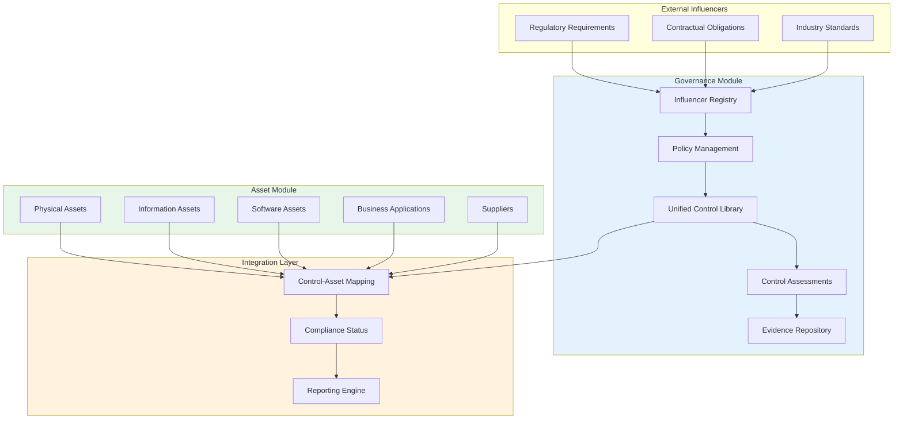

### Data Flow Summary

```mermaid
flowchart LR
    A[Influencers] -->|Drive| B[Policies]
    B -->|Define| C[Control Objectives]
    C -->|Implemented by| D[Controls]
    D -->|Applied to| E[Assets]
    E -->|Assessed via| F[Assessments]
    F -->|Generate| G[Evidence]
    G -->|Support| H[Compliance Reports]
    
    style A fill:#ffcdd2
    style B fill:#f8bbd9
    style C fill:#e1bee7
    style D fill:#c5cae9
    style E fill:#bbdefb
    style F fill:#b2ebf2
    style G fill:#c8e6c9
    style H fill:#dcedc8
```

---

## Asset Management Module

### Asset User Stories

#### Epic A1: Physical Asset Management

##### User Story A1.1: Create Physical Asset
**As a** cybersecurity analyst  
**I want to** add new physical assets (servers, workstations, network devices) to the inventory  
**So that** I can maintain an accurate record of all hardware assets

**Acceptance Criteria:**
- ✅ Can enter all required fields (name, type, location, owner)
- ✅ Can specify network details (IP, MAC address, hostname)
- ✅ Can set criticality level and business unit
- ✅ Unique identifier is auto-generated
- ✅ Audit log entry is created
- ✅ Validation errors are clearly displayed

**Priority**: P0 (Must Have)  
**Story Points**: 5

---

##### User Story A1.2: View Physical Asset Details
**As a** cybersecurity analyst  
**I want to** view detailed information about any physical asset  
**So that** I can access all relevant attributes, relationships, and compliance status

**Acceptance Criteria:**
- ✅ All asset attributes displayed in organized sections
- ✅ Related assets (dependencies) shown
- ✅ Governance controls linked to asset visible
- ✅ Audit history accessible
- ✅ Page loads within 2 seconds

**Priority**: P0 (Must Have)  
**Story Points**: 3

---

##### User Story A1.3: Update Physical Asset
**As a** cybersecurity analyst  
**I want to** update existing physical asset information  
**So that** asset records stay current and accurate

**Acceptance Criteria:**
- ✅ All fields are editable (with proper permissions)
- ✅ Changes are validated before saving
- ✅ Previous values are preserved in audit log
- ✅ Success/error feedback provided

**Priority**: P1 (Should Have)  
**Story Points**: 5

---

##### User Story A1.4: Search and Filter Physical Assets
**As a** cybersecurity analyst  
**I want to** search and filter physical assets by various criteria  
**So that** I can quickly find specific assets

**Acceptance Criteria:**
- ✅ Full-text search across all fields
- ✅ Filter by type, criticality, location, owner, status
- ✅ Results paginated and sortable
- ✅ Save filter configurations
- ✅ Export filtered results

**Priority**: P0 (Must Have)  
**Story Points**: 5

---

#### Epic A2: Information Asset Management

##### User Story A2.1: Create Information Asset
**As a** compliance officer  
**I want to** add information assets (databases, file shares, data repositories)  
**So that** I can track and classify data assets for compliance

**Acceptance Criteria:**
- ✅ Can set data classification level (Public, Internal, Confidential, Restricted)
- ✅ Can assign information owner and custodian
- ✅ Can link to physical assets where data resides
- ✅ Reclassification review date auto-calculated
- ✅ Compliance requirements linkable

**Priority**: P1 (Should Have)  
**Story Points**: 5

---

##### User Story A2.2: Classify Information Asset
**As a** compliance officer  
**I want to** classify information assets according to sensitivity levels  
**So that** appropriate controls can be applied

**Acceptance Criteria:**
- ✅ Classification levels clearly defined
- ✅ Classification justification required
- ✅ Reclassification workflow supported
- ✅ Classification history maintained

**Priority**: P0 (Must Have)  
**Story Points**: 5

---

#### Epic A3: Business Application Management

##### User Story A3.1: Create Business Application
**As a** security architect  
**I want to** add business applications to the inventory  
**So that** I can track applications and their security requirements

**Acceptance Criteria:**
- ✅ Can specify application details (name, version, vendor)
- ✅ Can define data types processed
- ✅ Can link to underlying infrastructure (servers, databases)
- ✅ Can assign application owner
- ✅ Integration with supplier management

**Priority**: P1 (Should Have)  
**Story Points**: 5

---

#### Epic A4: Software Asset Management

##### User Story A4.1: Create Software Asset
**As an** IT asset manager  
**I want to** add software assets to the inventory  
**So that** I can track software licenses and installations

**Acceptance Criteria:**
- ✅ Can specify software details (name, version, vendor)
- ✅ Can track license information (type, count, expiry)
- ✅ Can link to physical assets where installed
- ✅ License compliance alerts functional

**Priority**: P1 (Should Have)  
**Story Points**: 5

---

#### Epic A5: Supplier Management

##### User Story A5.1: Create Supplier
**As a** compliance officer  
**I want to** add third-party suppliers to the inventory  
**So that** I can track vendor relationships and manage third-party risk

**Acceptance Criteria:**
- ✅ Can specify supplier details and criticality
- ✅ Can add multiple contact persons
- ✅ Can track contract details and dates
- ✅ Can define goods/services provided
- ✅ Can link to assets provided by supplier

**Priority**: P1 (Should Have)  
**Story Points**: 5

---

#### Epic A6: Data Import

##### User Story A6.1: CSV Import
**As a** cybersecurity analyst  
**I want to** import asset data from CSV files  
**So that** I can quickly populate the asset inventory

**Acceptance Criteria:**
- ✅ File upload via drag-and-drop or file picker
- ✅ CSV parsing with preview (first 10 rows)
- ✅ Column mapping interface
- ✅ Validation before import
- ✅ Error report with row-level details
- ✅ Import audit log

**Priority**: P0 (Must Have)  
**Story Points**: 8

---

##### User Story A6.2: Excel Import
**As a** cybersecurity analyst  
**I want to** import asset data from Excel files (.xlsx, .xls)  
**So that** I can use existing spreadsheets

**Acceptance Criteria:**
- ✅ Support for .xlsx and .xls formats
- ✅ Multiple worksheet selection
- ✅ Same mapping interface as CSV
- ✅ Consistent error handling

**Priority**: P0 (Must Have)  
**Story Points**: 8

---

#### Epic A7: Asset Relationships

##### User Story A7.1: Create Asset Dependencies
**As a** security architect  
**I want to** map relationships between assets  
**So that** I can understand dependencies and assess impact

**Acceptance Criteria:**
- ✅ Can create parent-child relationships
- ✅ Can create peer relationships
- ✅ Can specify relationship type (depends on, hosts, connects to)
- ✅ Bidirectional relationships displayed
- ✅ Visual dependency graph available

**Priority**: P2 (Nice to Have)  
**Story Points**: 8

---

##### User Story A7.2: View Asset Dependency Graph
**As a** security architect  
**I want to** visualize asset dependencies in a graph  
**So that** I can understand impact of changes or incidents

**Acceptance Criteria:**
- ✅ Interactive graph visualization
- ✅ Drill-down to asset details
- ✅ Filter by relationship type
- ✅ Export graph as image

**Priority**: P2 (Nice to Have)  
**Story Points**: 8

---

#### Epic A8: Audit and Compliance

##### User Story A8.1: View Asset Audit Trail
**As a** compliance officer  
**I want to** view complete change history for any asset  
**So that** I can audit changes and demonstrate compliance

**Acceptance Criteria:**
- ✅ All changes logged with timestamp
- ✅ User attribution for each change
- ✅ Old and new values captured
- ✅ Export to CSV/PDF

**Priority**: P1 (Should Have)  
**Story Points**: 5

---

### Asset Flow Diagrams

#### Flow A1: Physical Asset Creation Flow

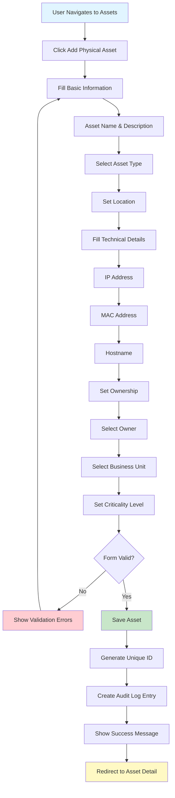

#### Flow A2: CSV Import Flow

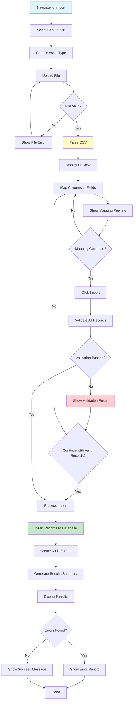

#### Flow A3: Asset Search and Discovery Flow

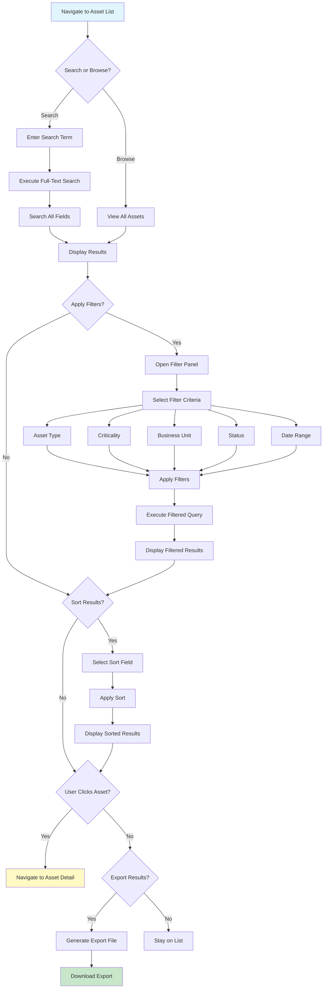

#### Flow A4: Asset Update Flow

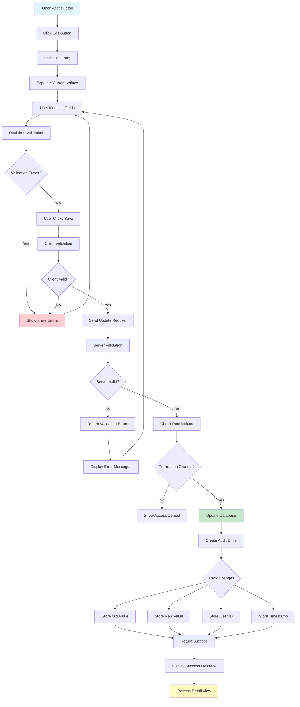

#### Flow A5: Asset Dependency Management Flow

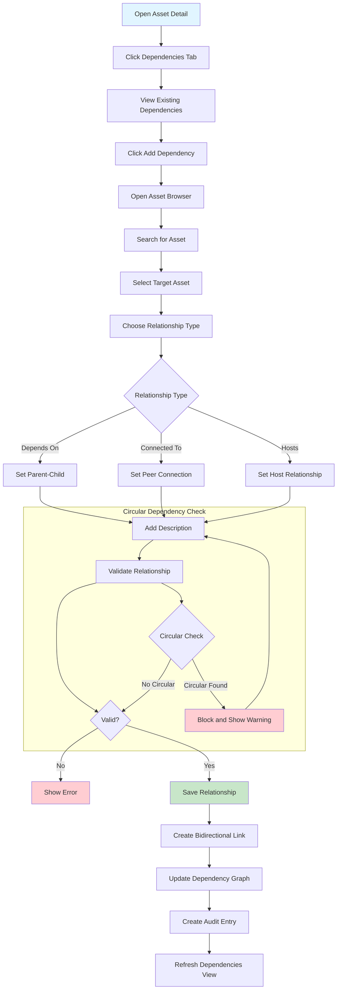

---

## Governance Management Module

### Governance User Stories

#### Epic G1: Influencer Management

##### User Story G1.1: Create Influencer Entry
**As a** compliance officer  
**I want to** create and register new governance influencers  
**So that** I can document all regulatory, contractual, and internal requirements

**Acceptance Criteria:**
- ✅ Can select influencer category (Internal, Contractual, Statutory, Regulatory, Industry Standard)
- ✅ Can specify issuing authority and jurisdiction
- ✅ Can set effective dates and review dates
- ✅ Can attach source documents
- ✅ Can tag and categorize
- ✅ Unique identifier auto-generated

**Priority**: P0 (Must Have)  
**Story Points**: 5

---

##### User Story G1.2: Assess Influencer Applicability
**As a** compliance officer  
**I want to** assess whether an influencer applies to our organization  
**So that** we focus only on relevant requirements

**Acceptance Criteria:**
- ✅ Can define applicability criteria (industry, geography, data types)
- ✅ Can set applicability status (Applicable, Not Applicable, Under Review)
- ✅ Justification required for decisions
- ✅ Evidence attachment supported
- ✅ Review date reminders functional

**Priority**: P0 (Must Have)  
**Story Points**: 8

---

##### User Story G1.3: View Influencer Relationships
**As a** compliance officer  
**I want to** view all policies and controls linked to an influencer  
**So that** I understand the influencer's impact across the organization

**Acceptance Criteria:**
- ✅ Show linked policies with status
- ✅ Show linked control objectives
- ✅ Show linked controls
- ✅ Navigate to related entities
- ✅ Impact analysis available

**Priority**: P0 (Must Have)  
**Story Points**: 5

---

##### User Story G1.4: Monitor Influencer Updates
**As a** compliance officer  
**I want to** track changes to external influencers (regulations, standards)  
**So that** I can assess impact of changes

**Acceptance Criteria:**
- ✅ Change history maintained
- ✅ Alert on updates (configurable)
- ✅ Impact assessment workflow
- ✅ Version comparison available

**Priority**: P1 (Should Have)  
**Story Points**: 8

---

#### Epic G2: Policy Management

##### User Story G2.1: Create Policy Document
**As a** policy manager  
**I want to** create a new policy using a standardized template  
**So that** all policies follow a consistent structure

**Acceptance Criteria:**
- ✅ Template selection available
- ✅ Rich text editor for content
- ✅ Version control (1.0, 1.1, 2.0, etc.)
- ✅ Status workflow (Draft → In Review → Approved → Published)
- ✅ Link to influencers
- ✅ Auto-save drafts

**Priority**: P0 (Must Have)  
**Story Points**: 8

---

##### User Story G2.2: Define Control Objectives
**As a** policy manager  
**I want to** define control objectives within a policy  
**So that** I establish clear, measurable requirements

**Acceptance Criteria:**
- ✅ Add control objectives to policy
- ✅ Auto-generated unique identifiers (CO-001, CO-002)
- ✅ Link to influencer requirements
- ✅ Assign responsible party
- ✅ Set target implementation date
- ✅ Reorder via drag-and-drop

**Priority**: P0 (Must Have)  
**Story Points**: 8

---

##### User Story G2.3: Policy Approval Workflow
**As a** policy manager  
**I want to** route policies through an approval process  
**So that** policies are reviewed before publication

**Acceptance Criteria:**
- ✅ Multi-level approval supported
- ✅ Approval comments captured
- ✅ Digital signature (optional)
- ✅ Rejection with feedback
- ✅ Email notifications sent
- ✅ Audit trail maintained

**Priority**: P0 (Must Have)  
**Story Points**: 13

---

##### User Story G2.4: Publish and Distribute Policy
**As a** policy manager  
**I want to** publish approved policies and notify users  
**So that** staff are aware of requirements

**Acceptance Criteria:**
- ✅ Publish changes status to Published
- ✅ Assign to users, roles, or business units
- ✅ Email notifications sent
- ✅ Published date recorded
- ✅ Previous versions accessible

**Priority**: P0 (Must Have)  
**Story Points**: 8

---

##### User Story G2.5: Track Policy Acknowledgments
**As a** policy manager  
**I want to** track which users have acknowledged reading policies  
**So that** I can demonstrate awareness compliance

**Acceptance Criteria:**
- ✅ Acknowledgment workflow for users
- ✅ Acknowledgment date captured
- ✅ Reminder notifications for overdue
- ✅ Acknowledgment rate reports
- ✅ Re-acknowledgment on policy updates

**Priority**: P1 (Should Have)  
**Story Points**: 8

---

#### Epic G3: Unified Control Library

##### User Story G3.1: Create Unified Control
**As a** compliance officer  
**I want to** create controls in the unified control library  
**So that** I can define implementation requirements once

**Acceptance Criteria:**
- ✅ Auto-generated control identifier (UCL-xxx-001)
- ✅ Control type selection (Preventive, Detective, Corrective, etc.)
- ✅ Domain and family assignment
- ✅ Rich text for description and procedures
- ✅ Complexity and cost impact ratings
- ✅ Owner assignment

**Priority**: P0 (Must Have)  
**Story Points**: 8

---

##### User Story G3.2: Map Control to Frameworks
**As a** compliance officer  
**I want to** map a control to requirements from multiple frameworks  
**So that** one control satisfies multiple compliance obligations

**Acceptance Criteria:**
- ✅ Select framework (NCA ECC, ISO 27001, NIST, etc.)
- ✅ Select specific requirement
- ✅ Set coverage level (Full, Partial, N/A)
- ✅ Add mapping notes
- ✅ Multiple frameworks per control
- ✅ Coverage matrix view

**Priority**: P0 (Must Have)  
**Story Points**: 13

---

##### User Story G3.3: Track Implementation Status
**As a** control owner  
**I want to** update the implementation status of my controls  
**So that** stakeholders can track governance maturity

**Acceptance Criteria:**
- ✅ Status options: Not Implemented, Planned, In Progress, Implemented, N/A
- ✅ Implementation percentage
- ✅ Implementation date
- ✅ Implementation notes
- ✅ Evidence attachment
- ✅ Notifications on status change

**Priority**: P0 (Must Have)  
**Story Points**: 8

---

##### User Story G3.4: Link Controls to Assets
**As a** control owner  
**I want to** link controls to assets where they're implemented  
**So that** I can demonstrate control coverage

**Acceptance Criteria:**
- ✅ Browse and search assets
- ✅ Select multiple assets
- ✅ Set implementation details per asset
- ✅ Bidirectional visibility (control shows assets, asset shows controls)
- ✅ Implementation status per asset

**Priority**: P1 (Should Have)  
**Story Points**: 8

---

#### Epic G4: Control Assessments

##### User Story G4.1: Create Assessment
**As an** assessor  
**I want to** create and plan control assessments  
**So that** I can evaluate control effectiveness

**Acceptance Criteria:**
- ✅ Define assessment scope and period
- ✅ Select controls to assess
- ✅ Assign assessors
- ✅ Define assessment procedures
- ✅ Set assessment type (Design, Operating Effectiveness)
- ✅ Send notifications to assessors

**Priority**: P0 (Must Have)  
**Story Points**: 13

---

##### User Story G4.2: Execute Assessment
**As an** assessor  
**I want to** execute assessments and record findings  
**So that** control effectiveness is documented

**Acceptance Criteria:**
- ✅ View control details and procedures
- ✅ Collect and upload evidence
- ✅ Record assessment result (Compliant, Non-Compliant, Partially Compliant)
- ✅ Rate effectiveness (1-5 scale)
- ✅ Document findings and observations
- ✅ Flag for remediation if needed

**Priority**: P0 (Must Have)  
**Story Points**: 13

---

##### User Story G4.3: Review Assessment Results
**As a** lead assessor  
**I want to** review all assessment results  
**So that** I can approve or request changes

**Acceptance Criteria:**
- ✅ View all assessment results
- ✅ Approve or reject results
- ✅ Add review comments
- ✅ Request additional evidence
- ✅ Complete assessment when all reviewed
- ✅ Generate assessment report

**Priority**: P0 (Must Have)  
**Story Points**: 8

---

#### Epic G5: Evidence Management

##### User Story G5.1: Upload Evidence
**As a** control owner  
**I want to** upload and manage control evidence  
**So that** I can demonstrate control effectiveness

**Acceptance Criteria:**
- ✅ Upload various file types (PDF, images, documents)
- ✅ Set evidence metadata (title, type, collection date)
- ✅ Link to controls and assessments
- ✅ Set validity period
- ✅ Status workflow (Draft, Under Review, Approved, Expired)

**Priority**: P1 (Should Have)  
**Story Points**: 5

---

##### User Story G5.2: Evidence Expiration Alerts
**As a** compliance officer  
**I want to** receive alerts when evidence is expiring  
**So that** I can refresh evidence in time

**Acceptance Criteria:**
- ✅ Configurable expiration alerts (30, 60, 90 days)
- ✅ Email notifications
- ✅ Dashboard widget showing expiring evidence
- ✅ Bulk renewal workflow

**Priority**: P2 (Nice to Have)  
**Story Points**: 5

---

#### Epic G6: Findings and Remediation

##### User Story G6.1: Create Finding
**As an** assessor  
**I want to** document findings from assessments  
**So that** issues are tracked and remediated

**Acceptance Criteria:**
- ✅ Link finding to control and assessment
- ✅ Set severity (Critical, High, Medium, Low)
- ✅ Document finding details
- ✅ Assign to responsible party
- ✅ Set due date for remediation
- ✅ Track finding status

**Priority**: P0 (Must Have)  
**Story Points**: 8

---

##### User Story G6.2: Track Remediation
**As a** compliance officer  
**I want to** track remediation of findings  
**So that** issues are resolved in time

**Acceptance Criteria:**
- ✅ Create remediation plan
- ✅ Track remediation progress
- ✅ Record completion and evidence
- ✅ Verify remediation effectiveness
- ✅ Close finding when remediated
- ✅ Overdue alerts

**Priority**: P0 (Must Have)  
**Story Points**: 8

---

### Governance Flow Diagrams

#### Flow G1: Influencer Creation and Applicability Flow

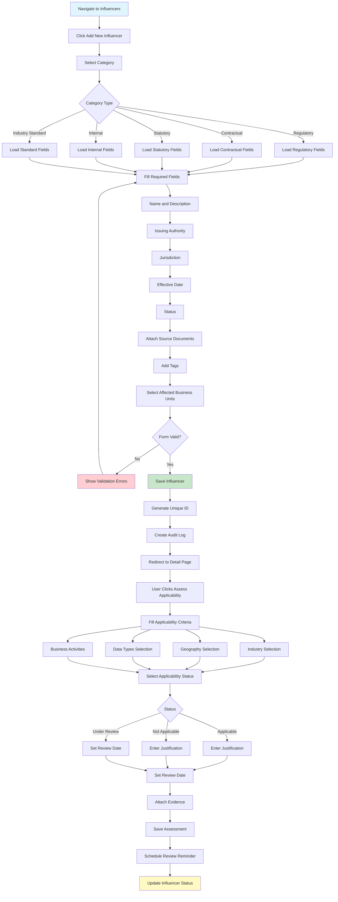

#### Flow G2: Policy Creation and Approval Flow

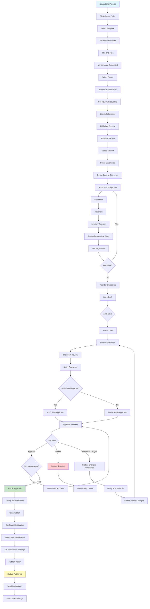

#### Flow G3: Unified Control Management Flow

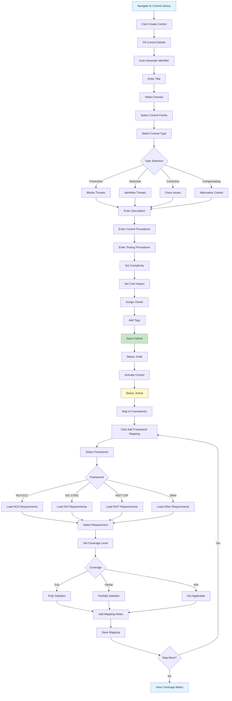

#### Flow G4: Control Assessment Flow

```mermaid
flowchart TD
    A[Navigate to Assessments] --> B[Create New Assessment]
    B --> C[Enter Assessment Details]
    C --> D[Assessment Name]
    D --> E[Description]
    E --> F[Assessment Type]
    F --> G{Type}
    G -->|Design Effectiveness| H[Test Control Design]
    G -->|Operating Effectiveness| I[Test Control Operation]
    
    H --> J[Set Assessment Period]
    I --> J
    
    J --> K[Start Date]
    K --> L[End Date]
    L --> M[Select Lead Assessor]
    M --> N[Add Additional Assessors]
    
    N --> O[Select Controls to Assess]
    O --> P[Browse Control Library]
    P --> Q[Filter by Domain]
    Q --> R[Select Controls]
    R --> S[Define Assessment Procedures]
    S --> T[Create Assessment Plan]
    T --> U[Notify Assessors]
    U --> V[Status: Not Started]
    
    V --> W[Assessment Period Starts]
    W --> X[Status: In Progress]
    X --> Y[Assessor Opens Assessment]
    
    Y --> Z[View Assigned Controls]
    Z --> AA[Open Control for Assessment]
    AA --> AB[Review Control Details]
    AB --> AC[Review Testing Procedures]
    AC --> AD[Collect Evidence]
    AD --> AE[Upload Evidence Files]
    AE --> AF[Record Assessment Result]
    AF --> AG{Result}
    AG -->|Compliant| AH[Full Compliance]
    AG -->|Partially Compliant| AI[Partial Compliance]
    AG -->|Non-Compliant| AJ[Non-Compliance]
    
    AH --> AK[Rate Effectiveness 1-5]
    AI --> AK
    AJ --> AK
    
    AK --> AL[Document Findings]
    AL --> AM[Add Observations]
    AM --> AN{Requires Remediation?}
    AN -->|Yes| AO[Create Finding]
    AN -->|No| AP[Submit Result]
    AO --> AP
    
    AP --> AQ{All Controls Assessed?}
    AQ -->|No| Z
    AQ -->|Yes| AR[Status: Under Review]
    
    AR --> AS[Lead Assessor Reviews]
    AS --> AT{Review Complete?}
    AT -->|No| AU[Request Changes]
    AU --> AF
    AT -->|Yes| AV[Status: Completed]
    
    AV --> AW[Generate Assessment Report]
    AW --> AX[Create Remediation Actions]
    AX --> AY[Notify Control Owners]
    
    style A fill:#e1f5ff
    style T fill:#fff9c4
    style AV fill:#c8e6c9
    style AU fill:#ffcdd2
```

#### Flow G5: Evidence Management Flow

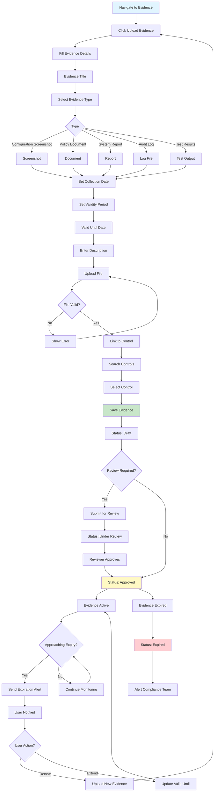

#### Flow G6: Finding and Remediation Flow

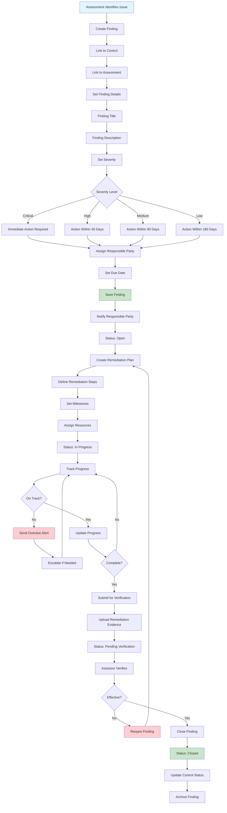

---

## Integration Workflows

### Integration User Stories

#### Epic I1: Control-Asset Integration

##### User Story I1.1: Link Control to Assets
**As a** control owner  
**I want to** link my controls to assets where they're implemented  
**So that** I can demonstrate control coverage across IT environment

**Acceptance Criteria:**
- ✅ Browse and search assets from control detail page
- ✅ Filter assets by type, criticality, business unit
- ✅ Select multiple assets at once
- ✅ Set implementation details per asset
- ✅ Bidirectional linking (control shows assets, asset shows controls)
- ✅ Audit trail in both modules

**Priority**: P1 (Should Have)  
**Story Points**: 8

---

##### User Story I1.2: View Asset Compliance Status
**As a** compliance officer  
**I want to** view compliance status of assets based on assigned controls  
**So that** I can identify non-compliant assets

**Acceptance Criteria:**
- ✅ Compliance percentage calculated
- ✅ Status indicators (Compliant, Partially Compliant, Non-Compliant)
- ✅ Breakdown by control status
- ✅ Link to detailed compliance report
- ✅ Dashboard widget available

**Priority**: P1 (Should Have)  
**Story Points**: 5

---

##### User Story I1.3: Bulk Control Assignment
**As a** compliance officer  
**I want to** assign multiple controls to an asset at once  
**So that** I can efficiently manage control coverage

**Acceptance Criteria:**
- ✅ Select multiple controls from library
- ✅ Set default implementation details
- ✅ Option to customize per control
- ✅ Validation before assignment
- ✅ Bulk update capability

**Priority**: P2 (Nice to Have)  
**Story Points**: 5

---

#### Epic I2: Compliance Reporting

##### User Story I2.1: Generate Framework Compliance Report
**As a** compliance officer  
**I want to** generate compliance reports with asset details  
**So that** I can demonstrate compliance to auditors

**Acceptance Criteria:**
- ✅ Select framework (NCA ECC, ISO 27001, etc.)
- ✅ Include asset compliance details
- ✅ Show control-to-requirement mapping
- ✅ Visual charts and graphs
- ✅ Export to PDF/Excel

**Priority**: P1 (Should Have)  
**Story Points**: 8

---

##### User Story I2.2: Control Gap Analysis
**As a** compliance officer  
**I want to** identify assets missing required controls  
**So that** I can prioritize control implementation

**Acceptance Criteria:**
- ✅ Identify assets without controls
- ✅ Determine required controls by asset type
- ✅ Show gap analysis by framework
- ✅ Drill-down to specific assets
- ✅ Export gap report

**Priority**: P1 (Should Have)  
**Story Points**: 8

---

### Integration Flow Diagrams

#### Flow I1: Control-Asset Linking Flow

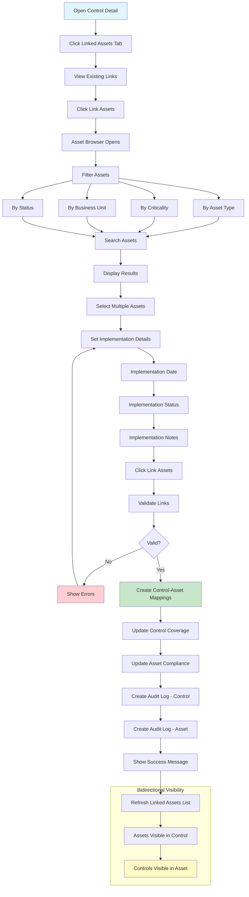

#### Flow I2: Asset Compliance Calculation Flow

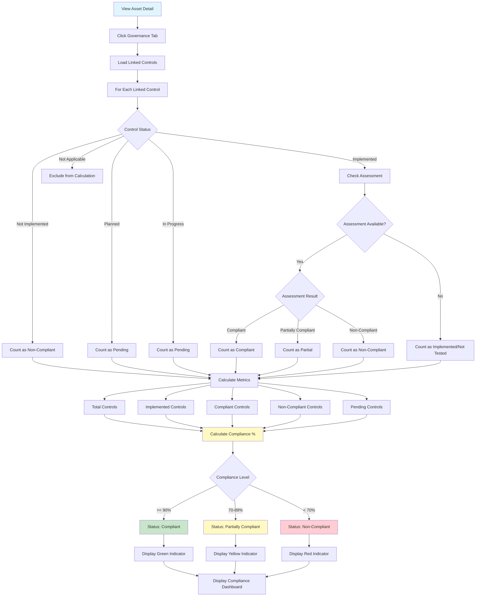

#### Flow I3: Framework Compliance Report Flow

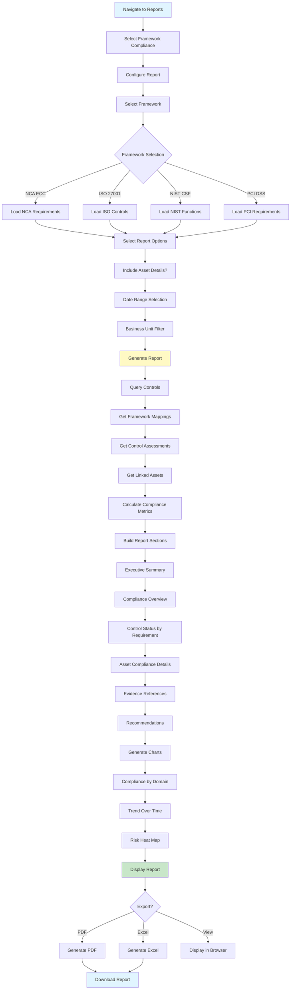

#### Flow I4: Gap Analysis Flow

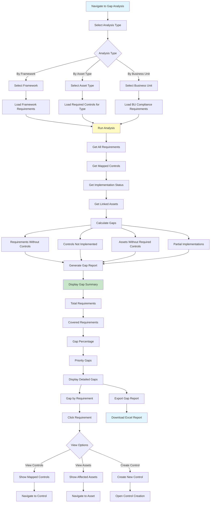

---

## End-to-End Workflows

### E2E Flow 1: Complete Governance Implementation Cycle

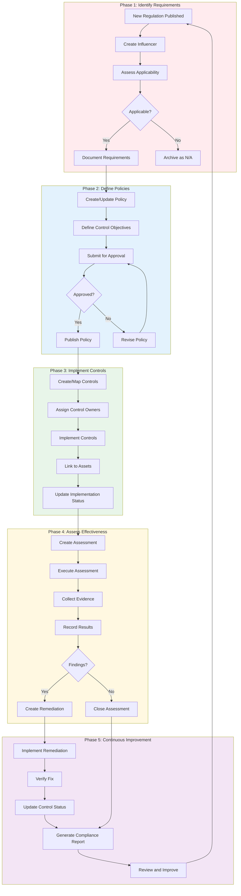

### E2E Flow 2: Asset Onboarding with Governance

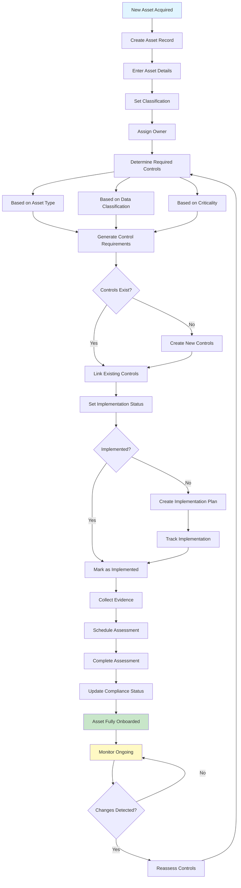

### E2E Flow 3: Audit Preparation Workflow

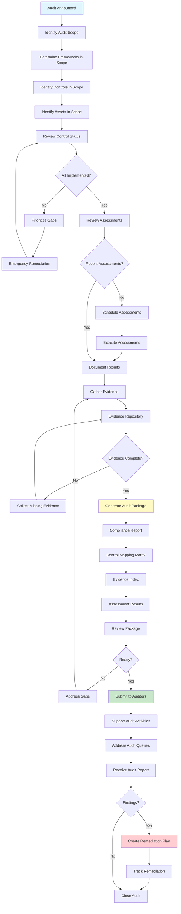

---

## Summary

This document provides comprehensive flow diagrams and user stories for the Stratagem GRC Platform, covering:

### Asset Management Module
- 5 asset types (Physical, Information, Software, Application, Supplier)
- Data import/export capabilities
- Asset relationships and dependencies
- Audit trail and compliance tracking

### Governance Management Module
- Influencer registry and applicability assessment
- Policy creation and approval workflows
- Unified Control Library with framework mapping
- Control assessments and evidence management
- Finding tracking and remediation

### Integration Layer
- Control-to-asset linking
- Compliance status calculation
- Gap analysis and reporting
- End-to-end governance workflows

### Key Metrics
- **Total User Stories**: 35+
- **Total Flow Diagrams**: 15+
- **Priority Distribution**:
  - P0 (Must Have): 18 stories
  - P1 (Should Have): 12 stories
  - P2 (Nice to Have): 6 stories
- **Estimated Story Points**: 250+

---

**Document End**

